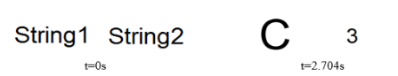
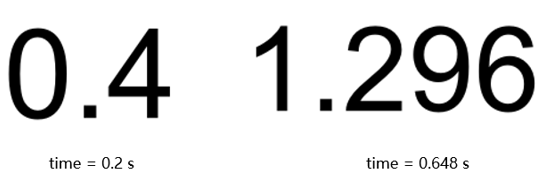
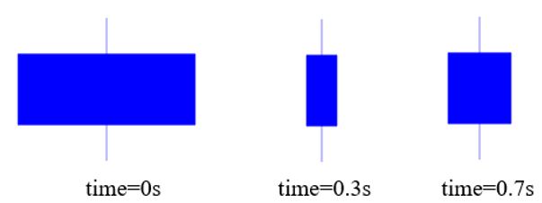

# 自定义动态组件

通常情况下，使用MWorks.Sysplorer提供的动态组件，已经可以适应大多数的应用场景。但也有一些不太常见的应用场景，或者用户对动态组件有自己的要求，MWorks.Sysplorer提供的几种动态组件已经不适用。此时，可以通过修改图元annotation中的动态属性，实现动态组件的自定义。

MWorks.Sysplorer支持以下几种动态属性表示方式：

### DynamicSelect

根据Modelica规范，图元属性值如果是DynamicSelect函数，则该属性将与仿真变量建立联系，具有动态更新功能。

DynamicSelect函数的表达式如下：

```
DynamicSelect(x, expr)  
```

其中：

- x是文字常量表达式，在图元编辑阶段，DynamicSelect函数调用表达式作为图元属性值。支持的文字常量表达式如下。

   | 类型           | 示例                         |
| -------------- | ---------------------------- |
| 整型文字常量   | 20                           |
| 布尔文字常量   | False，True                  |
| Real文字常量   | 18.28                        |
| string文字常量 | "ABC"                        |
| 数组构造       | {255,0,0}                    |
| 数组连接       | [100.0, 100.0; 100.0, 100.0] |

- expr是可能含有变量的表达式，在模型求解过程中，DynamicSelect函数调用该表达式作为图元属性值。变量每个时刻的值对应不同的图元属性值，以达到动态效果。

   | 类型             | 示例                                        |
| ---------------- | ------------------------------------------- |
| 一元表达式       | not                                         |
| 二元表达式       | and、or、+、/、^、*                         |
| if表达式         | if condition then expr1 else expr2          |
| 函数调用         | min, max, integer, String                   |
| 模型变量         | Real, Integer, Boolean, String              |
| String类型的参量 | String x="aabc"; 或 String x[2]={ "A", "B"} |
| 数组构造         | { {1,2,3},{4,5,6} }                         |

- DynamicSelect可作用的图元属性如下表：

   | **名称**             | **值类型** | **默认值** |
| -------------------- | ---------- | ---------- |
| Points  点           | Point[:]   |            |
| Extent  坐标         | Extent     |            |
| Origin  原点         | Point      | {0,0}      |
| Rotation  旋转角度   | Real       | 0          |
| thickness  线宽      | Real       | 0.25       |
| arrowSize  箭头尺寸  | Real       | 3          |
| radius  圆角半径     | Real       | 0          |
| startAngle  起始角度 | Real       | 0          |
| endAngle  终止角度   | Real       | 360        |

- expr表达式支持的图元属性值含变量表达式，其表达式可以是如下表达式或者表达式的组合。
  
   | **表达式**     | **示例**                                                     | **备注**                                                     |
| :------------- | ------------------------------------------------------------ | ------------------------------------------------------------ |
| If 表达式      | fillColor=DynamicSelect({255,255,255},   if active > 0.5 then {0,255,0} else  {255,255,255}) | -                                                            |
| 函数调用       | extent=DynamicSelect(} }-100,22},{0,-22}},  } }-100,max(0.1,min(1,diameter_a/max(diameter_a,  diameter_b)))*60},  {0,-max(0.1,  min(1, diameter_a/max(diameter_a, diameter_b)))*60}}) | -                                                            |
| 模型变量       | textString =  DynamicSelect("String3", m)                    | 1. String类型的变量变型必须直接为字面量，不可为其他表达式：  m="A" ;//ok  m=n; n="A";//看不到动画效果  2. 这里的模型变量只可为顶层模型的变量，不可引用组件中的变量。 |
| 多种表达式组合 | points=DynamicSelect( { {-100,0},{100,-0},{100,0},{0,0},{-100,-0},{-100,0} },   { {-100,50*opening_actual },  {-100,50*opening_actual },  {100,-50*opening_actual },  {  100,50*opening_actual },  {0,0},  {-100,-50*opening_actual },  {-100,50*opening_actual } } ) | -                                                            |
| 多种表达式组合 | extent=DynamicSelect(  { {-60,-40},{-60,-40} },  { {-60,-40},{80,(-40+level*100 ) } } ) | -                                                            |

**示例1**：在图标视图中，定义一个矩形，矩形的坐标(extent关键字表示坐标)具有动态属性，默认状态下为“{{0,0},{20,20}}”，在仿真的时候，会根据变量level的值，动态显示矩形的高度。

```
 annotation (  Icon(graphics={Rectangle(  extent=DynamicSelect({ {0,0},{20,20} },} }0,0},{20,level} })) }));
```

**示例2([DynamicSelectString](mworks://ref/static/Samples/DynamicSelectString.mo))**：MWorks.Sysplorer在DynamicSelect函数中特别支持了String类型的数组参量，但在使用时会有一些限制。

```
model DynamicSelectString
  String x[8] = {"A", "B", "C", "D", "E", "F", "G", "H"};
  Integer i = integer(time);
  Integer y[8] = {1, 2, 3, 4, 5, 6, 7, 8};
  Integer u = y[y[i + 1]];
  String z = x[i + 1];
  annotation (
    Diagram(coordinateSystem(extent = {{-150.0, -100.0}, {150.0, 100.0}}, 
      preserveAspectRatio = false, 
      grid = {2.0, 2.0}), graphics = {Text(origin = {-40.0, 5.0}, 
      extent = {{-42.0, -37.0}, {42.0, 37.0}}, 
      textString = DynamicSelect("String1", x[i + 1]), 
      textStyle = {TextStyle.None}), Text(origin = {62.0, 4.0}, 
      extent = {{-32.0, -18.0}, {32.0, 18.0}}, 
      textString = DynamicSelect("String2", String(u)), 
      textStyle = {TextStyle.None})}), 
    Icon(coordinateSystem(extent = {{-100.0, -100.0}, {100.0, 100.0}}, 
      preserveAspectRatio = false, 
      grid = {2.0, 2.0})), 
    experiment(StartTime = 0, StopTime = 8, NumberOfIntervals = 500, Algorithm = "Dassl", Tolerance = 0.0001, IntegratorStep = 0.016, DoublePrecision = false));
end DynamicSelectString;
```

DynamicSelectString在0s和2.704s时刻动画演示效果如下：



注意以下几点：

- String数组的赋值形式必须是数组构造{…}，且其中元素为字符串文字常量。
  
   ```
String  x[8] = {"A", "B", "C", "D",  "E", "F", "G", "H"}//ok   
String  x[1,8] = ["A", "B", "C", "D",  "E", "F", "G", "H"]//无法显示动画效果  
   ```

- 对于字符串数组，直接引用字符串分量，不能用中间变量代替。
  
   ```
  textString = DynamicSelect("String1", x[i + 1])//ok   
  textString  = DynamicSelect("String1", z)// 无法显示动画效果  
  ```

### 动态文本

新建一个模型，命名为DynamicText，并定义一个Real变量x，并赋值为“time*2”。切换到图标视图(Icon)，插入一个文本图形，文本的字符串值为“%x”。在仿真中，图标视图的二维动画窗口呈现不断变化的变量值。 

**示例3**([**DynamicText**](mworks://ref/static/Samples/DynamicText.mo))：

```
model DynamicText
  Real x = time * 2;
  annotation (Diagram(coordinateSystem(extent = {{-150.0, -100.0}, {150.0, 100.0}}, 
    preserveAspectRatio = false, 
    grid = {2.0, 2.0})), 
    Icon(coordinateSystem(extent = {{-100.0, -100.0}, {100.0, 100.0}}, 
      preserveAspectRatio = false, 
      grid = {2.0, 2.0}), graphics = {Text(origin = {-6.0, 11.0}, 
      extent = {{-70.0, -43.0}, {70.0, 43.0}}, 
      textString = "%x", 
      textStyle = {TextStyle.None})}));
end DynamicText;
```

在**仿真** > **图表**中，展开**图形**的下拉菜单，点击**图标**以创建图标的二维动画窗口，此时启动仿真，即可在二维动画窗口中看到不同时刻显示不同的数字。

  

### 动态颜色

利用dynamicFillColorR、dynamicFillColorG、dynamicFillColorB3个属性定义图元的动态颜色。

示例([**DynamicFillColor**](mworks://ref/static/Samples/DynamicFillColor.mo))：

```
model DynamicFillColor
  Real r = time * 200;
  Real g = 255 - r;
  Real b = 4 * r;
  annotation (Icon(graphics = {
    Rectangle(extent = {{-100, 100}, {100, -100}}, color = {0, 0, 255}, fillColor = {255, 255, 255}, fillPattern = FillPattern.Solid, 
    dynamicFillColorR = r, dynamicFillColorG = g, dynamicFillColorB = b)}));
end DynamicFillColor; 
```

对模型DynamicFillColor设置仿真区间为0~2 后，进行编译求解，查看模型图标视图的动画

                             

### 动态横条

利用dynamicWidth属性设置图元动态宽度。

**示例([DynamicWidth](mworks://ref/static/Samples/DynamicWidth.mo))**：

```
model DynamicWidth
  Real width = 100 * time;
  annotation (Icon(graphics = {
    Rectangle(extent = {{-100, -40}, {100, 40}}, color = {0, 0, 255}, fillColor = {0, 0, 255}, fillPattern = FillPattern.Solid, rotation = 0, origin = {0, 0}, dynamicWidth = width), 
    Line(points = {{0, 80}, {0, -80}}, color = {0, 0, 255})}));
end DynamicWidth;
```

求解并仿真，可以查看动态横条的动画效果。

                

除了矩形的动态宽度外，还有矩形的高度、图形的旋转角度、扇形的起始角度和终止角度，也可以作为动态属性。更多的动态属性如下表 所示：

| **动态属性**       | **说明**                                                     | **属性段**  |
| ------------------ | ------------------------------------------------------------ | ----------- |
| dynamicFillColorR  | 填充颜色R分量的动态值，有效取值范围为0~255                   | FillColor   |
| dynamicFillColorG  | 填充颜色G分量的动态值，有效取值范围为0~255                   |             |
| dynamicFillColorB  | 填充颜色B分量的动态值，有效取值范围为0~255                   |             |
| dynamicFillPattern | 填充方式的动态值，取值为枚举值。枚举常量可参见模型DynamicBlocks.Basic.FillPattern | FillPattern |
| dynamicLineColorR  | 线条颜色R分量的动态值，有效取值范围为0~255                   | LineColor   |
| dynamicLineColorG  | 线条颜色G分量的动态值，有效取值范围为0~255                   |             |
| dynamicLineColorB  | 线条颜色B分量的动态值，有效取值范围为0~255                   |             |
| dynamicLinePattern | 线条样式的动态值，取值为枚举值。枚举常量可参见模型DynamicBlocks.Basic.LinePattern | LinePattern |
| dynamicWidth       | 矩形、椭圆等图形的宽度的动态值                               | Extent      |
| dynamicHeight      | 矩形、椭圆等图形的高度的动态值                               |             |
| dynamicRotation    | 旋转角度的动态值                                             | Rotation    |
| dynamicStartAngle  | 扇形起始角度的动态值，仅用于Ellipse                          | Angles      |

