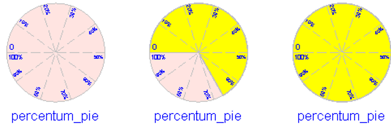

# DynamicBlocks

动态组件库DynamicBlocks中有7个动态组件模型。

本章将结合水箱模型SimpleTank逐个介绍各个动态组件模型的动态行为模式。

### 指示灯

图标：

英文名称：Bulb

指示灯用来关联到一个变量，当这个变量的值低于某个临界值时，指示灯显示为一种状态，通常为“指示灯关”的状态；当变量的值达到或高于临界值时，指示灯显示为另一种状态，通常为“指示灯开”的状态。

在SimpleTank模型中设置的指示灯组件参数值：

各个参数的含义：

| **参数**          | **类型**    | **说明**                                                     |
| ----------------- | ----------- | ------------------------------------------------------------ |
| coupling_variable | Real        | 关联变量，输入动态组件所关联的变量名。设为tank.outflow，表示将该指示灯组件与tank的出水流量outflow关联 |
| critical_value    | Real        | 临界值，表示关联变量达到该值时，指示灯的状态发生变化。设为0+err，表示当关联变量大于0，即tank开始出水时，指示灯状态发生变化 |
| lower_color       | ColorSelect | 低界颜色值，在下拉列表中选择White，表示当关联变量tank.outflow的值小于临界值，即tank的出水量为0时，指针灯显示为白色，显示效果为“指示灯关” |
| upper_color       | ColorSelect | 高界颜色值，在下拉列表中选择Yellow，表示当关联变量tank.outflow的值大于临界值，即tank的出水量大于0时，指示灯显示为黄色，显示效果为“指示灯开” |

下图依次展示SimpleTank模型，0s和4s时刻指示灯动画演示效果。

### 多级指示灯

图标：

英文名称：Polychrome Bulb

多级指示灯用来关联到一个变量，以演示该变量值的多级变化（通常为2次变化）。

多级指示灯有一个临界值序列，和一个状态颜色值数组。当关联变量的值低于临界值序列中的第一个值时，指示灯显示为给定的低界颜色值；当关联变量达到或高于临界值序列中的某个值时，指示灯显示为对应的状态颜色值。

在SimpleTank模型中设置的多级指示灯组件的参数值：

其中各个参数的含义：

| **参数**          | **类型**    | **说明**                                                     |
| ----------------- | ----------- | ------------------------------------------------------------ |
| coupling_variable | Real        | 关联变量，输入动态组件所关联的变量名。设为tank.outflow + tank.overflow，将该多级指示灯与tank的出水与溢水的总量关联 |
| N                 | Integer     | 多级指示灯的状态变换次数，默认为2                            |
| step_criticals    | Real[N]     | 临界值序列，表示关联变量达到某个值时，指示灯的状态发生变化，step_criticals的序列长度为N。设为{0+err, tank.outflow_limit+err}，表示当tank的出水量大于0，即出水口开始出水时，指示灯状态发生第一次变化；当tank的出水量大于tank出水口的最大出水量，即开始溢水时，指示灯状态发生第二次变化 |
| lower_color       | ColorSelect | 保持默认值White（RGB(255,255,255)），当tank的出水量为0时，指示灯显示为“指示灯关”的状态 |
| step_colors       | ColorSelect | 保持默认值{RGB(255,  255, 0), RGB(255, 0, 0)}，当tank的出水量大于0，即出水口开始出水时，指示灯显示为“黄灯亮”；当tank开始溢水时，指示灯显示为“红灯亮” |

下图依次展示SimpleTank模型0s、4s和9s时刻多级指示灯的动画演示效果：

### 横条

图标： 

英文名称：Horizontal Bar

横条用来关联到一个变量，显示变量值的绝对值变化。横条可以设置一个显示比例，变量值发生变化时，以一定的比例反应为横条的长度变化。

横条组件可以进行拖动与缩放，以改变图形的基本大小。也可以在**建模** > **格式**中，展开**排列**的下拉菜单，点击  或 ，将横条变为竖条。

在SimpleTank模型中设置的横条组件的参数值如下：

 

各个参数的含义：

| **参数**          | **类型** | **说明**                                                     |
| ----------------- | -------- | ------------------------------------------------------------ |
| coupling_variable | Real     | 关联变量，输入动态组件所关联的变量名。设为tank.level，将该动态组件与tank的水平位关联。 |
| K                 | Real     | 长度系数，表示横条长度与关联变量值的比例系数，默认为1。设为200 /  tank.height，表示当tank的水平位达到tank的最高位置时，横条的长度显示为动态组件的最大长度200 |
| min_limit         | Real     | 限制最小值，表示当关联变量的值小于该值时，动态组件不再显示其变化。默认值为0 |
| max_limit         | Real     | 限制最大值，表示当关联变量的值大于该值时，动态组件不再显示其变化。默认值为1e15。 |

下图依次展示SimpleTank模型0s、4s和9s时刻横条/竖条的动画演示效果：

### 百分比条

图标：

英文名称：Percentum Bar

百分比条用来关联到一个关联变量，并以百分比的形式，显示关联变量的值的变化。

百分比条组件有一个最小值参数min_limit与一个最大值参数max_limit。当关联变量的值value等于最小值min_limit时，百分比条显示为0%；当变量值value等于最大值max_limit时，百分比条显示为100%。

当关联变量的值在最小值和最大值区间时，则按比例显示为百分比：

`per = (value - min_limit) / (max_limit - min_limit) * 100%`

当关联变量的值在区间外时，百分比条不显示其变化。

在SimpleTank模型中设置的百分比条组件参数值：

各个参数的含义：

| **参数**          | **类型** | **说明**                                                     |
| ----------------- | -------- | ------------------------------------------------------------ |
| coupling_variable | Real     | 关联变量，输入动态组件所关联的变量名。设为tank.volume，将百分比条与tank中的水量（体积）关联。 |
| min_limit         | Real     | 最小值，表示当关联变量的值等于该值时，百分比条显示为0%。默认值为0。设为0，水的体积最小为0 |
| max_limit         | Real     | 最大值，表示当关联变量的值等于该值时，百分比条显示为100%。默认值为100。设为tank.area * tank.height，最大为水箱的容积 |

下图依次展示SimpleTank模型0s、4s和9s时刻百分比条的动画演示效果：

### 速度计

图标：

英文名称：Speedometer

速度计用来关联到一个变量，以指针的指向显示变量值的变化。速度计可以设置一个显示比例，变量值发生变化时，以一定的比例反映为仪表指针与0位置的角度。

在**建模** > **格式**中，点击**排列**下拉菜单中的或，可以翻转速度计组件，将指针从顺时针转变为逆时针转。

在SimpleTank模型中设置的速度计组件参数值：

 

各个参数的含义：

| **参数**          | **类型** | **说明**                                                     |
| ----------------- | -------- | ------------------------------------------------------------ |
| coupling_variable | Real     | 关联变量，输入动态组件所关联的变量名。设为tank.level，将该动态组件与tank的水平位关联。 |
| K                 | Real     | 角度系数，表示指针角度与关联变量值的比例系数，默认为1。设为300 /  tank.height，表示当tank的水平位达到tank的最高位置时，速度计的指针角度显示为速度计的最大角度300 |
| min_limit         | Real     | 限制最小值，表示当关联变量的值小于该值时，动态组件不再显示其变化。默认值为0。设为0，水平位tank.level最小为0 |
| max_limit         | Real     | 限制最大值，表示当关联变量的值大于该值时，动态组件不再显示其变化。默认值为300。设为tank.height，水平位最大为水箱的高度。 |

下图依次展示SimpleTank模型0s、4s和9s时刻速度计的动画演示效果：

### 百分比饼图

图标：

英文名称：Percentum Pie

百分比饼图用来关联到一个关联变量，并以百分比的形式，显示关联变量的值的变化。

百分比饼图有一个最小值参数min_limit与一个最大值参数max_limit。当关联变量的值value等于最小值min_limit时，饼图显示为0%；当变量值value等于最大值max_limit时，饼图显示为100%。

当关联变量的值在最小值和最大值区间时，则按比例显示为百分比：

`per = (value - min_limit) / (max_limit - min_limit) * 100%`

当关联变量的值在区间外时，饼图不显示其变化。

在SimpleTank模型中设置的百分比饼图组件的参数值：

 

各个参数的含义：

| **参数**          | **类型** | **说明**                                                     |
| ----------------- | -------- | ------------------------------------------------------------ |
| coupling_variable | Real     | 关联变量，输入动态组件所关联的变量名。设为tank.volume，将饼图组件与tank中的水量（体积）关联 |
| min_limit         | Real     | 最小值，表示当关联变量的值等于该值时，百分比饼图显示为0%。默认值为0。设为0，水的体积最小为0 |
| max_limit         | Real     | 最大值，表示当关联变量的值等于该值时，百分比饼图显示为100%。默认值为100。设为tank.area * tank.height，最大为水箱的容积 |

下图依次展示SimpleTank模型0s、4s和9s时刻百分比条的动画演示效果：

### 数值显示器

图标：

英文名称：Numeric Display

数值显示器用来关联到一个变量，以数值的方式显示变量值的变化。

在SimpleTank模型中设置的数值显示器组件的参数值如下：

各个参数的含义：

| **参数**          | **类型** | **说明**                                                     |
| ----------------- | -------- | ------------------------------------------------------------ |
| coupling_variable | Real     | 关联变量，输入动态组件所关联的变量名。设为tank.level，将该动态组件与tank的水平位关联 |

下图为SimpleTank中，9s时刻数值显示器的动画演示效果：

