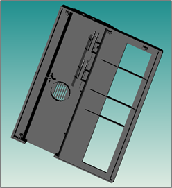

# 3D软件外部文件转换为MWorks可识别格式的方法

本节根据各个三维软件自身特点，给出相应的转换方法。

用到的3D软件、格式转换工具及MWorks可识别图形文件格式的简单说明。

| **3D软件**      | **安装版本** | **自有文件格式**         | **公用文件格式**          |
| --------------- | ------------ | ------------------------ | ------------------------- |
| Autodesk  3Dmax | 2013         | .max/.chr                | .stl/.igs/.stp/.step/.obj |
| Pro/ENGINEER    | 5.0          | .prt                     |                           |
| UG              | 8.0          | .prt                     |                           |
| CATIA           | P3  V5R20    | .CATPart/.CATProduct     |                           |
| SolidWork       | 2009  SP0.0  | .sldprt/. sldasm/.slddrw |                           |
| Adams           | 2013         | .shl                     |                           |

格式转换工具主要有HOOPS、TransMagic及3D-Tool，可根据需要下载最新版本。

| **转换工具** | **网址**                                             |
| ------------ | ---------------------------------------------------- |
| HOOPS        | https://www.techsoft3d.com/products/hoops/visualize/ |
| TransMagic   | http://www.transmagic.com/                           |
| 3D-Tool      | http://www.3d-tool-usa.com/                          |

 ### SolidWorks

将SolidWorks中模型文件另存为.hsf格式即可，转换后的模型导入MWorks.Sysplorer后系统显示未发生变化。

- 转换前

  

- 转换后

  

### Pro/E

Pro/E的图形文件自有格式为.prt，结合转换工具和三维软件SolidWorks的文件格式转换，转换前后无差异。

- 转换前

  

- 转换后

  

### CATIA

CATIA的图形文件自有格式为.CATPart，结合转换工具和三维软件Solidworks的文件格式转换，转换前后无差异。

- 转换前

  

- 转换后

  

### UG

UG的图形文件自有格式为.prt，结合转换工具的文件格式转换，转换前后无差异。

- 转换前

  

- 转换后

  

### 3Dmax

3Dmax中模型文件转换为MWorks可识别格式，转换后模型无变化。

  - 转换前

    

- 转换后

  

### Adams

  将Adams中模型直接导出为.shl格式即可，转换后的模型颜色丢失，导入MWorks后显示系统的默认颜色。

  - 转换前

    

- 转换后

  

### 非stl格式

1. Pro/E

   Pro/E通过公有文件格式结合转换工具TransMagic转换为MWorks支持的.hsf/hmf格式。转换后模型的曲面颜色改变。

   *注：Pro/E转换为.iv格式后经HOOPS转换为.hsf后倒入MWorks中，模型比例发生改变，其他均未变化*

   

   

   - 转化前

     

   - 装换后
   
     
     

2. CATIA

   CATIA通过公有文件格式结合转换工具TransMagic转换为MWorks支持的.hsf/hmf格式；转换后模型的曲面颜色改变。

   

   

   - 转化前

     

   - 装换后

     
   
2. UG

   UG通过公有文件格式结合转换工具TransMagic转换为MWorks支持的.hsf/hmf格式；转换后模型颜色改变。

   

   

   - 转化前

     

   - 装换后

     
   
2. 3Dmax

   3Dmax通过公有文件格式结合转换工具TransMagic转换为MWorks支持的.hsf/hmf格式；转换后模型颜色改变，失去透明度，曲面的光泽度变差。

   

   

   - 转化前

     

   - 装换后

     

### stl格式

5种三维软件可另存为或导出MWorks支持的.stl格式，转换后模型颜色丢失，曲面不光滑，某些情况下失去透明度，分辨率变低。

以3Dmax为例：

  - 转换前

    

- 转换后

  