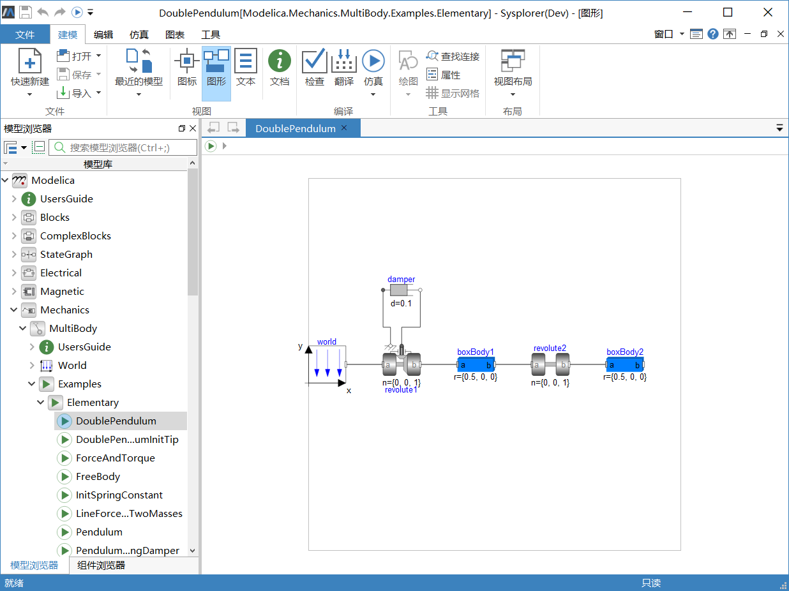

# 基本仿真步骤

本节以Modelica 机械多体库中的实例——双摆模型(DoublePendulum) 为例，介绍模型翻译、模型仿真、结果后处理等操作过程。对于其他非多体模型，比如电学、电磁、液压等领域模型，模型编译、求解与后处理相关的操作是相同的。

| 主题                                                         | 说明                                                         |
| ------------------------------------------------------------ | ------------------------------------------------------------ |
| **[打开仿真环境](#/forthExample/BasicSimulationSteps/OpenSimulationEnvironment)** | 激活仿真环境                                                 |
| **[翻译模型](#/forthExample/BasicSimulationSteps/TranslateModel)** | 对当前模型进行翻译，转换文本格式的Modelica代码生成可运行的求解器程序 |
| **[仿真设置](#/forthExample/BasicSimulationSteps/SetSimulationOptions)** | 设置仿真选项，即设置实例的仿真区间、输出区间、积分算法与结果存储 |
| **[求解模型](#/forthExample/BasicSimulationSteps/SimulateModel)** | 系统调用当前实例翻译生成的求解器计算模型中所有变量随时间变化的数据 |
| **[查看变量曲线](#/forthExample/BasicSimulationSteps/ViewVariablePlot)** | 在曲线窗口中显示所选变量的仿真结果数据                       |
| **[浏览模型动画](#/forthExample/BasicSimulationSteps/DemoSimulationAnimation)** | 动画窗口显示当前模型的三维结构                               |
| **[修改参数](#/forthExample/BasicSimulationSteps/ChangeParameters)** | MWorks.Sysplorer支持修改模型参数，以便通过多次仿真了解不同情况下模型的动态性能 |

