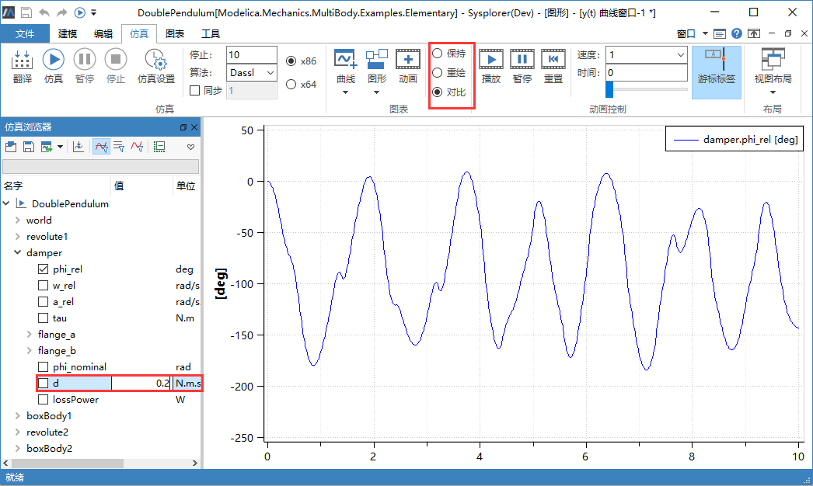
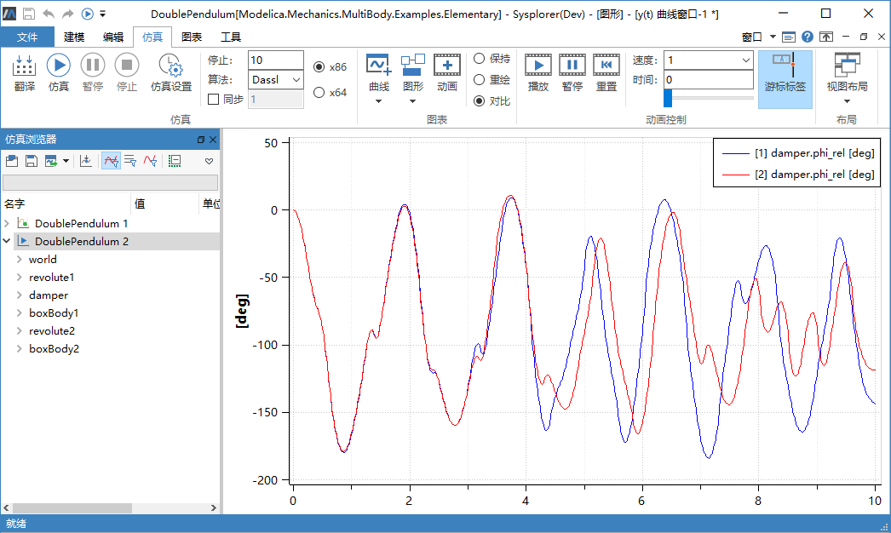

# 修改参数

模型的仿真结果在很大程度上由模型参数决定，对于仿真模型来说，不同的参数对应不同的模型配置，并体现出不同的设计方案。MWorks.Sysplorer 支持修改模型参数，以便通过多次仿真了解不同情况下模型的动态性能。

修改参数在**仿真浏览器**中进行，如果某个节点的第 2 列**值**显示出一个编辑框，则表示该节点为参数，可进行修改。如下图中，在**仿真浏览器**中展开 “damper” 节点，将阻尼参数“d”改为 0.2。

可以通过勾选曲线绘制模式（**保持**、**重绘**与**对比**）来控制变量曲线的绘制策略。这里勾选**对比**绘制模式，重复仿真时，将保留原有曲线，同时绘制新生成实例中对应的变量曲线，以实现新旧实例之间的曲线对比。

点击**快速访问工具**中的 ，对修改参数后的模型实例再次进行求解。此时，**仿真浏览器**中自动增加一个新的仿真实例**DoublePendulum 2**，并且绘制新的结果曲线。

