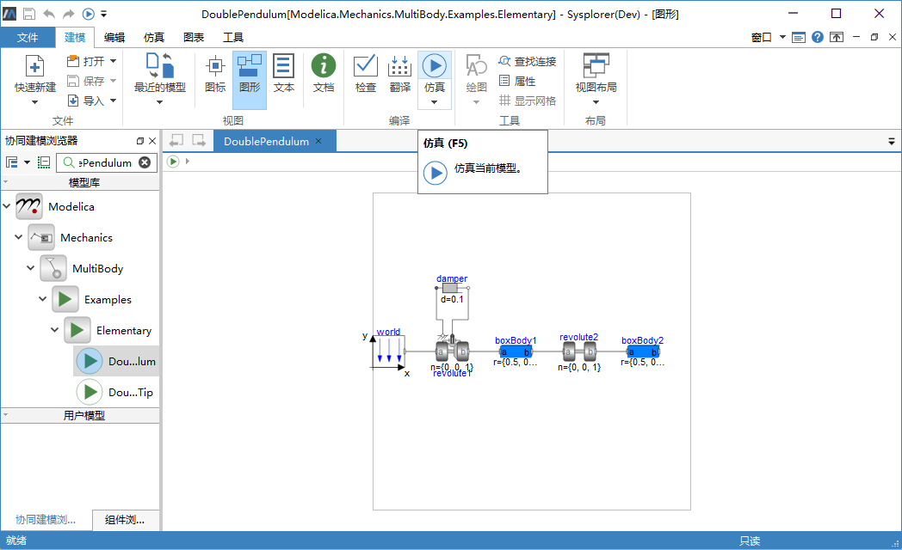
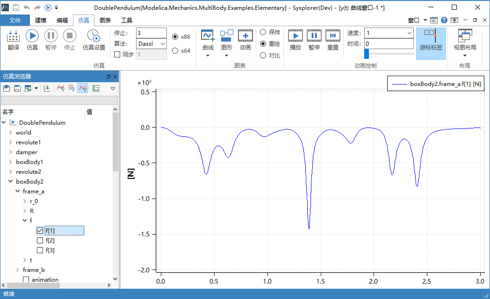

# 打开仿真环境

为了打开仿真界面进行模型求解并观察分析求解结果，必须首先激活仿真环境。打开仿真环境的方式有两种：

- 切换到**仿真**标签页，进入到仿真环境。
- 点击**快速访问**栏或**建模**标签页中的或**建模** > **编译**>，仿真模型，系统会自动打开仿真环境。

  

通过仿真启动仿真环境后，系统自动执行以下操作：

1. 如果模型编译成功（生成了求解器 MWSolver.exe）， 调用内部过程取出求解器相关信息，构造模型实例并显示于**仿真浏览器**。

2. 调用 MWSolver 程序进行求解， 如果模型求解成功，可在**仿真浏览器**中勾选变量查看其动态变化过程。 

   

