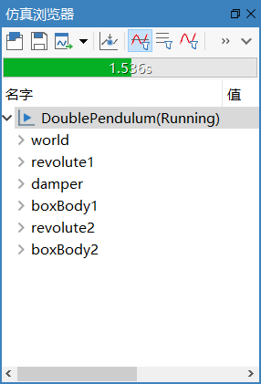

# 求解模型

切换到**建模**或**仿真**标签页，点击**仿真**，或**快速访问工具**的，系统调用模型翻译生成的求解器，计算模型中所有变量随时间变化的数据。

仿真时，在**仿真浏览器**的**进度条**显示仿真进度。

仿真生成的结果文件Result.msr位于“【仿真结果目录】/DoublePendulum”中（切换到**工具**标签页，点击**选项**，在弹出的对话框中点击**环境** > **系统目录**，可查看和修改仿真结果目录）。
