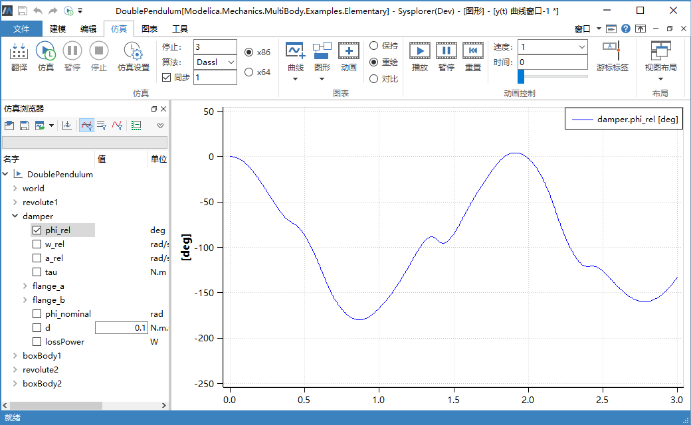
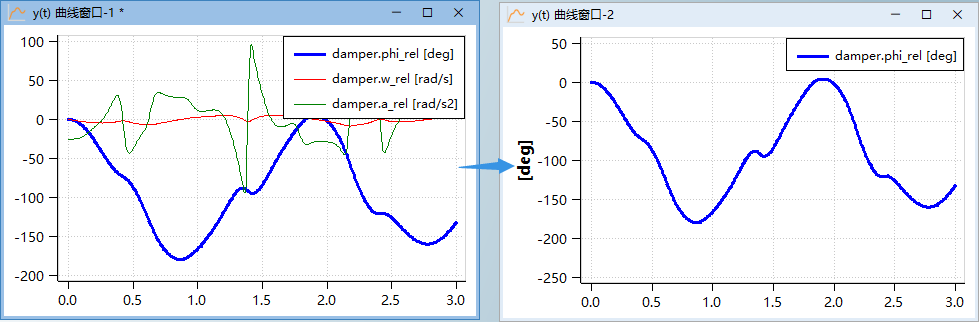

# 查看变量曲线

查看变量曲线，即在曲线窗口中显示所选变量的仿真结果数据。

在**仿真浏览器**中展开组件"damper"，点击节点"phi_rel"前的勾选框或变量名，**曲线窗口**中绘制变量“phi_rel”的求解结果曲线 。

在**仿真浏览器**中取消勾选变量 “phi_rel"可以删除此曲线，曲线显示状态与变量节点勾选状态是保持一致的。

曲线窗口支持两种情形的曲线拖放：

1. 从**仿真浏览器**拖拽变量到**曲线窗口**；

2. 从**曲线窗口**拖动曲线到另一**曲线窗口**，在拖动过程中按住Ctrl 键，表示复制曲线。
   
   
   
   > 注意：曲线窗口之间的曲线拖放仅适用于y(t)曲线窗口。

