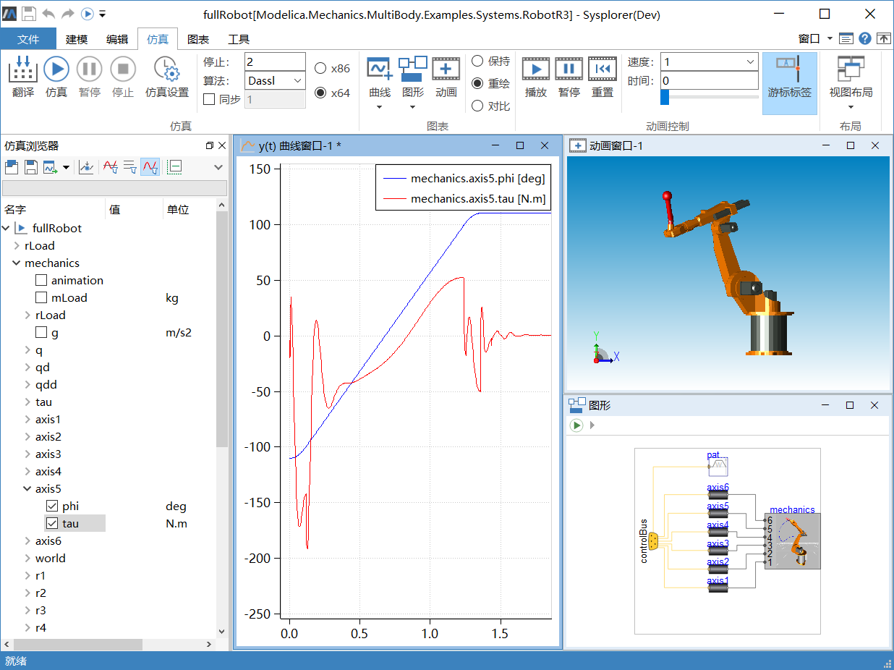

# 仿真环境

使用MWorks.Sysplorer 完成模型搭建后，用户需要对所建模型进行仿真分析。本节将介绍仿真环境中的各个窗口面板，及其各自的功能与使用方法，方便后续对模型仿真操作的详细介绍。

| 主题                                                         | 说明                                       |
| ------------------------------------------------------------ | ------------------------------------------ |
| **[仿真浏览器](#/forthExample/SimulationEnvironment/SimulationBrowser)** | 仿真浏览器以树的形式显示模型的编译结果     |
| **[曲线窗口](#/forthExample/SimulationEnvironment/PlotWindow)** | 曲线窗口用于显示变量曲线                   |
| **[二维动画窗口](#/forthExample/SimulationEnvironment/2AnimationWindow)** | 显示组件动画                               |
| **[动画窗口](#/forthExample/SimulationEnvironment/AnimationWindow)** | MWorks.Sysplorer支持三维图形显示与动画播放 |
| **[命令窗口](#/forthExample/SimulationEnvironment/PythonCommand)** | 命令窗口                                   |
| **[输出窗口](#/forthExample/SimulationEnvironment/OutputBar)** | 从输出栏中可以得到关于模型求解的详细信息   |
| **[仿真结果自动呈现](#/forthExample/SimulationEnvironment/AutomaticSimulationResults)** | 用于设置模型的仿真结果自动呈现             |

