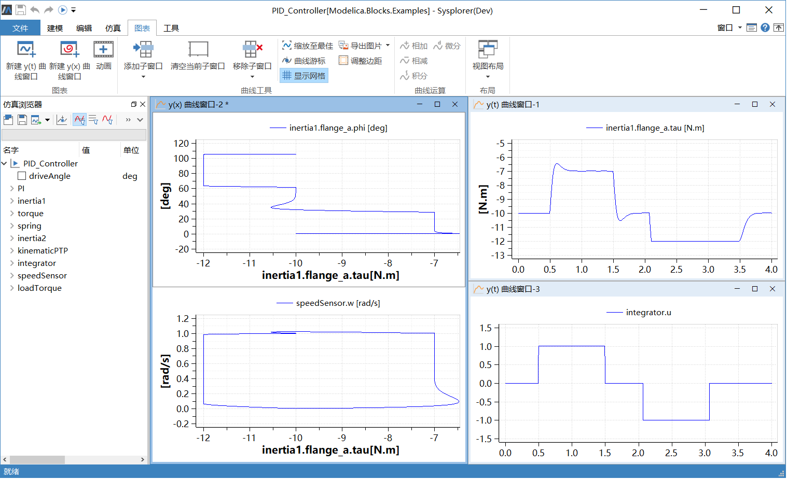
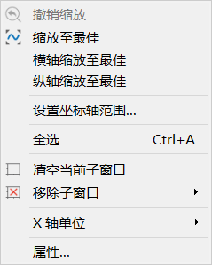
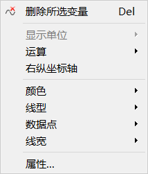

# 曲线窗口

**曲线窗口**用于显示变量曲线。MWorks.Sysplorer 中**曲线窗口**分为y(t) 曲线窗口和y(x) 曲线窗口，**y(t) 曲线窗口**以时间(time) 作为横坐标（也称为自变量），而**y(x) 曲线窗口**则以第一次拖入的变量作为横坐标。

在**曲线窗口**中单击右键会弹出上下文菜单，菜单根据选中对象不同显示不同内容。

- 空白处点击右键

  

- 选中曲线后点击右键

  