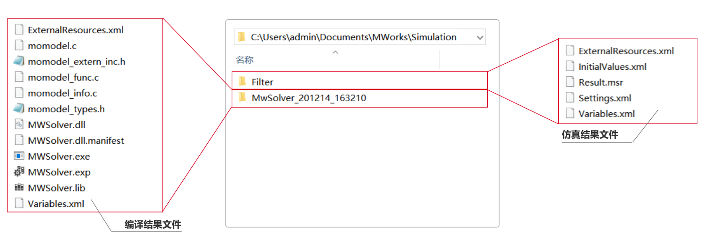
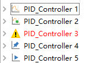
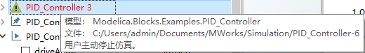
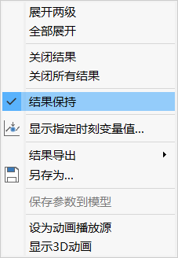
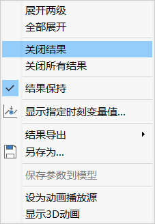

# 仿真实例管理

为了避免自动生成的结果目录占用过多的磁盘空间，在**仿真浏览器**上，默认允许保留2个实例（**仿真设置**  > **输出**中可修改保留数目）。仿真实例数目达到上限时，生成的新实例将覆盖先前的仿真结果。

### 实例目录结构

MWorks 采用结构化的目录层次来管理不同模型相关的仿真实例，并约定将 C:\\Users\\{User}\Documents\MWorks\Simulation 作为仿真结果文件的默认存储目录。缺省情况下，所有模型的仿真结果文件均位于该目录之下，并采用两级目录来管理不同模型与不同实例相关的仿真结果文件。

- 一级目录
  - 多个子文件如Filter、Filter-1，存放生成的仿真结果
  - 编译结果文件，文件夹名称形如“MwSolver_201214_163210”,其中”201214_163210“为软件启动的时间，根据实际情况发生变化。
- 仿真结果二级文件
  - 外部资源文件数据(ExternalResources.xml)
  - 参数初值数据(InitialValues.xml)
  - 求解结果文件(Result.msr)
  - 求解选项文件(Setting.txt)
  - 变量文件(Variable.xml)
- 编译结果二级文件
  - 外部资源文件数据(ExternalResources.xml)
  - 模型相关的C文件(momodel.c等)
  - 求解器调用的动态链接库文件(MWSolver.dll)
  - 可执行的求解器文件(MWSolver.exe)
  - 变量文件(Variables.xml)

> **提示：**目录中的编译结果文件，所有模型共用，每执行一次编译，覆盖更新一次。

### 添加仿真实例

 可通过以下两种方法向仿真浏览器中添加仿真实例：

1. 仿真模型

   仿真模型，**仿真浏览器**中创建以当前仿真模型的实例。

2. 打开仿真结果文件

   在**仿真浏览器**工具栏中点击，弹出窗口中选择本地的仿真结果文件，该仿真结果文件被加载至**仿真浏览器**中，并生成仿真实例。

   通过本地文件添加的仿真实例默认为状态。

### 仿真实例标签

在仿真实例（根节点）前有不同的标签，标识实例不同的情形。

- ：常规状态，在执行新的仿真时，若仿真结果数量超过上限（**仿真设置**  > **输出**中可修改保留数目），则删除该结果。
- ，该实例中存在被绘制曲线的变量。在新的仿真时，该实例也将自动保留，不会被删除，除非取消变量的选择状态。

- ，编译或仿真失败的实例，将鼠标放置在警告图标上，显示失败信息。

- ，在执行新的仿真时，该实例将永远不会被自动删除。在实例上下文菜单中，可以通过修改**结果保持**勾选状态，来决定实例是否保留。

- ：该实例为动画播放源。

若实例中同时含有以上多个情况，实例仅显示优先级最高的标签，各标签显示的优先级为 >  >  > > 。

### 保存仿真实例

模型仿真后，系统自动将仿真结果保存在**工具**标签页的**选项** > **环境** > **系统目录**的仿真结果目录里。

[另存为](#/forthExample/OperationPanelContextMenu/SimulationBrowser?target=SimulationBrowser_Saveas)操作支持将当前仿真实例保存到指定的目录。

### 移除仿真实例

移除操作支持从仿真浏览器中移除仿真实例。

在**仿真浏览器**中，右击需要移除的实例节点(根节点)，在上下文菜单中选择**关闭结果**，仿真浏览器将移除该实例，资源管理器中仍保留该实例的结果文件。

若在上下文菜单中选择**关闭所有结果**，则仿真浏览器内所有的仿真实例均会被移除。

​                