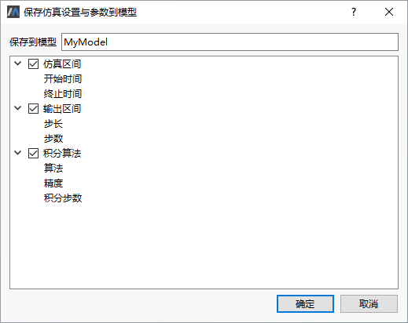

# 仿真设置-常规

切换到**仿真**标签页，单击，弹出**仿真设置**对话框，弹窗默认显示**常规**标签页。

- 开始/停止时间

  仿真开始/停止的时间。终止时间必须大于开始时间。

- 步长：

  仿真输出点之间的间隔长度。

- 步数：

  仿真生成的输出间隔的数目，与区间长度的关系为：”步长×步数=（停止时间-开始时间）” 。

- 算法：
  
  指定用于仿真的算法，有**17** 种不同的算法可供选择。
  
  - Dassl：一种变步长和变阶算法，使用一个向后微分公式法。
  - Radau5：一种变步长定阶算法，适用于求解刚性问题。
  - Dop853：基于Dormand-Prince的一种8(5, 3)阶显式龙格-库塔方法，是变步长单步方法。
  - Dopri5：基于Dormand-Prince的一种5(4)阶显式龙格-库塔方法，是变步长单步方法，适用于非刚性问题，算法能检测到类刚性问题并发出警告。
  - Mebdfdae：使用的是改进的扩展BDF方法，用于求解具有刚性初值的大型稀疏系统，是常微分方程系统(ODE)初值问题、线性隐式微分代数方程系统(DAEs)的求解器，MEBDF具有更好的稳定性和高阶收敛性，但需要更多的计算。
  - Mebdfi：是MEBDF求解微分代数方程的一个扩展方法，能有效处理刚性问题，适用于指标不大于2的DAE系统。
  - Lsode：是常微分方程(ODE)，可处理刚性/非刚性问题。
  - Lsodar：是LSODA算法的一个变种，增加了rootfinding特征，所以支持事件定位。
  - Cvode：一种变步长变阶的多步方法，是刚性/非刚性常微分方程系统(ODE)初值问题的求解器。
  - Ida：一种隐式变步长方法，是微分代数方程系统(DAE)初值问题(IVP)的通用求解器，IDA包含rootfinding特征，支持准确的事件定位。
  - Euler、Rkfix2、Rkfix3、Rkfix4、Rkfix6和Rkfix8：适合实时仿真的固定步长的算法，仿真区间控制步长，同时也控制仿真结果的输出值的数目。
  - ModifiedEuler：是定步长算法，相较于显示Euler法有更高的精度。
  
- 误差：指定每个仿真步长的局部精度，最终（全局）的错误是由每一步的错误通过某种方式累积而成的。

- 积分步长：选择Dassl 和Radau5 时为初始积分步长，选择Euler 和Rkfix 时为固定积分步长。

其中，停止时间与算法可在Ribbon菜单栏的仿真标签页快速修改

### 步长设置

MWorks.Sysplorer在求解设置中对输出步长与积分步长进行了明确区分。其中，输出步长是指仿真结果存储的时间间隔，对应图中输出区间的步长，即每隔1个区间步长的时间存储或输出一次结果。输出步长在联合仿真时也称通讯步长。

对于变步长算法（Dassl与Radau5），积分步长实则为初始积分步长，即算法启动第一步的积分步长。初始积分步长默认为自适应，默认值参照Dassl算法中的设置取输出步长（输出区间步长）的千分之一，在如图所示设置中，初始积分步长为2e-6。通常情况下，用户不需要显式设置初始积分步长，采用自适应默认值即可。在如下两种情况下，建议尝试调整初始积分步长。

1. 事件很多导致积分算法频繁重启，尝试增大初始积分步长。

   变步长算法为保险起见，通常默认采用较小的初始积分步长，使得默认设置可以适应于大多数模型的求解，而非采用较大的初始积分步长，但经常第一步即求解失败。较小的初始积分步长在积分频繁重启时，显著影响求解效率。此时，在保证模型可成功求解的情况下，可尝试增大初始积分步长。

2. 积分算法第一步即求解失败，尝试减小初始积分步长。

   对一些仿真启动阶段高刚性或快变的模型，采用默认初始积分步长可能求解失败，此时尝试减小初始积分步长。

对于定步长算法，积分步长即为积分算法每步积分计算所采用的步长。要求积分步长为输出步长的整数分之一，故而界面中提供积分步数设置，如图所示。积分步数是指每个输出步长需要的积分步数，默认值为1。

在如图设置情况下，积分步长也为0.002秒。通常情况下可采用默认积分步数设置，即输出步长与积分步长相等。但在步长太大导致求解失败，或步长太小导致结果文件太大的情况下，可调整积分步数设置。

### 误差设置

在采用定步长积分算法的情况下，误差设置只影响非线性方程求解。若模型中没有非线性方程，则求解设置中的误差对模型求解无用。在采用变步长积分算法的情况下，误差设置既影响积分计算，也影响非线性方程求解。

误差默认设置为0.0001。除非采用默认设置求解失败，否则不建议加大误差设置以降低求解精度。

在此需要特别指出的是，变步长积分算法一般基于局部误差估计判定积分收敛性。局部收敛不意味着全局收敛，但全局收敛性判断因计算量超大而失去实用价值，这也就是现行通用积分算法采用局部收敛性判断的根本原因。因此，对于变步长积分算法，采用不同误差设置可能出现结果严重不一致情况。尽管这样的情况较少出现，但确实存在，包括AIT SED库与标准库中的少数模型出现过这种情况。

另外，对于定步长积分算法，能成功求解并不一定意味着求解结果收敛。

针对以上情况，给出如下建议。

1. 采用定步长积分算法，先采用较小的积分步长计算一个参考结果，再基于参考结果选择合适的步长，以保证较快的求解速度。

   因为只要积分步长足够小，定步长算法理论上是全局收敛的。但问题在于对一般问题，积分步长应该小到何种程度无法得知。一种比较有效的做法是，缩小1-2次步长，而目标变量曲线没有明显变化，那么求解结果很大可能是收敛的。

2. 采用变步长积分算法，逐次将求解精度提高1个数量级，直至目标变量曲线无明显变化或求解失败。在结果稳定（更高的精度设置不会导致明显变化）情况下，选用较低的求解精度，以保证较快的求解速度。

### 保存到模型

对于可修改的模型，可以将**仿真设置**中的**常规**设置保存到模型中。

点击**仿真设置**对话框中的**保存到模型**，弹出保存仿真设置

