# 变量操作

仿真浏览器的变量树包含了实例的所有变量与参数，显示内容包括变量的名字、值、单位以及描述信息。

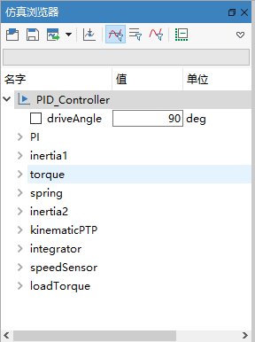

### 显示变量曲线

当模型实例求解结束，可以利用曲线窗口查看变量曲线，以直观地了解变量随时间的变化规律。

- 从**仿真浏览器**中勾选变量

  展开damper组件使得phi_rel变量节点可见，单击phi_rel变量节点前的方框或变量名，立即在当前曲线窗口中显示出变量曲线。

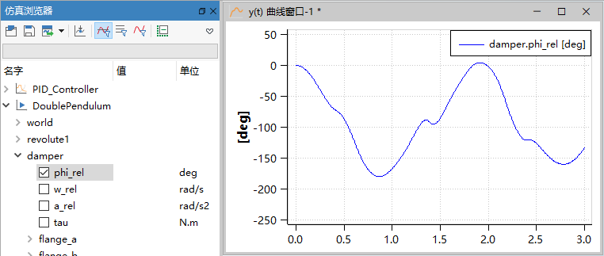

MWorks支持在变量浏览器中一次选中或取消选中多个变量。先选中变量damper.phi_rel，然后按下Shift键，选中变量tau，组件damper中从phi_rel到tau之间的所有变量均被选中，单击任意一个选中变量前的方框或变量名，所有被选中的变量曲线全部显示当前曲线窗口。

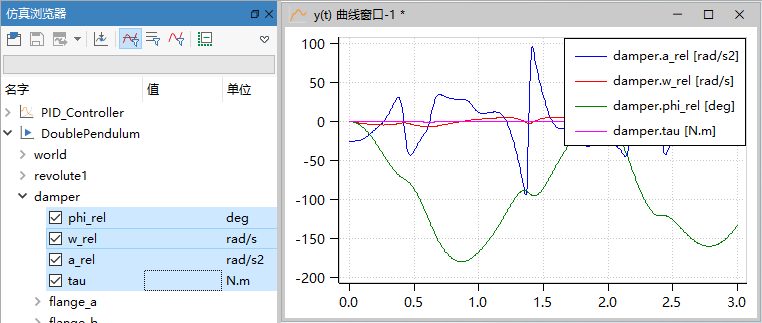

- 从**仿真浏览器**中拖拽变量             

  从仿真浏览器中选中变量，鼠标长按拖拽变量节点至曲线窗口，系统立即在该曲线窗口中显示出变量曲线。当变量节点的拖拽终点不在曲线窗口内时，系统将创建Y(time) 曲线窗口，并将该变量曲线添加至该曲线窗口。

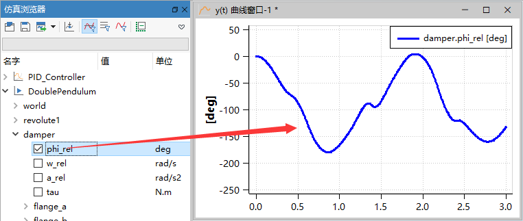

> **提示：**如果变量节点前的方框中有“√”，表示当前曲线窗口中包含该变量，即仿真浏览器中变量的勾选状态与当前曲线窗口显示的变量曲线有关。

### 删除变量曲线

在**仿真浏览器**上取消变量前的勾选或者使用曲线窗口上下文菜单**删除所选变量**，可以删除曲线窗口中的变量曲线。使用曲线工具中的**清空当前子窗口**，可清空当前曲线子窗口中所有变量曲线。

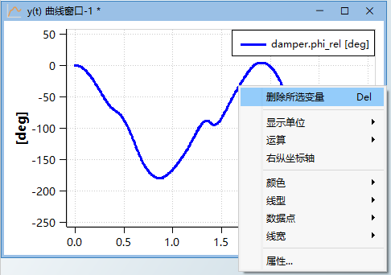

### 过滤变量

**仿真浏览器**上默认显示仿真实例的所有参数与变量，**仿真浏览器**工具栏中提供过滤变量和参数操作选项，对**仿真浏览器**上的所有实例生效。

- 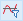，显示实例中的所有变量和参数；
- 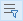，仅显示参数；
- 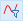，仅显示变量。

### 查找变量

对于结构复杂的模型，其组件层次较深，直接在**仿真浏览器**中定位变量并非易事。为此，MWorks提供变量查找功能。

下面以变量damper.tau为例介绍查找功能的使用方法。

在查找输入框中输入“tau”，此时不含字符“tau”的组件和变量节点被排除，仅保留符合搜索条件的组件和节点。

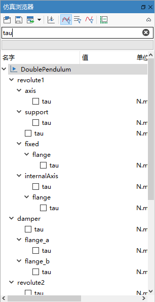

### 保存变量数据

模型实例求解成功之后，模型中所有变量的数据保存在MWorks自有格式的结果文件中。用户可以通过点击或变量树上下文菜单中的**另存为**，将仿真结果保存到指定目录。

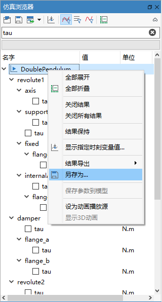

为方便用户获取变量数据，系统提供了数据输出接口，允许将多个**变量数据导出**为文本文件(.csv)和Matlab文件(.mat)，以支持外部其他应用程序访问结果数据。

由于不同的模型实例其仿真区间和步长存在差异，MWorks约定以模型实例为单位导出变量数据。

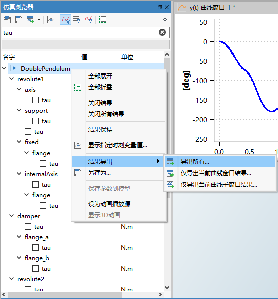

点击工具栏上的，或模型实例的根结点上右击鼠标，弹出上下文菜单中选择**结果导出**，提供三种导出选项。

- All，导出实例中所有的变量结果，支持MAT格式。
- Only Plot Window，导出当前曲线窗口中该实例的变量结果，支持MAT、CSV without unit、CSV with unit格式。
- Only Current Sub Plot，导出当前曲线子窗口中该实例的变量结果，支持MAT、CSV without unit、CSV with unit格式。

为避免仿真区间和时间步不一致产生的数据差异，保存变量操作约定只输出该模型实例中显示于当前曲线窗口的原有变量，不包括经过曲线运算之后得到的结果变量。

下图显示了使用Microsoft Excel 打开保存的表格文件(CSV with unit) 内容，其中包括时间Time和其他三个变量。                       

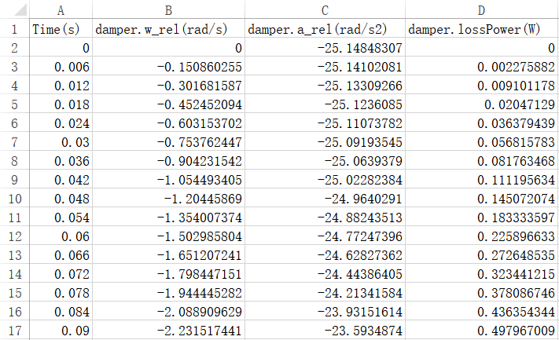

### 变量时间点

**仿真浏览器**中的参数和变量节点缺省只显示参数值，使用**设置变量时间点**功能，可以查看所有变量在指定时间点的数据。

**仿真浏览器**上实例、组件或变量的右键菜单中选择**设置变量时间点**，在弹出的对话框中键入指定的时间点数值。

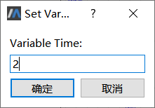

键入的时间点不应超出模型仿真区间，即不小于开始时间，也不大于停止时间，否则该选项无效。

键入的时间点不是输出时刻，系统按照就近原则自动获取最近输出时刻的变量值。

在该窗口中输入2，点击按钮**确定** 。由于2不是输出时刻，系统自动选择并在**仿真浏览器**上显示最近输出时刻1.998的变量值。

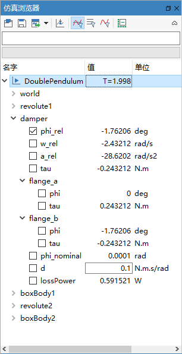

### 保存参数到模型

通过[修改参数](#/forthExample/BasicSimulationSteps/ChangeParameters)，可以无需再次编译，直接进行仿真并生成新的仿真结果。

如果模型可修改，可以在模型实例的根结点上右击鼠标，弹出上下文菜单中选择**保存参数值到模型**，弹出参数保存对话框。

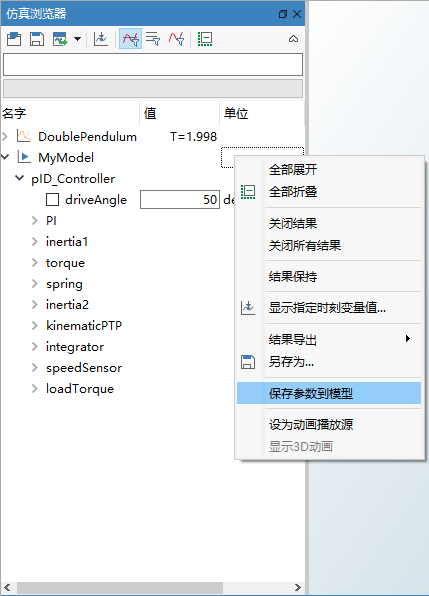

在参数保存对话框中，用户可以勾选要保存的参数，点击确定，将参数保存到模型中。

> **提示**：对话框中的参数值是按国际标准单位显示的。

### 选择显示单位

**仿真浏览器**上，**单位**栏显示出变量的“displayUnit”属性。点击后，弹出的下拉列表中显示出候选的显示单位。选择新的显示单位后，系统自动将**仿真浏览器**上的变量结果换算成显示单位进行显示。

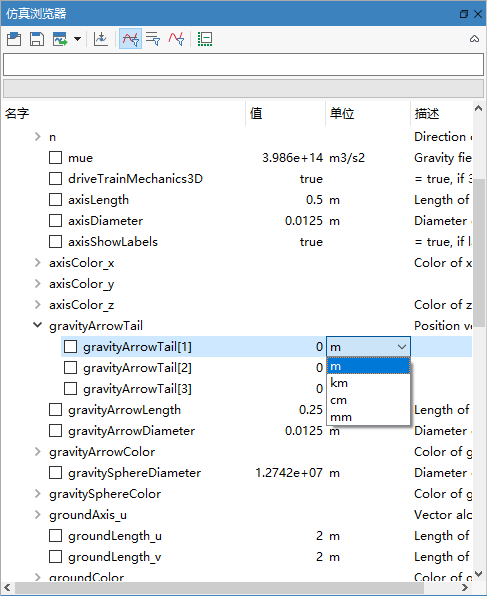

