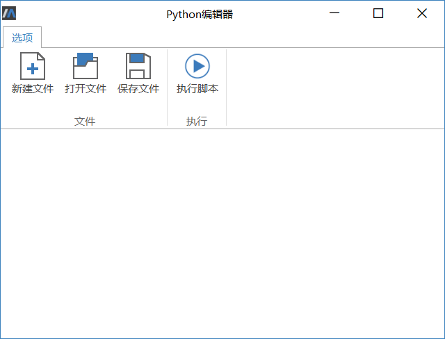
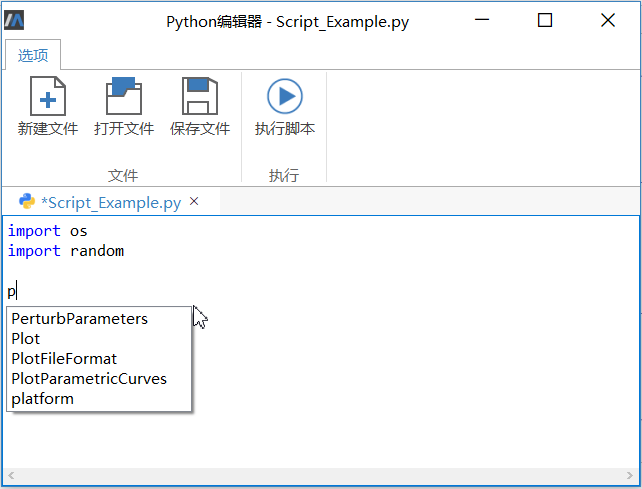

# Python编辑器

在**工具**  > **应用** 中点击**运行脚本**，即可打开Python编辑器。

### 选项栏

- 新建文件

  点击后新建空白的Python脚本。

- 打开文件

  从本地打开.py文件至编辑器，此时脚本内容将显示在下方的文本编辑区内。

- 保存文件

  将当前脚本保存至本地。

- 执行脚本

  执行当前脚本

### 编辑文本

新建文件或打开文件后，可在文本编辑区内对当前脚本进行编辑，编辑器提供编码助手功能，提高编辑效率。

Python编辑器内编码助手提供的函数使用方法详见[Python脚本命令](#/forthExample/Command/PythonScriptCommand)。

