# 功能介绍

**频率估算**窗口界面布局如下图所示。

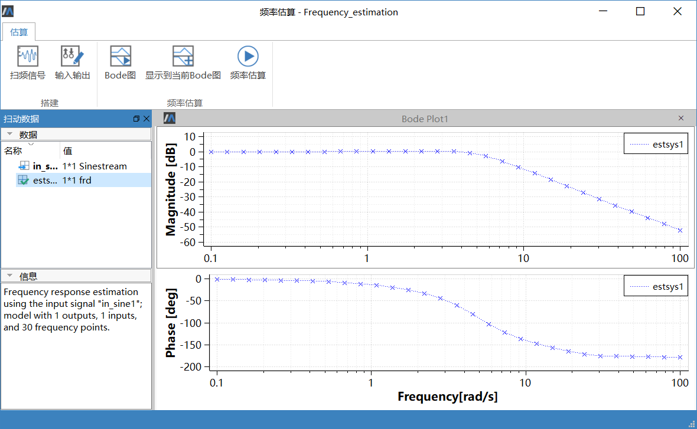

- 工具栏：
  - 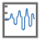 ：打开创建输入信号窗口；
  -  ：打开编辑模型输入输出窗口
  -  ：估算并在新的曲线窗口中绘制Bode图；
  -  ：当前有曲线窗口时激活可用，估算并在当前曲线窗口生成Bode图；

  - ：估算，只生成结果；
- 数据窗口：显示创建的输入信号和生成的结果；

- 信息窗口：输出相关信息；

- 曲线窗口：以曲线形式显示生成的结果文件。

### 创建扫频信号

1. 点击工具栏按钮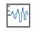 ，弹出**创建扫频信号**窗口，设置**变量名**、**频率单位**、**稳态点**、**频率**及其**参数值**。

   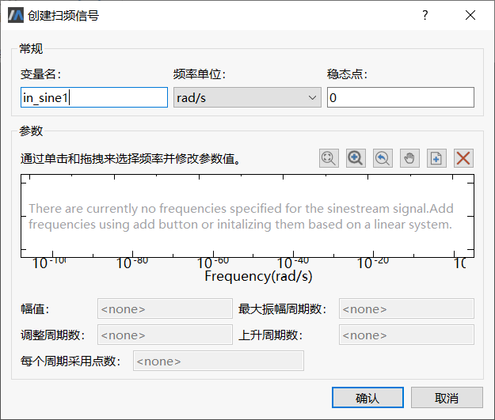

   - 变量名：输入信号的名称，确定后显示在数据子窗口下，若与当前存在的输入信号同名则覆盖原有信号；

   - 频率单位：当前支持单位为rad/s 和Hz ；

   - 稳态点：频率的偏正；

   -  ：重置，频率曲线最佳显示；

   -  ：放大，在频率曲线窗口单击鼠标左键，以点击位置为中心放大曲线；

   -  ：缩小，在频率曲线窗口单击鼠标左键，以点击位置为中心缩小曲线；

   -  ：移动，按下左键，移动鼠标，视图随鼠标实时平移，松开鼠标中止本次操作；

   -  ：添加新频率，点击后弹出 “添加频率”窗口；

     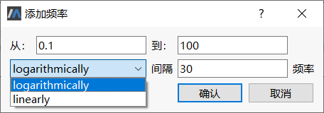

     - 当前添加频率窗口表示从10 到1000 以“对数”形式取30 个点；

     - 添加频率后再次打开可在当前取值基础上增加取值点；

     - Logarithmically 表示以对数形式取值；

     - Linearly 表示以线性形式取值。

   -  ：删除所选频率，在频率曲线中，可以选中单个，也可以通过框选选中多个数据点；

   参数值：设置选中频率的幅值、最大振幅周期数，调整周期数、上升周期数和每个周期采用点数。

   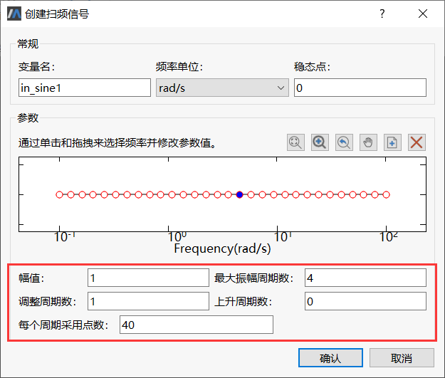

2. 设置完成后点击**确定**按钮，在数据子窗口下生成扫频信号。

   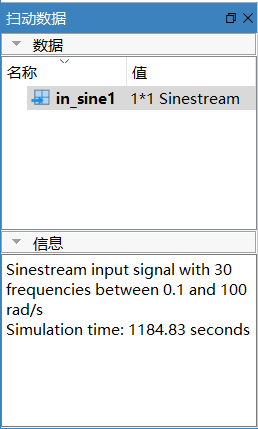

   > **提示：**双击数据子窗口下生成的输入信号可打开编辑窗口进行修改。

   数据子窗口的输入信号提供上下文菜单，如下图所示。

   

   - 设置当前：存在多个输入数据时，设置为估算时采用的输入信号。此时输入信号加粗显示；
   
   - 重命名：可对当前输入信号进行重命名，若重名则覆盖重名输入信号；
   
   - 删除：删除当前选中输入信号。

### 创建输入输出

点击工具栏按钮 ，弹出**编辑模型输入输出**对话框，对话框中显示模型所有的端口， 设置输入输出端口如下图所示。

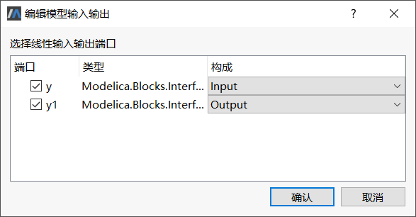

> **注意：**编辑模型输入输出时必须保证勾选一个Input 输入和一个Output 输出，否则点击**确定**按钮时会弹出错误提示。

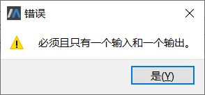

### 频率估算

点击工具栏按钮 进行估算。如下图所示。

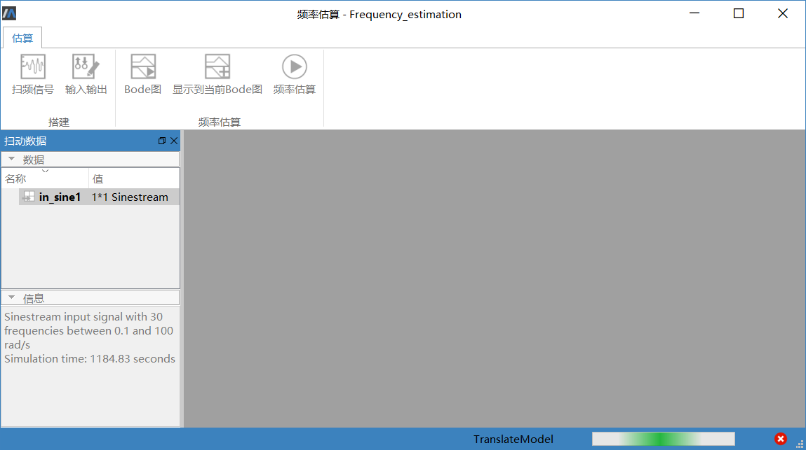

> **注意：**频率估算时除了扫频信号按钮，其他按钮置灰。

### 查看结果

1. 估算完成后，在**数据子窗口**生成默认名为“estsys1 ”的结果数据。

   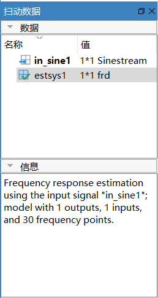

2. 双击节点 “estsys1 ”，可显示结果数据，如下图所示。

   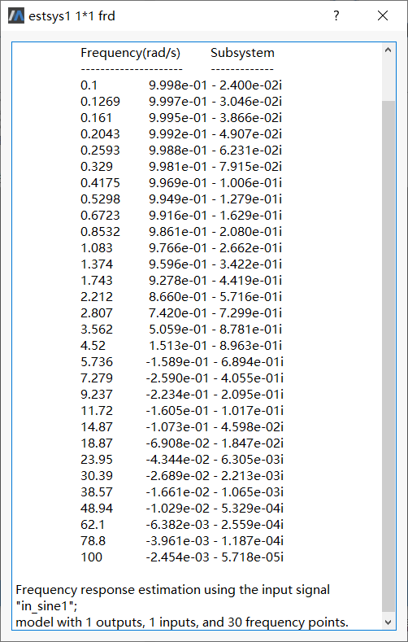

3. 右击节点“estsys1 ”，弹出上下文菜单。

   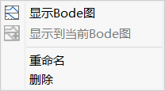

   - 显示Bode 图：打开新的曲线窗口并生成曲线；

   - 显示到当前Bode 图：在当前曲线窗口添加；

   - 重命名：可对当前生成的结果文件重命名，若重名则覆盖重名结果，曲线窗口删除覆盖的结果曲线；

   - 删除：删除当前结果文件。若Bode 图中只含有该结果的曲线，删除时Bode 图也会被关闭。

4. 选择**显示Bode图**，弹出曲线窗口并显示相应曲线，如下图所示。

   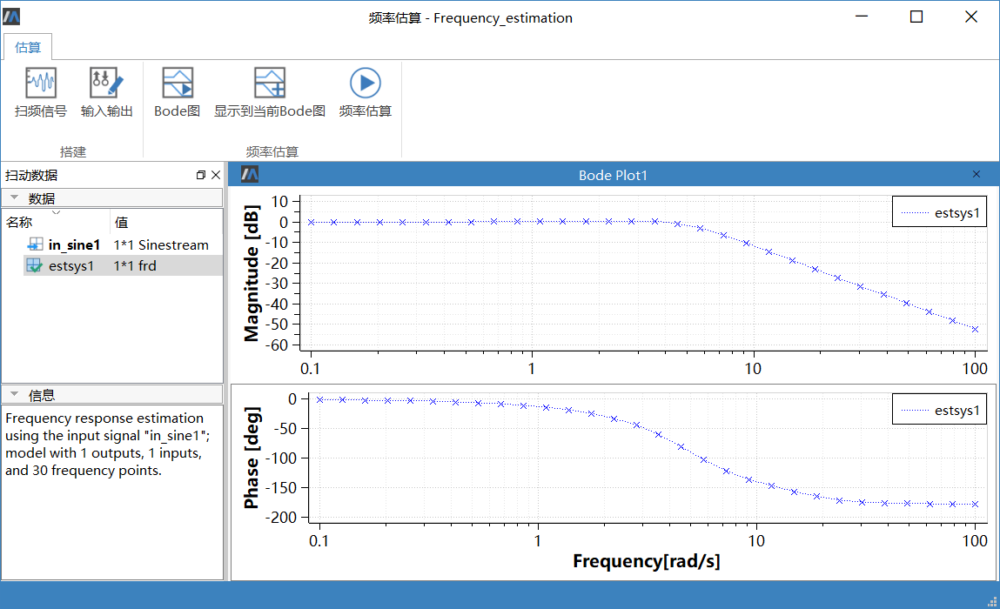

   频率估算的曲线窗口操作可参见 [曲线窗口交互操作](#/forthExample/SimulationOperation/InteractiveOperationOfPlotWindow) 。

   **曲线窗口**提供上下文菜单，如下图所示。

   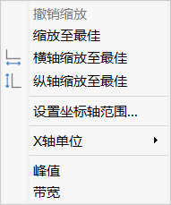

   “峰值”表示幅频特性中最大值；“带宽”表示-3db 处的频率值；

 