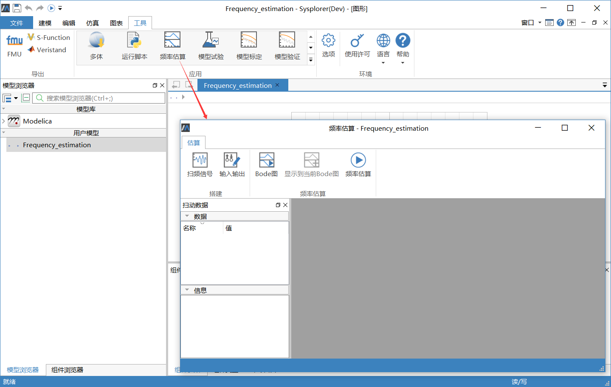
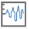
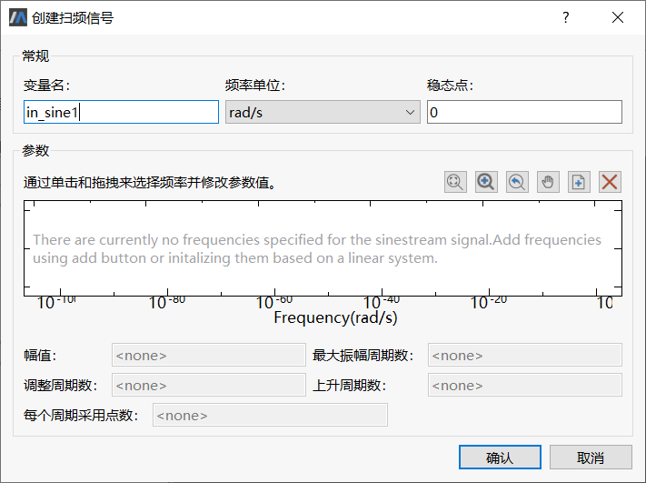
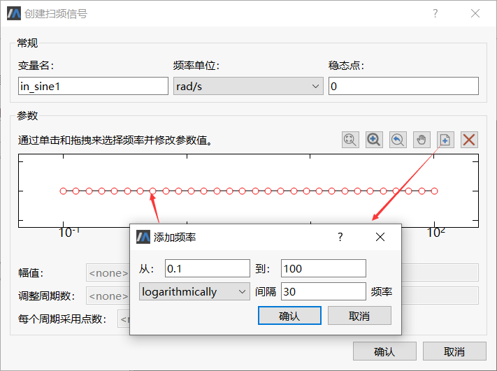
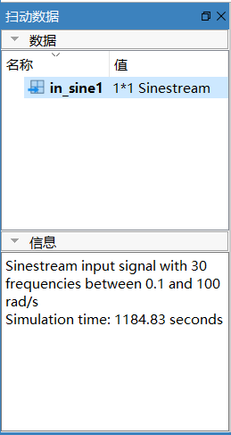
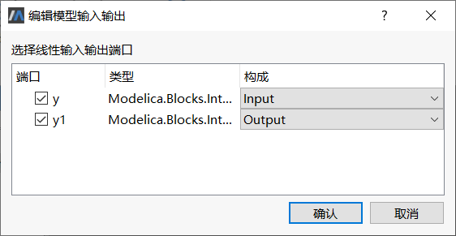
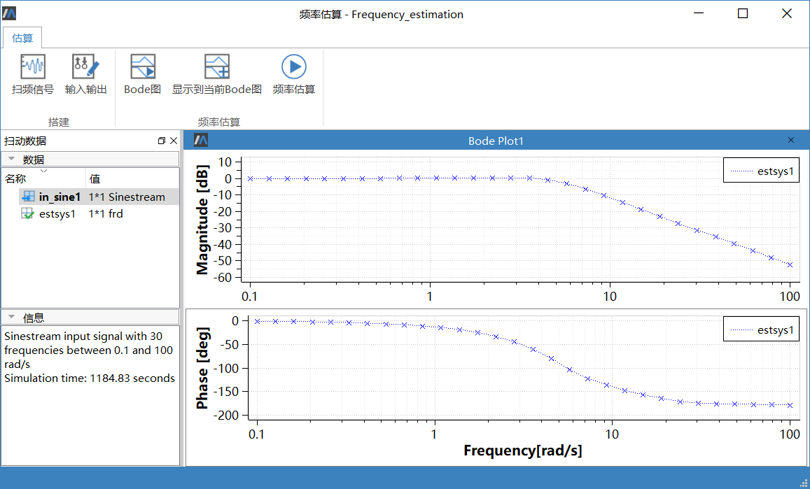

# 示例演示

本节以示例模型[Frequency_estimation](mworks://ref/static/Samples/Frequency_estimation.mo) 为例介绍频率估算的具体使用流程。

1. 加载标准库Modelica3.2.1 ，打开示例模型后点击菜单**工具** > **频率估算**弹出频率估算窗口。

    

2. 点击工具栏按钮 ，创建扫频信号。

    

3. 点击**创建扫频信号**对话框中的按钮 ，弹出“添加频率”对话框，采用默认值，点击【确定】按钮，添加的频率图如下所示。

    

4. 根据需要修改变量名、频率单位、稳态点和频率属性值，本例均采用默认值。点击**确定**按钮，添加的扫频信号“in_sine1 ”显示在**扫动数据**面板。

    

5. 点击工具栏按钮 ，弹出**编辑模型输入输出**对话框，勾选y和y1 ，并设置y 为Input ，y1 为Output 。点击**确定**按钮。

    

6. 点击工具栏中的按钮 进行估算，估算完成后自动显示曲线。

    
