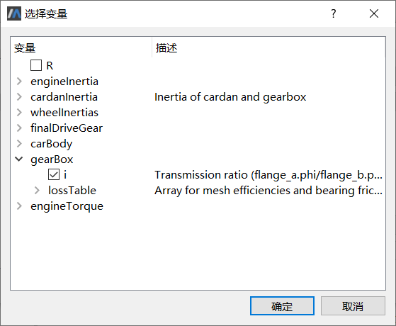

# 参数标定

模型标定是通过改变一些模型参数使得仿真结果变量与测量数据达到吻合。首先要解决的一个问题是，到底该调节哪些参数？除了可以使用MWorks.Sysplorer其他试验功能来分析参数变动对结果变量的影响，一般情况下可以考虑：哪些参数最不容易确定。

本例中，摩擦力等已被忽略，考虑到有些组件（gearBox、finalDriveGear）的效率损耗不太容易精确估算，有必要将其合并到一起来考虑。参考gearBox的类型“Modelica.Mechanics.Rotational.LossyGear”，可以选择组件gearBox的参数“gearBox.lossTable[1,2]”，合并考虑仿真模型的效率损耗。另外，发动机的扭矩（参数“engineTorque.tau_0”）对结果变量起决定作用，也可作为调节参数。
结合本例，下面先对模型参数标定的操作步骤进行介绍。

点击**工具** > **模型标定**，打开**模型标定**窗口。

- 源模型：选择将要进行模型标定的仿真实例，系统将自动调用与该实例关联的求解器。

- 调节参数：选择一个或多个进行调节的参数。显然，所选择的参数必须对结果变量有影响才是可行的，如果改变调节参数之后结果变量输出不变，参数标定将失败。

- 试验数据：浏览外部测量数据。

-  固定参数：选择一个或多个固定不变的参数。如果把模型的参数关联到具体的产品参数、运行工况选项等，这些参数在实际的物理场景中是保持不变的。

- 结果变量：选择一个或多个结果变量，并指定所关联的测量指标。这些变量将以曲线形式进行展示，从中可以直观地看出二者之间的差异。如前所述，模型仿真结果变量与对应的测量指标变量在各个测量时间点上残差的平方和作为模型验证准则，将该值的最小化作为参数标定的目标。

-  求解设置：设置求解起止时间、步长、算法、误差等选项。

- 选项：设置参数标定过程选项，例如收敛误差、最大迭代步数等。

下面结合SimpleCar模型详细介绍操作步骤（部分操作可参考模型验证）。

### 选择源模型

首先选择进行参数分析的仿真实例。“源模型”列表中显示了当前候选的仿真实例，当前实例“SimpleCar”缺省已被选中。

### 选择调节参数

1. 点击左侧属性页列表的**调节参数**，切换至**调节参数**属性页。

   

2. 调节参数来自仿真模型，通过交互方式进行选择。点击**选择**按钮，弹出**选择变量**对话框。

3. 按本例要求，从中勾选参数gearBox.lossTable[1,2]（变速箱效率损耗）和engineTorque.tau_0（发动机扭矩）。

   

4. 完成参数选择之后，点击**确定**回到调节参数属性页，在其中的列表框中显示出已选中的参数集。

   - 名字：即参数全名。为避免出错，限制不能修改参数名。
   
   - 是否生效：设置该参数是否要进行调节（缺省为true）。如果选择不生效（设为false），该参数在模型标定过程中视为固定参数（将调节参数设为不生效实际上改变了模型参数的缺省值，对应改变了模型的运行状态）。
   
   - 名义值：调节参数初始值，缺省来自仿真实例，允许修改。

   - 最小值：设置调节参数的下界，“－1e100”表示不作限制。

   - 最大值：设置调节参数的上界，“＋1e100”表示不作限制。
   
   本例中，调节参数“gearBox.lossTable[1,2]”和“engineTorque.tau_0”的名义值分别设为1.0和320.0，参数上下界均不作限制。
   
   > 提示：使用“上移”、“下移”按钮可以改变调节参数生效顺序；使用“删除”按钮可以去除多余的参数。

### 浏览试验数据

1. 点击左侧属性页列表的**试验数据**，切换至**试验数据**属性页。

2. 点击**选择**按钮，弹出**打开文件**对话框，选择“【安装目录】\Docs\static\Samples\Acceleration _measurements.csv”（如前所述），系统读取测量数据并显示于列表框中。

   

3. 其中列出了包含“时间（time）”在内的所有变量。注意，为了后续在采样时间点上进行计算，要求测量数据文件中必须包含时间数据，并且变量名必须为“time”。

### 选择固定参数

1. 点击左侧属性页列表的**固定参数**，切换至**固定参数**属性页。

2. 点击**选择**按钮，弹出**选择变量**对话框。

   注意不同的运行工况需要不同的参数设置，对于状态变量，还需要设置对应的变量初值。回顾本文模拟的运行时间区间为3.8—6秒，此时第2级齿轮处于啮合状态，需要设置汽车在3.8秒时的初始速度（变量初值已设定）以及第2级齿轮的传动比，因此本例选择参数gearBox.i（传动比）。

   

   注意，选择变量对话框与MWorks.Sysplorer**仿真浏览器**面板中的显示内容不同，这一步中只列出允许修改的参数（非独立参数和非参数节点已排除）。

3. 完成参数选择之后，点击**确定**回到**固定参数**属性页，在其中的列表框中显示出已选中的参数集。

   

   - 名字：即参数全名。为避免出错，限制不能修改参数名。
   
- 值：固定参数值，缺省来自仿真实例，允许修改。注意，如果此处“值”表示变量初值（start），那么该值必须与求解选项中的“开始时间”相关，对应求解开始时刻的数值。
  
   本例中，gearBox.i设为2.34。

### 选择结果变量

1. 点击左侧属性页列表的**结果变量**，切换至**结果变量**属性页。

   

2. 结果变量同样来自仿真模型，点击**选择**按钮，弹出**选择变量**对话框。

3. 本例中选择“carBody.a”作为输出变量，注意这一步的树形列表中不显示参数。

   

4. 完成选择之后，点击**确定**回到结果变量属性页，在其中的列表框中显示出已选中的变量集。

   

   设置加速度指标“acc”与之关联，二者在仿真区间内各个测量时间点上残差的平方和将作为验证准则，该值的最小化作为参数标定的目标。

### 设置模型求解选项

点击左侧属性页列表的**结果变量**，切换至**结果变量**属性页。

本例中，求解起止时间设为3.8—6秒，步数设为1100，误差设为0.001，步长与积分算法等取缺省选项。

### 设置参数标定过程选项

点击左侧属性页列表的**选项**，切换至**选项**属性页。

- 相对误差：作为迭代收敛误差，该值范围为1e-8—0.1，缺省值为1e-3。

- 最大迭代次数：不能小于10，缺省为100。

- 分步显示迭代信息：缺省true，这样，在迭代过程中输出栏将显示参数变动细节，同时给出仿真结果变量与测量指标在各个时间点残差的平方和（即验证准则）。

- 分步显示曲线变化过程：缺省true，每当调节参数变化时，系统自动运行源模型对应的求解器，并动态显示仿真结果变量与测量指标的时变曲线，从中可直观了解二者之间差异的变化情况。

参数配置完成，点击**保存**按钮将本次参数配置结果保存为外部脚本文件，供后续操作“检查参数灵敏度”复用。

### 查看模型标定结果

点击**确定**按钮执行模型标定，经过15次迭代之后得到结果。

1. **曲线窗口**中显示了仿真结果变量以及与其关联的测量数据在仿真区间内的变化趋势，其中，绿色曲线表示测量指标“acc”，红色曲线和蓝色曲线表示当调节参数在标定前后分别对应的仿真数据“carBody.a”。

2. 在**输出窗口**中给出了调节参数的最优解，gearBox.lossTable[1,2] = 0.78831；engineTorque.tau_0 = 268.458，以及对应的验证结果，∑(ysi-ymi)² = 0.243407 。如果选中了“分步显示迭代信息”，在迭代过程中输出栏还将显示参数变动细节，同时给出仿真结果变量与测量指标在各个时间点残差的平方和（即验证准则）。

3. **仿真浏览器**中生成了模型标定之后的仿真实例“SimpleCar 1”，该实例中调节参数已设为其最优解， gearBox.i设为 “2.34”，可以从中观察模型其他变量指标在标定前后的差异情况。

4. 如果选中了“分步显示曲线变化过程”，每当调节参数发生变化，系统自动运行源模型对应的求解器，并动态显示仿真结果变量与测量指标的时变曲线，从中可直观了解二者之间差异的变化情况。

参数标定后的仿真模型在3.8—6秒内的结果曲线与测量数据达到最大程度上的吻合，参数标定得到期望的结果。

> 提示：由于模型参数对输出变量的影响是复杂多变的，适当改变模型结构或增加调节参数的数目，模型标定过程也许比较“巧合”地达到收敛，但是并不能保证这组参数能够适应其他仿真环境。因此，对于标定出的最优参数组合，应该使用另外一组测量数据进行验证，检查仿真结果与试验数据是否也趋向一致。