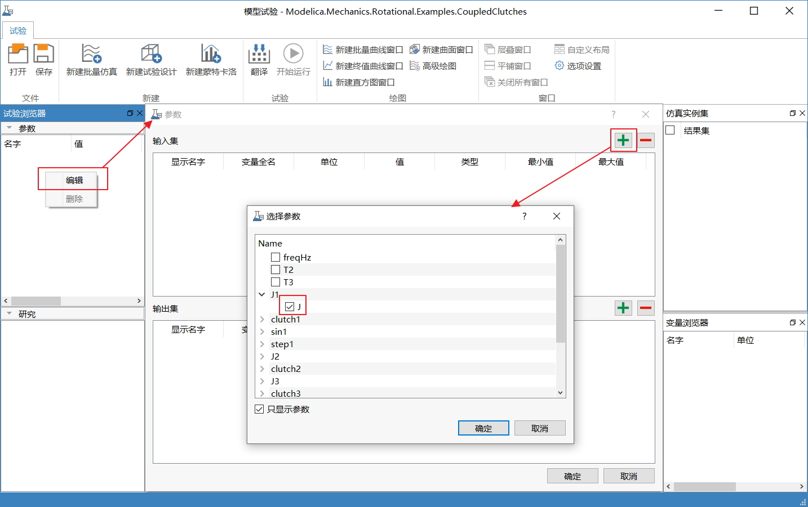
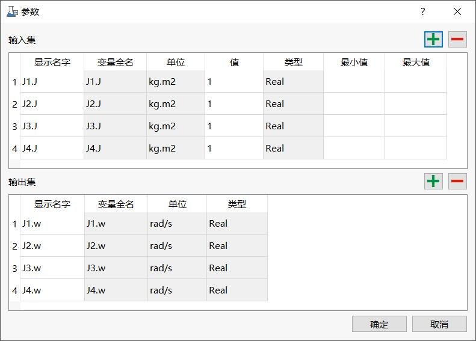
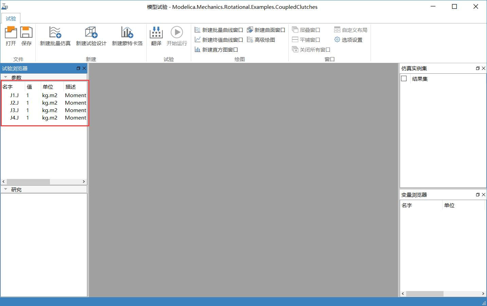

# 添加输入和输出集

在试验之前需对输入变量和输出变量进行定义。

在**参数**面板的上下文菜单中，选择**编辑**，弹出**参数**对话框。点击在弹出**选择参数**对话框中通过勾选的方式选择变量，变量来自源实例。

本例中选择J1.J、J2.J、J3.J和J4.J为输入变量， J1.w、J2.w、J3.w和J4.w为输出变量。

其中

- 显示名字：变量的别名，支持中文。

- 最小值/最大值：输入变量的最小和最大值，试验设计中的“水平”自动根据最小值和最大值生成初值。

点击**确定**，**参数**面板显示选定的输入集。

