# 批量仿真

首先介绍批量仿真，这是考察参数变动对系统行为影响的最简单方式。

在**研究**面板的上下文菜单选择**新建批量仿真**，或点击工具栏按钮弹出**新建试验**对话框，输入试验名称，本例中设置为“批量仿真”。点击**确定**后，在研究面板生成名为“批量仿真”的试验节点。

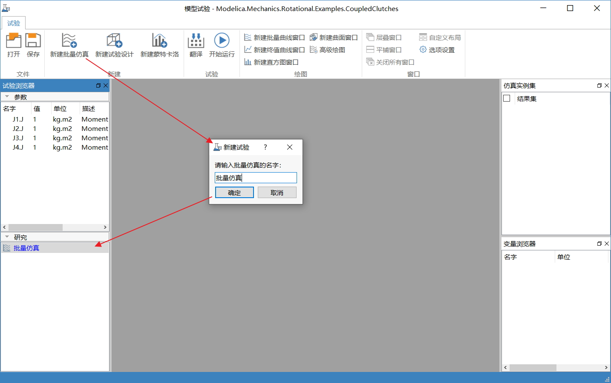 

在**研究**面板中，右击**批量仿真**试验节点，在上下文菜单中选择**编辑**，弹出**批量仿真**对话框，进行批量仿真和仿真选项设置。

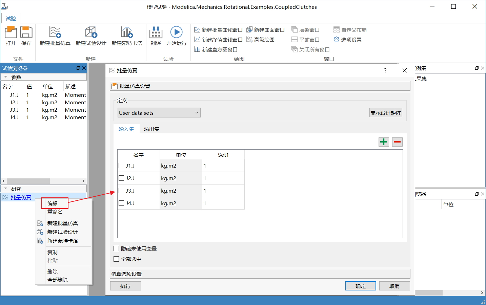

输入集有两种定义方式：User data sets 和Varying between 2 limits。设置输入集后，可以点击**显示设计矩阵**查看具体设计矩阵。

### UserDateSets

User data sets定义方式中，每个set对应一次仿真试验，点击，可以添加和删除set，本例中设置了4个set，如下所示。

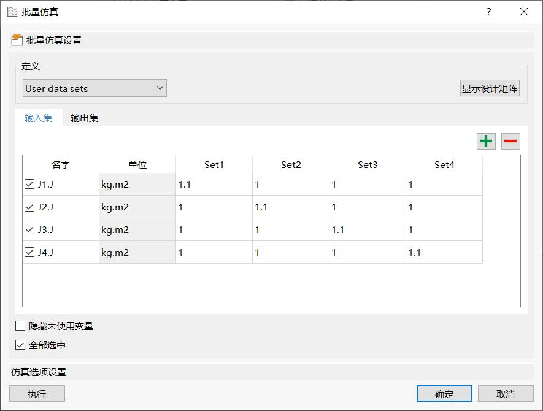

切换到**输出集**，勾选输出参数J1.w、J2.w、J3.w、J4.w。

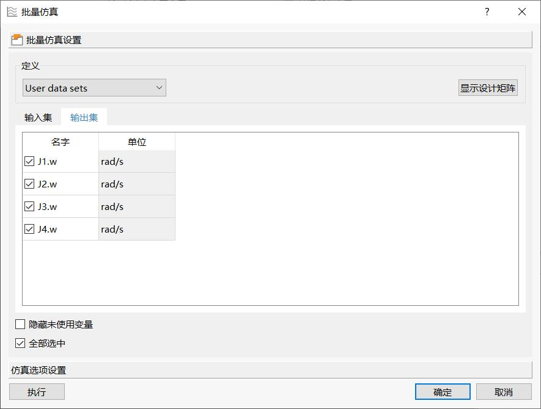

点击**仿真选项设置**，默认仿真设置来自源实例。本例中修改仿真区间开始时间为0，终止时间为1.2。

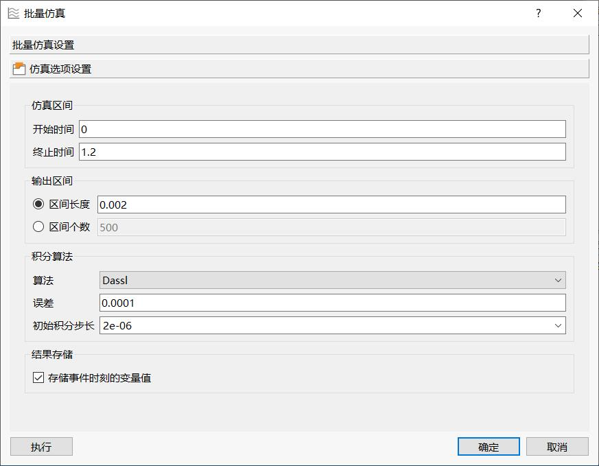

点击**执行**，根据批量仿真和仿真选项设置，进行批量仿真。**变量浏览器**面板显示每次的仿真运行进度。仿真结束后，**仿真实例集**生成4个结果实例(Result set)。

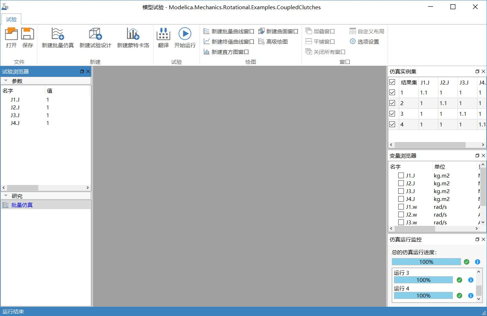

点击工具栏中的**新建批量曲线窗口**，新建批量曲线窗口，勾选仿真实例集中的实例(实例1-4)和变量浏览器中的变量J1.w，查看J1.w的结果曲线。

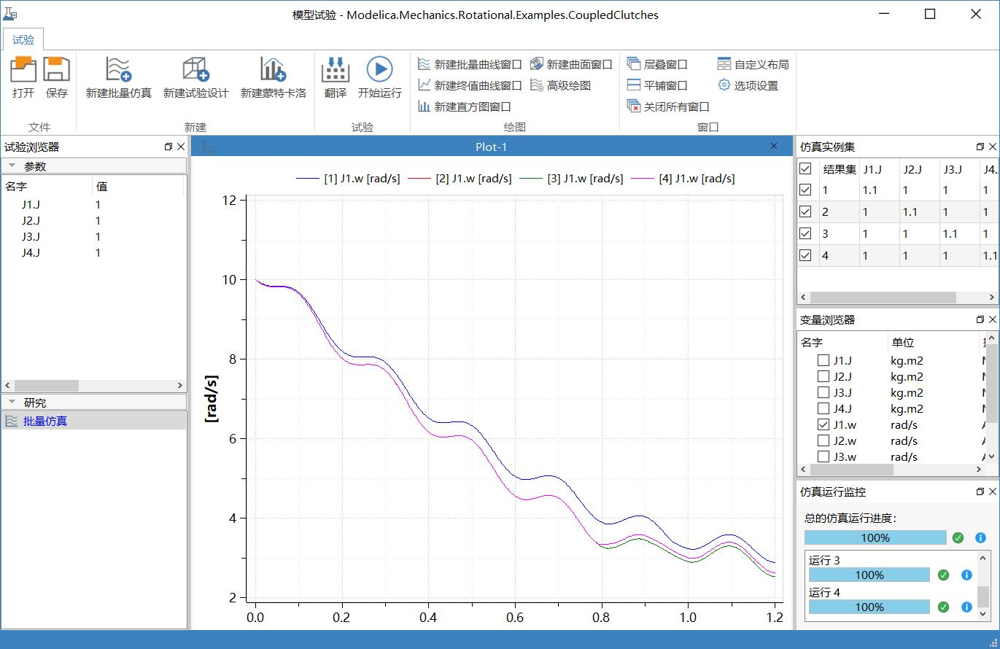

按照同样的方法查看结果J2.w、J3.w和J4.w曲线。点击工具栏中的**自定义布局**，设置窗口列数为1，定义**显示区**的布局。

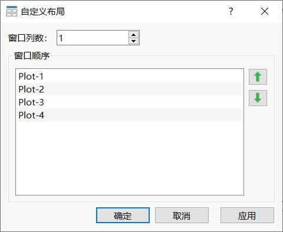

最终查看到如下结果。为方便观察对比结果变量的时序变化趋势，将结果变量分散到单独的Plot窗口中进行显示。本例有“J1.w”、“J2.w”、“J3.w”和“J4.w”共4个输出变量，故创建了4个Plot窗口显示其时序曲线。

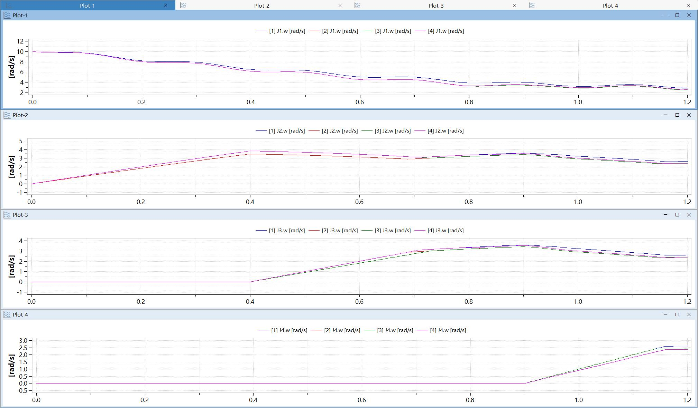

### VaryingBetween2Limit

Varying between 2 limits是根据设置步长、向下和向上点数，生成等距参数序列，进行批量仿真。

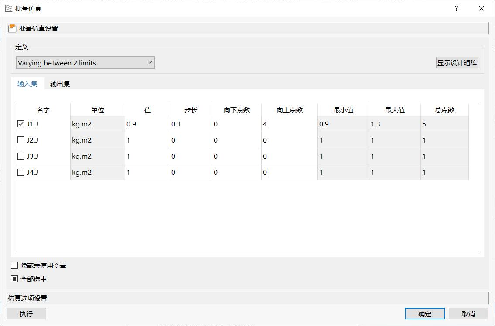

其中

- 值：参数名义值，缺省来自源仿真实例，允许修改；

- 步长：参数取值间隔

- 向下/向上点数：向下/向上取值的次数

- 最小值：变动最小值，最小值=值-(步长*向下点数)

- 最大值：变动最大值，最大值=值+(步长*向上点数)

- 总点数：参数序列长度，总点数=向上点数+向下点数+1

设置J1.J值为0.9，步长0.1，向下点数0，向上点数4，表示如下参数变动序列：0.9、1.0、1.1、1.2、1.3。其余设置不变。点击**执行**。

仿真结束后，点击工具栏中的**高级绘图**，勾选J1.J为X轴变量，J1.W为Y轴变量。

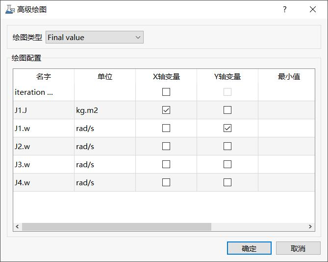

点击**确定**，绘制输出变量“J1.w”随输入参数“J1.J”变动时在求解结束时刻的变化趋势，从中可以直观地了解参数变动对系统行为的影响。

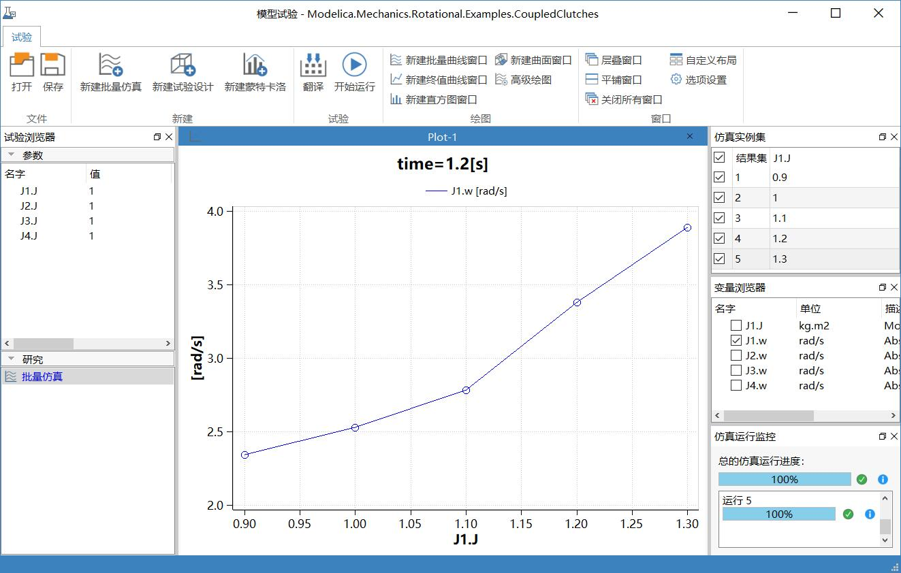

若同时有多个输入变量变动，则根据每个输入变量的变动序列全组合，进行仿真试验。

如下图所示，设置J1.J和J2.J值为0.7，步长为0.06、向下点数为0、向上点数为10。

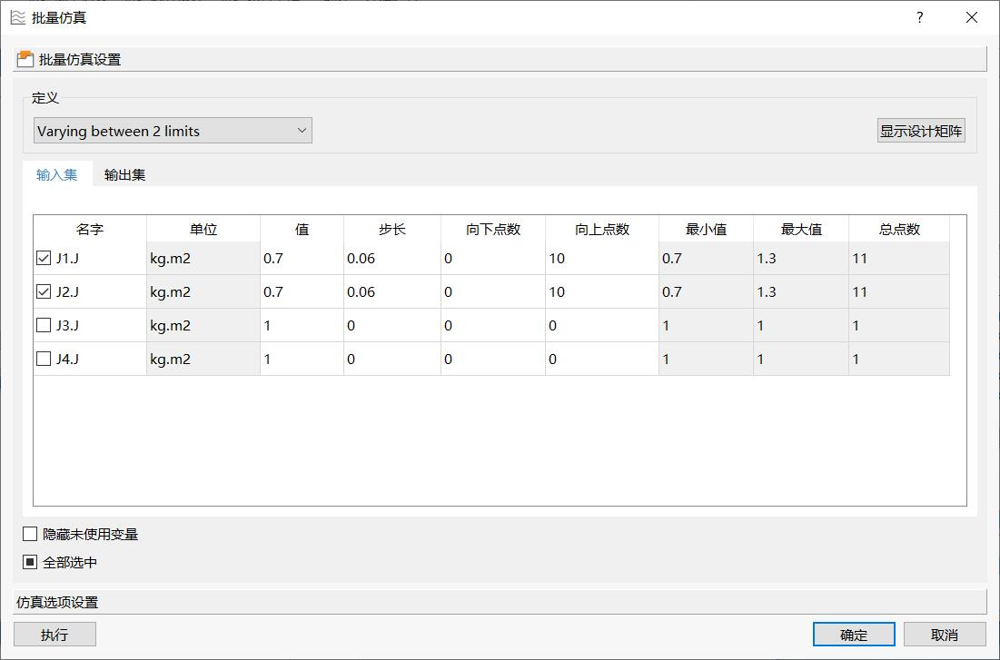

J1.J等距的变动序列为0.7、0.76、…、1.3合计11个数值。J2.J的设置与J1.J相同，将J1.J和J2.J的变动序列排列组合，生成11*11=121种参数变动方案，对应121次运行。如下所示。

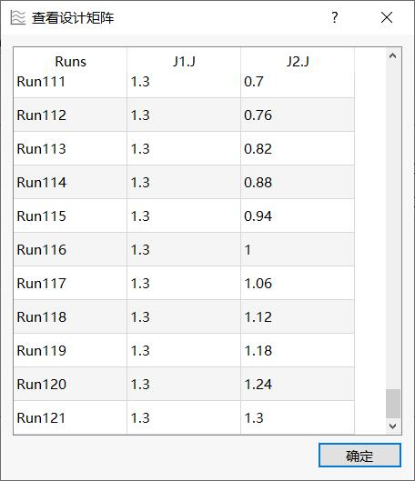

设置仿真区间为0-1.2，其余默认。执行仿真后，点击工具栏中的**新建曲面窗口**，绘制如下曲面。

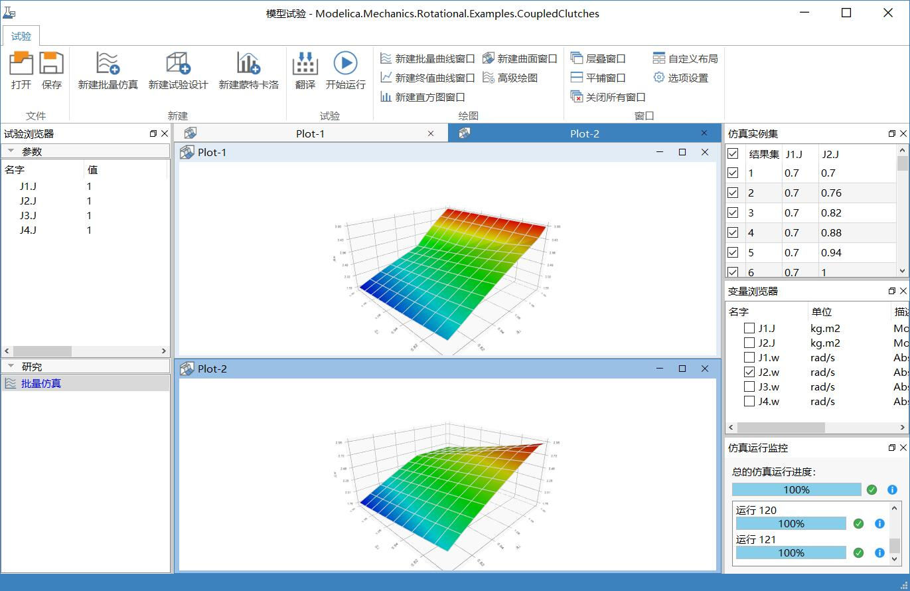

其中：

由于有2个变动参数各自独立变化，因此采用3D曲面表示输出结果比较合适。曲面窗口的X/Z轴坐标分别对应2个扫动参数（本例中为“J1.J”和“J2.J”，均从0.7渐变到1.3）；Y轴坐标表示输出变量随扫动参数变动时的特性值（即每次参数变动之后输出变量在求解结束时刻的数值）。

为方便观察结果变量特性值随着扫动参数的变化趋势，将结果变量分散到独立的Plot窗口中进行显示（例如在本例中展示的“J1.w”和“J2.w”的特性值曲面）。

 