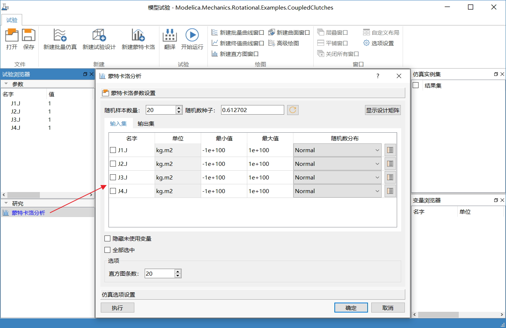
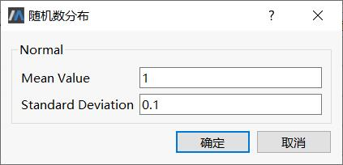
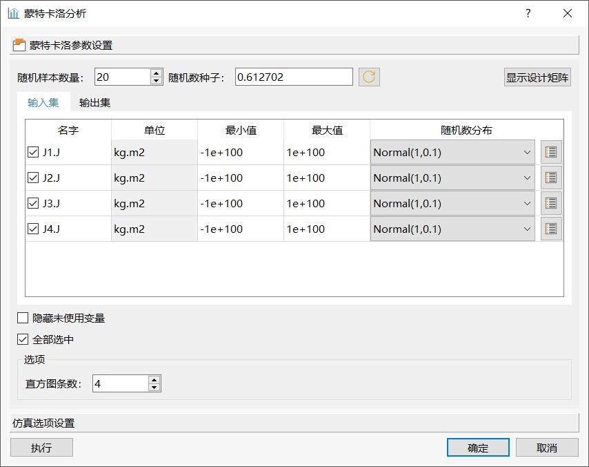
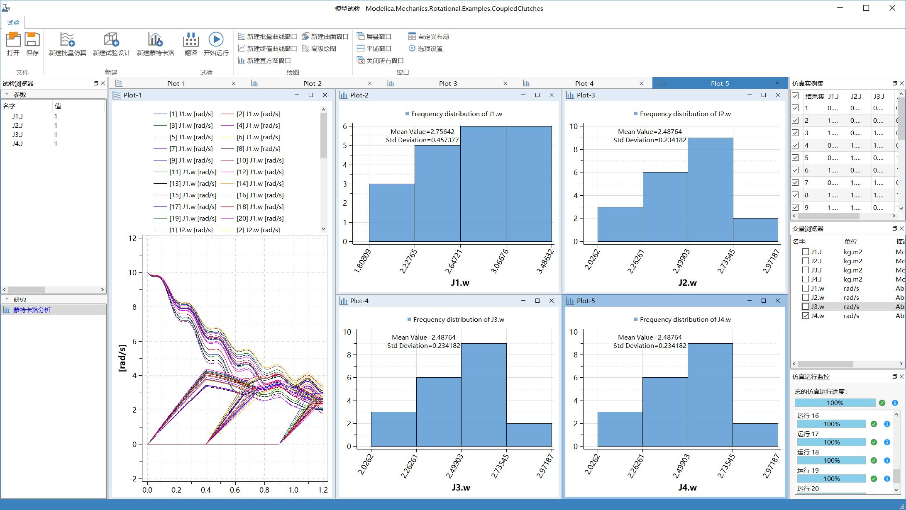
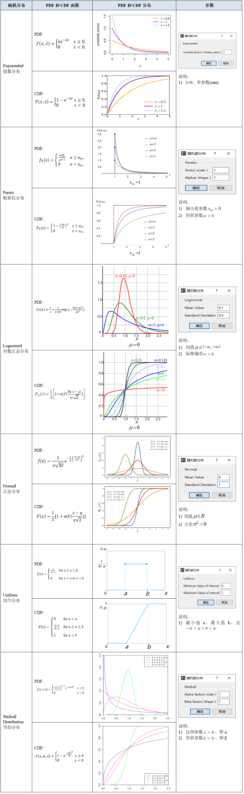

# 蒙特卡洛分析

蒙特卡洛分析广泛地用于研究当输入参数是多维时的模型行为。

### 示例演示

新建名为“蒙特卡洛分析”的试验节点。右击“蒙特卡洛分析”，在上下文菜单中选择**编辑**，弹出**蒙特卡洛分析**对话框，进行蒙特卡洛参数和仿真选项设置。

蒙特卡洛参数设置中的各参数含义为：

- 随机样本数量：运行次数。
- 随机数种子：随机数是由随机种子根据一定的计算方法计算出来的数值。所以，只要计算方法一定，随机种子一定，那么产生的随机数就不会变。初始种子为0.612702，若需更换，请点击按钮。
- 输入集
  - 最小值：设置进行随机变动时的参数下界，“－1e100”表示对参数下界不作限制。
  - 最大值：设置进行随机变动时的参数上界，“＋1e100”表示对参数上界不作限制。
  - 随机数分布：设置随机函数，定义参数随机变动序列。缺省为Normal，点击设置随机函数的参数值。

本例中设置随机样本数量为20，随机数分布为Normal(1,0.1)，直方图条数为4。

输出集勾选J1.w、J2.w、J3.w和J4.w，设置仿真开始时间为0，终止时间为1.2，其余默认。

设置完成后，点击**执行**，根据蒙特卡洛参数和仿真选项设置，进行仿真。仿真结束后，绘制如下曲线和直方图。

蒙特卡洛的输出结果

1. Plot-1显示20个随机样本变动后，J1.w-J4.w四个变量的变化趋势。

2. 其余4个直方图窗口，分别显示输出变量J1.w—J4.w终值落在每个区间内的频率分布。

### 随机函数

如前所述，不确定参数使用随机分布来模拟仿真模型所处的实际场景，为此MWorks蒙特卡洛提供了多个随机函数，用于产生服从不同分布的参数变量序列。

注意选用随机函数时，必须输入合适的参数值。各种函数的参数及其输入窗口，对应的概率密度（PDF，Probability density function）和累积概率（CDF，Cumulative distribution function）分布详见表 1‑3。

随机数的概率密度分布

### 参考文献

[1] 指数分布（Exponential）

https://en.wikipedia.org/wiki/Exponential_distribution

[2] 帕累托分布（Pareto）

https://en.wikipedia.org/wiki/Pareto_distribution

[3] 对数正态分布（Log-normal）

https://en.wikipedia.org/wiki/Log-normal_distribution

[4] 正态分布（Normal）

https://en.wikipedia.org/wiki/Normal_distribution

[5] 均匀分布（Uniform）

https://en.wikipedia.org/wiki/Uniform_distribution_(continuous)

[6] 韦伯分布（Weibull）

https://en.wikipedia.org/wiki/Weibull_distribution