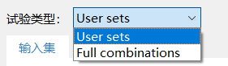
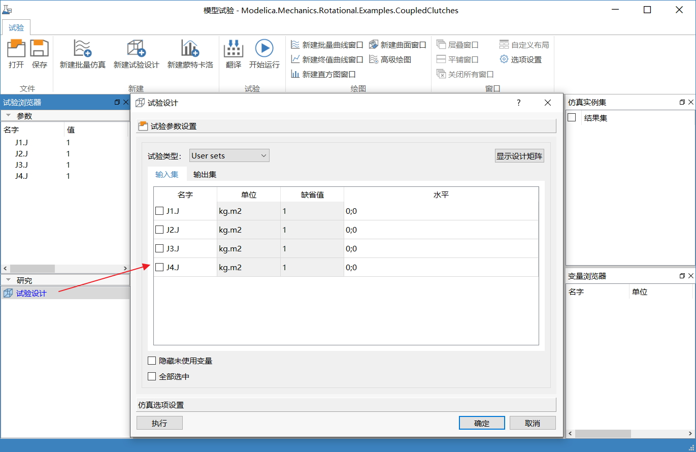
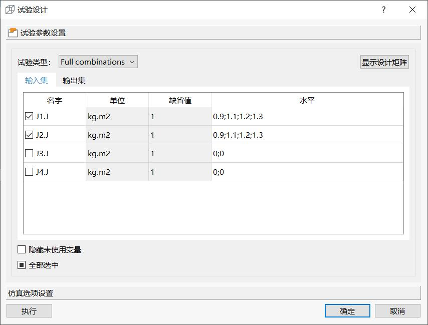
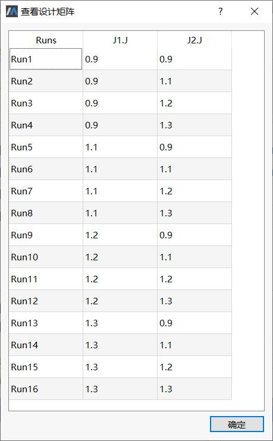
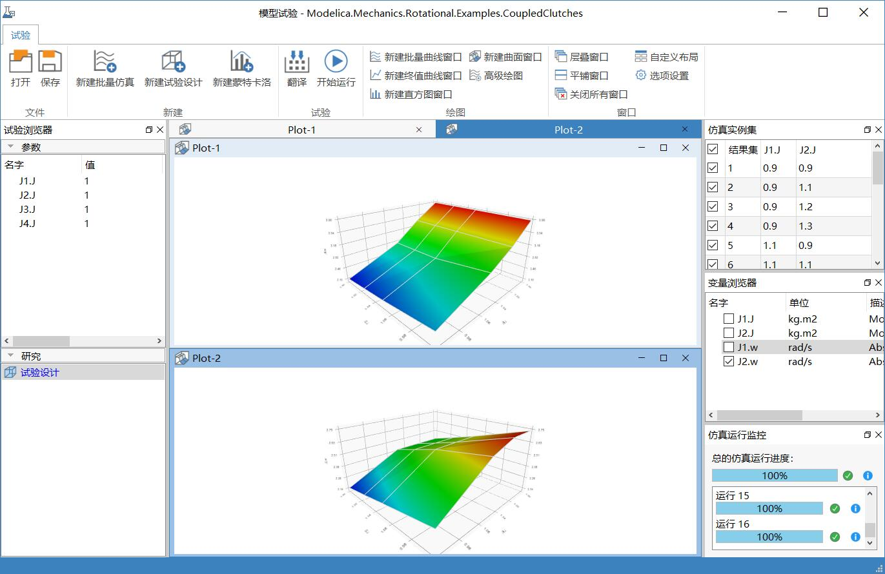

# 试验设计

试验设计是研究和处理多因子与响应变量关系的一种方法。它通过合理地挑选试验条件，安排试验，并通过对试验数据的分析，从而建立响应与因子之间的函数关系，或者找出总体最优的改进方案。

### 基本概念

试验的相关概念：

- 响应变量：试验的输出变量

- 因子：试验过程中的不同输入变量

- 水平：试验中对因子的不同设定值。

- 试验设计方法：最基本的试验设计方法是全因子试验法，需要的试验次数最多，其它试验设计方法均以“减少试验次数”为目的， MWorks支持自定义试验(User sets)和全因子试验(Full Combinations)。

举个例子，某个试验有2个因子a，b，其中a的水平为(a0;a1;a2)，b的水平为(b0;b1)，User sets和Full Combinations不同的试验设计方案为：

| User sets |      |      |
| --------- | ---- | ---- |
|           | b0   | b1   |
| a0        | √    |      |
| a1        |      | √    |
| a2        |      |      |

上表中，自定义试验的组合结果为2种：(a0,b0)、(a1,b1)。

| Full Combinations |      |      |
| ----------------- | ---- | ---- |
|                   | b0   | b1   |
| a0                | √    | √    |
| a1                | √    | √    |
| a2                | √    | √    |

上表中，全因子试验的组合结果为6种：(a0,b0)、(a0,b1)、(a1,b0)、(a1,b1)、(a2,b0)、(a2,b1)。

### 示例演示

新建名为“试验设计”的试验节点。右击“试验设计”，在上下文菜单中选择**编辑**，弹出**试验设计**对话框，进行试验参数和仿真选项设置。

在**水平**中定义输入变量取值序列，值以“；”分隔。本例中设置J1.J的取值序列为0.9、1.1、1.2、1.3共计4个数值，J2.J的水平与J1.J相同。试验类型选择Full Combinations。

点击**显示设计矩阵**，弹出**查看设计矩阵**对话框。

其余设置与批量仿真一致：输出变量勾选J1.w和J2.w，仿真开始时间设置为0，终止时间为1.2，其余默认。

点击**执行**，根据试验参数和仿真选项设置，进行试验仿真。仿真结束后，绘制结果曲面，如下所示，分别展示“J1.J”和“J2.J”各自独立变动4次，对应“J1.w”和“J2.w”在求解结束时刻的变化趋势。

