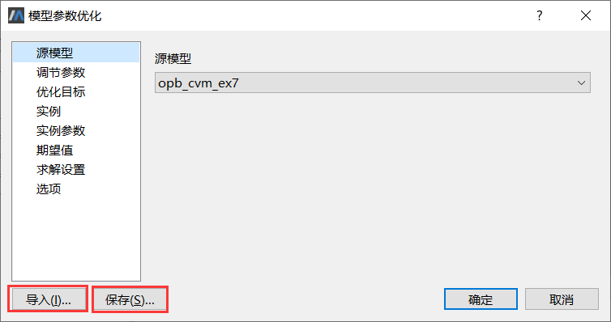

# 高级选项

### 复用先前的设置

完成参数配置之后，可以保存为外部脚本文件供下次使用。例如，因某种原因改变了仿真模型，当再次进行参数优化时可避免重复配置。

参数配置完成后，点击**保存**按钮，在弹出的文件对话框中输入xml文件名，可将本次参数配置结果保存到该文件。

当需要再次进行参数配置时，点击**导入**按钮，选择之前保存的配置文件，可将其中的参数配置信息载入进来，随后立即执行参数优化。

### 多目标聚合方式

MWorks.Sysplorer针对多目标优化问题提供了多种目标聚合方式实现加权转换，将其转化为单目标问题进行求解。

| 约束类型    | 含义                         | 备注               |
| ----------- | ---------------------------- | ------------------ |
| Default     | 缺省方式                     | 如何处理由算法决定 |
| MaximumNorm | 使用最大的目标函数值         | 返回max(wifi)      |
| 1-Norm      | 使用线性加权法计算目标函数值 | 返回wifi的和       |
| 2-Norm      | 使用平方加权法计算目标函数值 | 返回(wifi)的平方和 |

