# 多实例优化

### 定义实例参数

本例中，选择空气动力学参数 { Ma, Md, Mq, Za, Zd } 定义仿真模型所处的工作条件，选择控制器参数 { Ki, Kf, Kq } 作为调节参数，并沿用前文提及的4个优化目标 { Overshoot, MaxDeviation, RiseTime, SettlingTime }。

### 使用前准备

1. 启动MWork.Sysplorer，打开“【安装目录】\Docs\static\Samples\F14.mo”。在**模型浏览器**中找到“F14.ControllerDesign_F14”，双击打开该模型。

   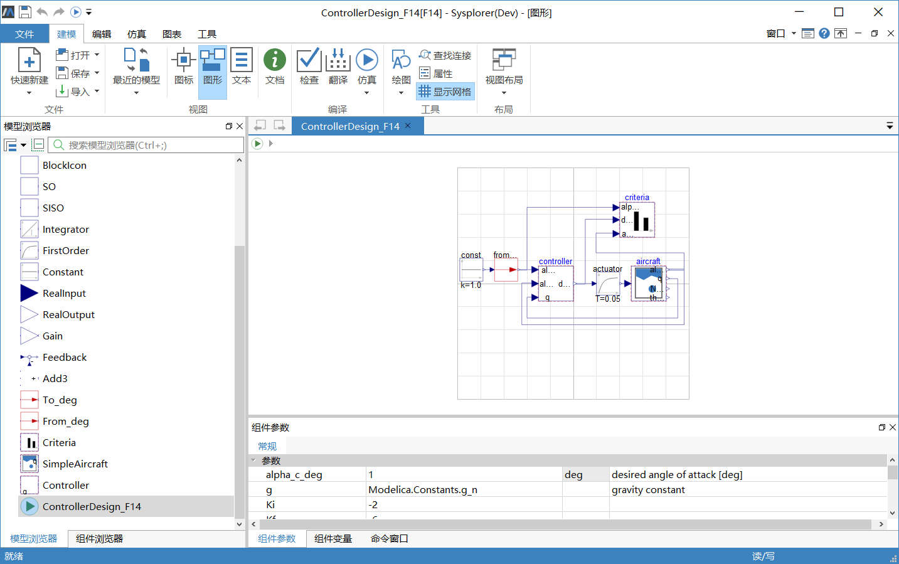

2. 点击**仿真** > **翻译**，生成可运行的求解器。翻译完成后仿真实例“F14”会出现在**仿真浏览器**中。

   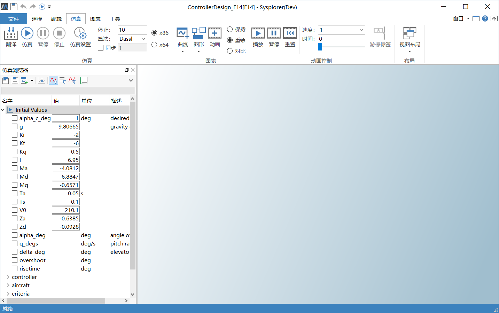

3. 在仿真浏览器的参数面板中输入下列参数。
   控制器参数 { Ki, Kf, Kq } = { -2, -1.72, 0.5 },
   空气动力学参数 { Ma, Md, Mq, Za, Zd } = { -5, -7.5, -0.7, -0.67, -0.2 }
   
   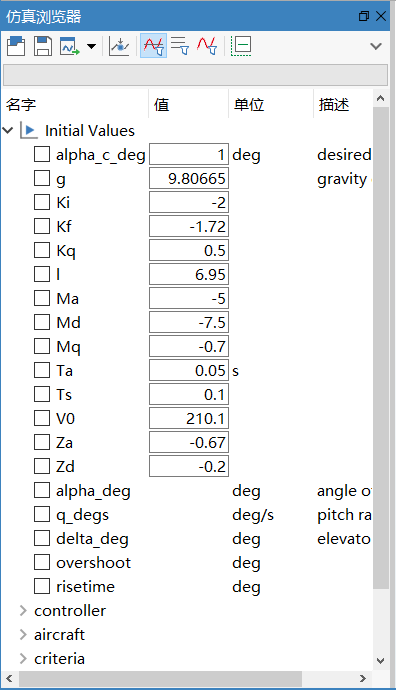
   
4. 点击**仿真** > **仿真**，调用求解器进行求解，然后点击**工具** > **模型参数优化**，打开**模型参数优化**窗口。

### 优化上升时间(RiseTime)

本次优化试图解决“alpha_deg”（攻角）性能指标“RiseTime”（上升时间）不符合期望值的问题。参数配置过程如下。

1. 选择调节参数

   本次操作中，选择控制器参数“Ki”、“Kf”、“Kq”作为调节参数，名义值设为“-2.0”、“-1.72”、“0.5”。

   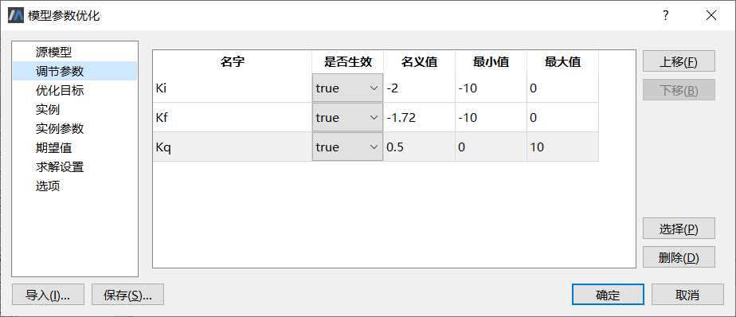

2. 设置优化目标

   本次操作中，有效的优化目标包括4项：Overshoot、MaxDeviation、RiseTime、SettlingTime，函数实参保持不变，约束类型均为“Minimize”（最小化）。

   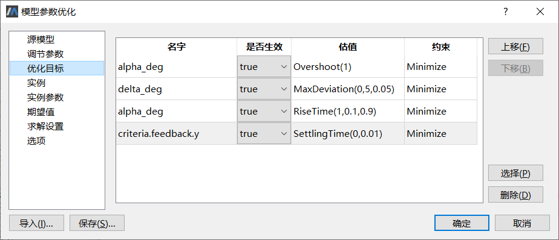

3. 设置实例选项

   本次操作中，使用缺省实例“Normal”。

   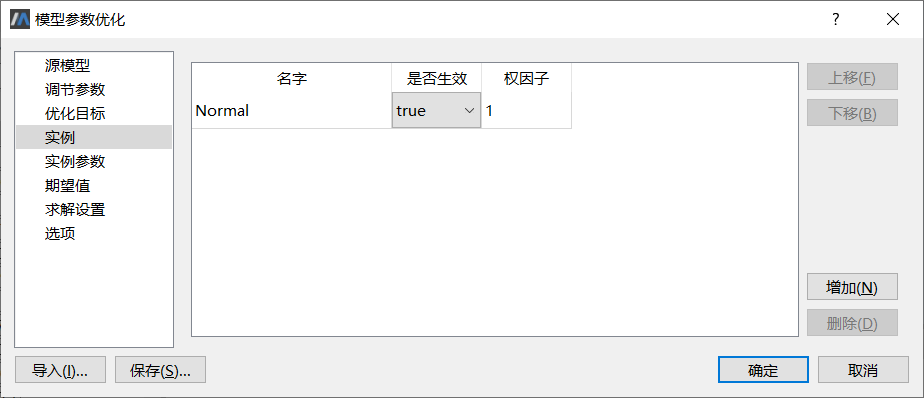

4. 选择实例参数

   本次操作中，选择{ Ma, Md, Mq, Za, Zd }作为实例参数，参数值设为{ -5, -7.5, -0.7, -0.67, -0.2 }。

   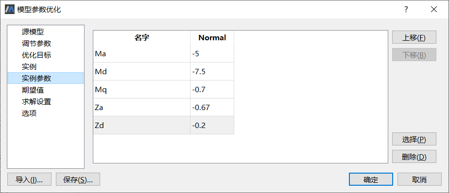

5. 设置期望值

   本次操作中，期望值分别设为“100.0”、“0.5”、“2.0”、“0.25”，表示期望的攻角alpha_deg小于0.01=1/100 ，升角偏离量delta_deg小于2=1/0.5 ，上升时间RiseTime小于0.5=1/2秒，稳态时间SettlingTime小于4=1/0.25秒。

   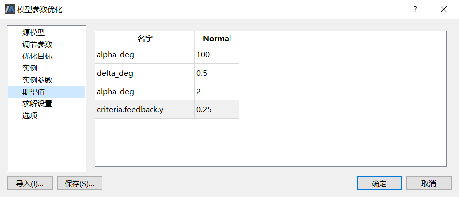

6. 设置模型求解选项

   本次操作中，求解起止时间设为0—10秒，步数为10000，其他选项设为缺省值。

   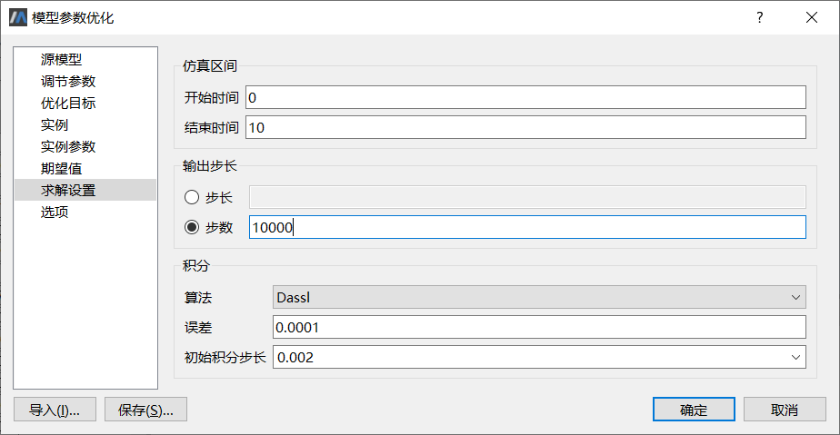

7. 设置优化算法选项

   本次操作中，优化方法设为CVM，目标聚合方式选择“MaximumNorm”（最大值作为目标值），步长因子设为1e-05。

   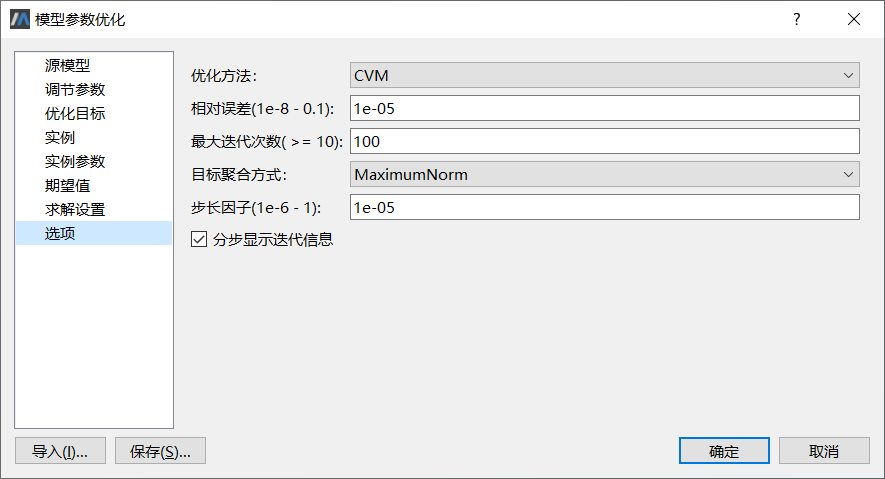

8. 查看模型优化结果

   执行模型优化，经过7次迭代之后得到结果。

   最优解 ( Ki, Kf, Kq ) = ( -2.13526, -3.12547, 0.595156 )，优化前后目标变量的性能指标参见下表，结果符合预期。

   | 优化目标     | 期望值 | 优化前   | 优化后   | 是否满足 |
   | ------------ | ------ | -------- | -------- | -------- |
   | Overshoot    | 0.01   | 0        | 0        | 是       |
   | MaxDeviation | 2      | 1.1699   | 1.8692   | 是       |
   | RiseTime     | 0.5    | 0.556496 | 0.404131 | 是       |
   | SettlingTime | 4      | 3.668    | 5.233    | 是       |

### 优化最大超调量(Overshoot)

本次操作通过多实例优化解决“Overshoot”（最大超调量）不符合期望值的问题。增加一个新的实例，不失一般性，命名为“worstOvershoot”，对应的实例参数为：{ Ma, Md, Mq, Za, Zd } = { -4.5, -6.75, -0.63, -0.603, -0.18 }。
参数配置过程如下。

1. 选择调节参数

   本次操作中，控制器参数“Ki”、“Kf”、“Kq”的名义值取前次优化得到的最优值，分别为“-2.13526”、“-3.12547”、“0.595156”。

   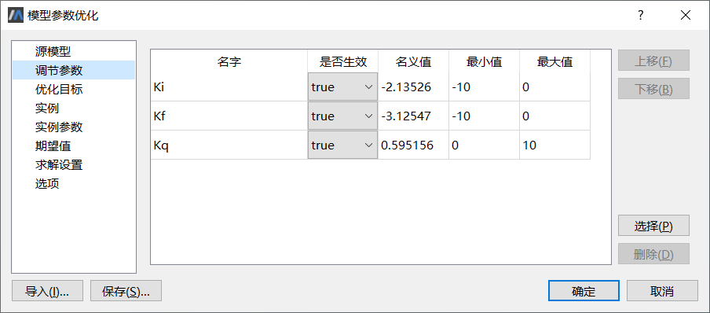

2. 设置实例选项

   本次操作中，除了前次操作使用的缺省实例“Normal”之外，增加新的实例“worstOvershoot”

   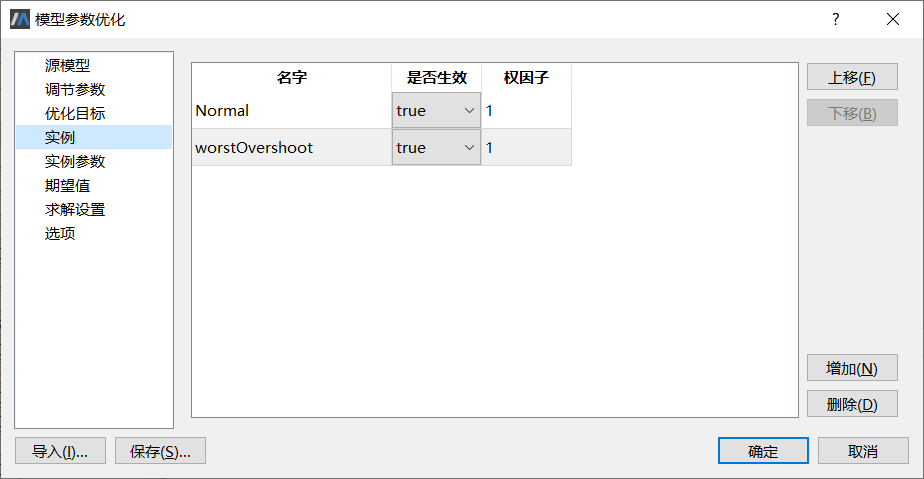

3. 选择实例参数

   本次操作中，需要分别为“Normal”和“worstOvershoot”设置两组参数值，分别为：{ -5, -7.5, -0.7, -0.67, -0.2 }、{ -4.5, -6.75, -0.63, -0.603, -0.18 }。

   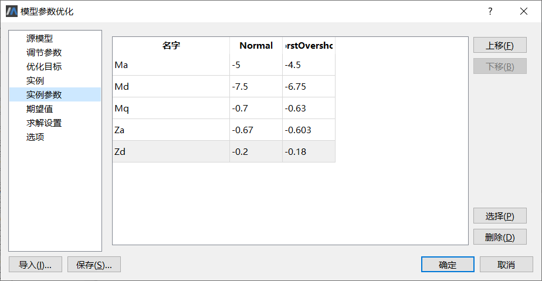

4. 设置期望值

   本次操作中，需要分别为“Normal”和“worstOvershoot”设置期望值，均设为“100.0”、“0.5”、“2.0”、“0.25”，表示期望的攻角alpha_deg小于0.01=1/100 ，升角偏离量delta_deg小于2=1/0.5 ，上升时间RiseTime小于0.5=1/2秒，稳态时间SettlingTime小于4=1/0.25秒。

   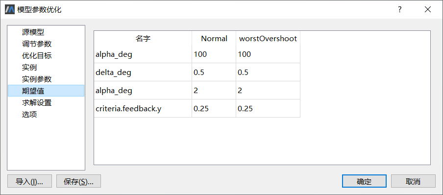
   
5. 设置优化算法选项

   优化算法选项与前次操作略有差异，相对误差和步长因子均设为1e-4。

   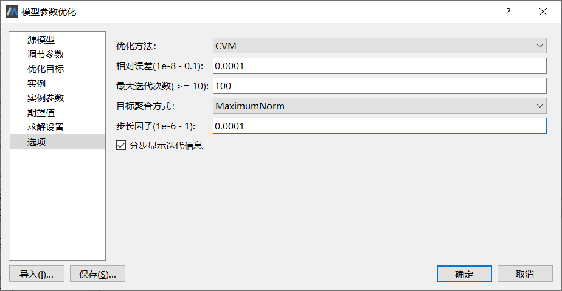

6. 查看模型优化结果

   执行模型优化，经过58次迭代之后得到结果，最优解 ( Ki, Kf, Kq ) = (-3.87926, -3.34909, 0.940903)，优化前后目标变量的性能指标如下表，结果符合预期。

   | 优化目标     | 期望值 | 优化前(Normal) | 优化后(Normal) | 优化前(worstOvershoot) | 优化后(worstOvershoot) | 是否满足 |
   | ------------ | ------ | -------------- | -------------- | ---------------------- | ---------------------- | -------- |
   | Overshoot    | 0.01   | 0              | 7.86814e-07    | 0.0245546              | 0.00957227             | 是       |
   | MaxDeviation | 2      | 1.86921        | 1.85651        | 1.9239                 | 1.92059                | 是       |
   | RiseTime     | 0.5    | 0.40413        | 0.479761       | 0.399283               | 0.456176               | 是       |
   | SettlingTime | 4      | 5.233          | 1.376          | 5.09                   | 0.799                  | 是       |

### 结果分析与小结

从上述优化结果看，多实例优化能够解决不同工作条件下的指标优化问题。注意到两次操作中的参数配置略有差异，特别是相对误差和步长因子对算法迭代次数以及算法是否能够收敛有一定影响，实际使用时需根据具体的场景进行多次测试，以期得到最满意的结果。