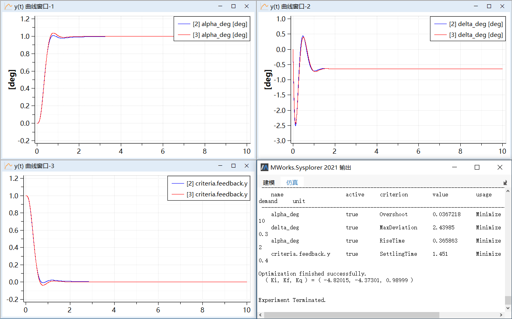

# 多目标优化

下面以一个简化的飞机模型F14为例（参考【安装目录】\Docs\static\Samples\F14.mo）介绍MWorks.Sysplorer参数优化工具在复杂仿真模型参数分析中的应用。具体的模型路径为“F14.ControllerDesign_F14”。


该模型用于飞机纵向运动过程的仿真和分析：

- 控制器仿真模型ControllerDesign_F14使用阶跃信号“const”来驱动；

- 组件“aircraft”包含飞机的动力学方程；

- 组件“controller”对应飞机纵向运动的控制器，本例中将要进行调节的控制参数在该组件中定义，并与实际使用的界面参数通过变型方程来关联，变量“controller.alpha”作为反馈单元用于跟踪飞机的相对运动；

- 组件“criteria”中包含本例中将要进行优化的目标变量。

本例中的优化目标是通过改变controller的参数，使得飞机对某种阶跃响应的输出——纵向运动保持在最合理的范围之内。

### 多领域仿真模型F14

##### 问题描述

下面先给出模型在初始情况下(Ki = -2,Kf = -6,Kq = 0.5)仿真10秒的结果曲线。分别对应alpha_c_deg（俯仰角）、alpha_deg（攻角）；q_degs（俯仰角速度）；delta_deg（升角偏离量）。


存在的问题是，alpha_deg（攻角）与q_degs（俯仰角速度）相对alpha_c_deg（=1° ）的超调量太大，delta_deg（升角偏离量）在开始一段时间以及达到稳态之后远离期望值。

本例中，通过参数优化将alpha_deg（攻角）相对于q_degs（俯仰角速度）的超调量减小到1%以下，同时保持delta_deg（升角偏离量）在 以内。

对上述问题建立优化模型如下，

- 优化变量：选择控制器参数“Ki”、“Kf”、“Kq”；

- 目标变量：选择alpha_deg（攻角）、delta_deg（升角偏离量）；

- 优化目标：减小alpha_deg相对alpha_c_deg的最大超调量，并且使得delta_deg在期望值范围内。

为便于访问组件内部的参数与变量，模型ControllerDesign_F14使用了很多外层别名变量，参考下面给出的代码片段，后续操作中直接使用这些短名变量。

```
parameter Real Ki(max = -0.5, min = -10) = -2;
parameter Real Kf(max = -0.5, min = -10) = -6;
parameter Real Kq(max = 10, min = 0.1) = 0.5;
……
Controller controller(Kf = Kf, Ki = Ki, Kq = Kq, Ts = Ts);
……
Angle_deg alpha_deg = criteria.to_alpha.degree;
Angle_deg delta_deg = criteria.to_delta.degree;
……
Criteria criteria(alpha_c_deg = alpha_c_deg);
……
```

##### 使用前准备

1. 启动MWork.Sysplorer，打开“【安装目录】\Docs\static\Samples\F14.mo”。在**模型浏览器**中找到“F14.ControllerDesign_F14”，双击打开该模型。

   

2. 点击**仿真** > **仿真**，生成可运行的求解器。仿真完成后仿真实例“F14”会出现在**仿真浏览器**中。

   

### 单个调节参数

先测试只调节1个控制参数的情况。

点击**工具** > **模型参数优化**，弹出**模型参数优化**窗口。


1. 选择源模型

   本例选择缺省实例“ControllerDesign_F14”。

2. 选择调节参数

   按本例要求，选择控制器参数“Kf”作为调节参数，名义值“-6.0”缺省取自模型实例，最小值、最大值分别设为“-10.0”、“0.0”。

   

3. 设置优化目标

   按本例要求，选择攻角alpha_deg、升角偏离量delta_deg作为目标变量。其中，alpha_deg的“估值”函数选择“Overshoot（最大超调量）”，实参设为“1.0”（注意俯仰角alpha_c_deg = 1.0）；delta_deg的“估值”函数选择“MaxDeviation（最大偏差）”，实参设为“0.0”、“5.0”、“0.05”（表示相对“0.0”的偏差，最大值不超过“5.0”）。

   

4. 设置优化实例

   本例中使用缺省实例“Normal”，关于多实例优化相关的应用场景以及界面操作详见[多实例优化](#/forthExample/ModelOptimization/MultiInstanceOptimization)。

5. 选择实例参数

   按本例要求，选择俯仰角alpha_c_deg作为实例参数，设为“1.0”（注意按“角度”单位赋值）

   

6. 设置期望值

   本例中的2个目标变量均作为优化目标，故此处的期望值视为“权值”，用于考量不同优化目标之间的关系。
   本例中，攻角alpha_deg、升角偏离量delta_deg的权值分别设为“100.0”、“0.5”，表示期望的攻角alpha_deg小于0.01=1/100°，升角偏离量delta_deg小于2=1/0.5°，

   

7. 设置模型求解选项

   例中，求解起止时间设为0—10秒，步长设为1e-4，步数设为100000，其他求解选项取缺省值。

   

8. 设置优化算法选项

   本例中，优化方法设为CVM，步长因子设为1e-5，其他选项取缺省值。

   

   参数配置完成，建议将本次参数配置结果保存为外部脚本文件，以便复用。

9. 查看模型优化结果

   

   输出栏中给出了控制器参数“Kf”的最优解“-1.68648”，变化幅度为“+4.31352”。

   观察迭代过程信息，优化前后，攻角alpha_deg对俯仰角alpha_c_deg的最大超调量从“0.237945”（=24%）减小至“0.0295781”（=3.0%>1/100），升角偏离量delta_deg的最大偏移量从“3.52939”减小至“1.19167”（小于1/0.5）。

   可以看出，改变调节参数“Kf”使得升角偏离量delta_deg达到预期目标，但攻角alpha_deg相对于俯仰角速度q_degs的超调量仍然大于1%。

   此时在**仿真浏览器**中生成了新的优化实例“ControllerDesign_F14-1”，其中调节参数设为最优解，并且实例参数也同时写入，接下来测试增加调节参数“Ki”和“Kq”的优化效果。

   > 注意：后续操作将基于新的模型实例“ControllerDesign_F14-1”进行，注意不要关闭**仿真浏览器**中新产生的实例。如果前次操作中保存了参数配置文件，后续操作可将其读入进来，此举可加快参数配置过程。

### 多个调节参数

如前所述，仅调节参数“Kf”不能满足期望目标，本节测试调节多个控制器参数的优化效果，将控制器参数“Ki”、“Kq”补充选为调节参数，并且引入新的优化目标——上升时间（RiseTime）和稳态时间（SettlingTime）。

##### 优化最大超调量(Overshoot)

1. 选择源模型

   在**仿真浏览器**内选中仿真实例“ControllerDesign_F14”，点击**工具** > **模型参数优化**，弹出**模型参数优化**窗口。

   

   “ControllerDesign_F14”是当前实例，它会被自动选中。

2. 选择调节参数

   按本例要求，选择控制器参数“Ki”、“Kf”、“Kq”作为调节参数，名义值取自模型实例“ControllerDesign_F14-1”，分别为“-2.0”、“-1.68648”、“0.5”，参数范围分别为：-10.0≤Ki、Kf≤0.0，0≤Kq≤10.0。

   

   这里先将参数“Ki”的生效状态设为“false”，意味着“Ki”在本次优化过程中视为固定参数，看看通过调节“Kf”、“Kq”能否满足期望目标。

3. 设置优化目标

   本例中，在前次基础上增加攻角alpha_deg的上升时间（RiseTime）和criteria.feedback.y的稳态时间（SettlingTime）作为新的优化目标，其中，函数RiseTime实参设为“1.0”、“0.1”、“0.9”（注意俯仰角alpha_c_deg = 1.0）；函数SettlingTime实参设为“0.0”、“0.01”。

   

   这里先将此次新增优化目标的生效状态设为“false”，意味着在优化过程中不参与计算目标函数（或约束条件）。

4. 选择实例参数

   与优化单个参数时相同，仍选择俯仰角alpha_c_deg作为实例参数，设为“1.0”（注意按“角度”单位赋值）。

5. 设置期望值

   注意上一步中增加了新的优化目标，尽管上升时间（RiseTime）和稳态时间（SettlingTime）的生效状态设为“false”（本次优化中被忽略），还是应该设置其期望值。本例中分别设为“2.0”、“0.2”，表示期望的上升时间RiseTime小于0.5=1/2秒，稳态时间SettlingTime小于5=1/0.2秒。

   

6. 设置模型求解选项

   与优化单个参数时相同，求解起止时间设为0—10秒，步数设为100000，其他求解选项取缺省值。

   

7. 设置优化算法选项

   本次操作中，优化算法设为CVM，目标聚合方式改为“1-Norm”（线性加权法），步长因子设为1e-05，其他选项保持不变。

   

   参数配置完成，建议将本次参数配置结果保存为外部脚本文件，以便复用。

8. 查看模型优化结果
    执行模型优化，经过56次迭代之后得到结果。

  

  **输出栏**中给出了调节参数的最优解，( Ki, Kf, Kq ) = ( -2, -1.35859, 0.699738 )，注意“Ki”保持不变。

  观察迭代过程信息，优化前后，攻角alpha_deg对俯仰角alpha_c_deg的最大超调量从“0. 0295781”减小至“7.27033e-07”（远小于1/100），同时升角偏离量delta_deg从“1.19167”减小至“0.915588”（小于1/0.5）。

  可以看出，改变调节参数“Kf”、“Kq”使得攻角alpha_deg对俯仰角alpha_c_deg的最大超调量、升角偏离量delta_deg均达到预期目标。但由于“Kq”的因素，使得攻角alpha_deg的上升时间（RiseTime）延长了。

  此时**变量浏览器**中生成了新的优化实例“ControllerDesign_F14 2”，其中调节参数“Kf”、“Kq”已设为最优解，接下来测试调节参数“Ki”的优化效果。

##### 优化上升时间(RiseTime)

这一小节中将使用3个控制器参数作为调节参数，并将新增优化目标置恢复为有效，参数配置过程如下。

1. 选择源模型

   在**仿真浏览器**内选中仿真实例“ControllerDesign_F14 2”，点击**工具** > **模型参数优化**，弹出**模型参数优化**窗口。

   

2. 选择调节参数

   本次优化中，控制器参数“Ki”、“Kf”、“Kq”的生效状态全部设为“true”，其中“Kf”、“Kq”的名义值“-1.35859”、“0.699738”取自前次优化结果，该值将写入模型实例“ControllerDesign_F14 3”，其他设置保持不变。

   

3. 设置优化目标

   本次优化中，对于在前次操作中新增的优化目标：上升时间（RiseTime）、稳态时间（SettlingTime），将其生效状态改为“true”，其他设置保持不变。

   

4. 设置优化算法选项

   本次操作中，相对误差和步长因子设为1e-4（影响收敛准则判断），将目标聚合方式设为“MaximumNorm”（最大的目标函数值），其他选项保持不变。

   

   参数配置完成，建议将本次参数配置结果保存为外部脚本文件，以便复用。

5. 查看模型优化结果
    点击“确定”执行模型优化，经过33次迭代之后得到结果。

  

  输出栏中给出了调节参数的最优解，( Ki, Kf, Kq ) = ( -2.2558, -2.81425, 0.645128)。

  观察迭代过程信息，优化前后，攻角alpha_deg对俯仰角alpha_c_deg的最大超调量从“7.27196e-07”增加到“0.00861111”（0.86%＜1%），升角偏离量delta_deg从“0.915586”增加到“1.74815”，但处于期望值以内（小于1/0.5）。

  本次操作中增加的优化目标中，攻角alpha_deg的上升时间（RiseTime）从“0.791471”秒缩短到“0.437222”秒（小于1/2）；criteria.feedback.y的稳态时间（SettlingTime）也从“1.4828”秒变为到“4.3492”秒（小于1/0.2）。

  注意在仿真浏览器中生成了新的优化实例“ControllerDesign_F14 3”，其中控制器参数“Ki”、“Kf”、“Kq”已设为最优解，可以从中观察其他指标变量。

### 多目标优化

##### 使用不同的参数初值

先看不同的参数初值对多目标优化的影响。

1. 选择调节参数

   本次操作中，选择控制器参数“Ki”、“Kf”、“Kq”作为调节参数，名义值改为“-2.0”、“-3.0”、“0.5”，参数范围保持不变。

   

2. 设置优化目标

   本次操作中，有效的优化目标包括4项：Overshoot、MaxDeviation、RiseTime、SettlingTime，函数实参保持不变，约束类型均为“Minimize”（最小化）。

   

3. 设置期望值

   本次操作中，目标变量“权值”分别设为“100.0”、“0.3”、“2.0”、“0.4”，表示期望的攻角alpha_deg小于0.01=1/100°，升角偏离量delta_deg小于2.5=1/0.4°，上升时间RiseTime小于0.5=1/2秒，稳态时间SettlingTime小于3=1/0.3秒。

   

4. 设置模型求解选项

   本次操作中，求解起止时间设为0—10秒，步数设为10000，其他求解选项取缺省值。

   

5. 设置优化算法选项

   本次操作中，优化方法设为CVM ，目标聚合方式选择“MaximumNorm”（最大的目标函数值），步长因子设为1e-4，其它选项取默认值。

   

6. 查看模型优化结果

   执行模型优化，经过84次迭代之后得到结果，最优解 ( Ki, Kf, Kq ) = ( -4.51969, -4.6363, 1.05065 )，如下为优化前后目标变量结果对比。

   

##### 改变目标权值

在上一节操作基础上，将优化目标Overshoot（最大超调量）的“权值”从“100”改为“10”，参数配置过程如下。

1. 选择调节参数

   本次操作中在前次操作基础上进行，控制器参数“Ki”、“Kf”、“Kq”设为“-4.51969”、“-4.6363”、“1.05065”，参数范围保持不变。

   

2. 设置期望值

   本次操作中，目标权值分别设为“10.0”、“0.3”、“2.0”、“0.4”，表示期望的攻角alpha_deg小于0.1=1/10 ，升角偏离量delta_deg小于3=1/0.3 ，上升时间RiseTime小于0.5=1/2秒，稳态时间SettlingTime小于2.5=1/0.4秒。

   

   其他未特别说明的选项使用前次操作相同的配置。

3. 查看模型优化结果

   执行模型优化，经过26次迭代之后得到结果，最优解 ( Ki, Kf, Kq ) = ( -4.82015, -4.37301, 0.98999 )，如下为优化前后目标变量曲线对比。

   

##### 使用不等式约束条件

在上一节操作基础上，将优化目标“MaxDeviation（最大偏差）”改为不等式约束，参数配置过程如下。

1. 选择调节参数

   本次操作中在前次操作基础上进行，控制器参数“Ki”、“Kf”、“Kq”设为“-4.82015”、“-4.37301”、“0.98999”，参数范围保持不变。

   

2. 设置优化目标

   本次操作中，有效的优化目标包括4项：Overshoot、MaxDeviation、RiseTime、SettlingTime，函数实参保持不变，注意MaxDeviation约束类型设为“LessThan”，表示该目标变量用作不等式约束条件“≤”。

   

3. 设置期望值

   本次操作中，期望值分别设为“10.0”、“3.0”、“2.0”、“0.4”，表示期望的攻角alpha_deg小于0.1=1/10°，升角偏离量delta_deg小于3.0°（注意此处视为约束值，即要求delta_deg≤3.0），上升时间RiseTime小于0.5=1/2秒，稳态时间SettlingTime小于2.5=1/0.4秒。

   

   其他未特别说明的选项使用前次操作相同的配置。

4. 查看模型优化结果

   执行模型优化，经过13次迭代之后得到结果，最优解 ( Ki, Kf, Kq ) = (-4.86162, -4.85932, 0.925789)，如下为优化前后目标变量曲线对比。

   

##### 结果分析与小结

从上述结果中可以看出，多目标优化结果对调节参数、目标权值和约束条件是比较敏感的，不同的参数配置情况得到不同的参数最优解（属于Pareto解集），但优化结果能够满足预期目标。注意到算法迭代次数也受到这些因素影响，本例中迭代次数分别是84次、26次、13次。实际使用时需根据具体的场景进行多次测试，以期得到最满意的结果。

