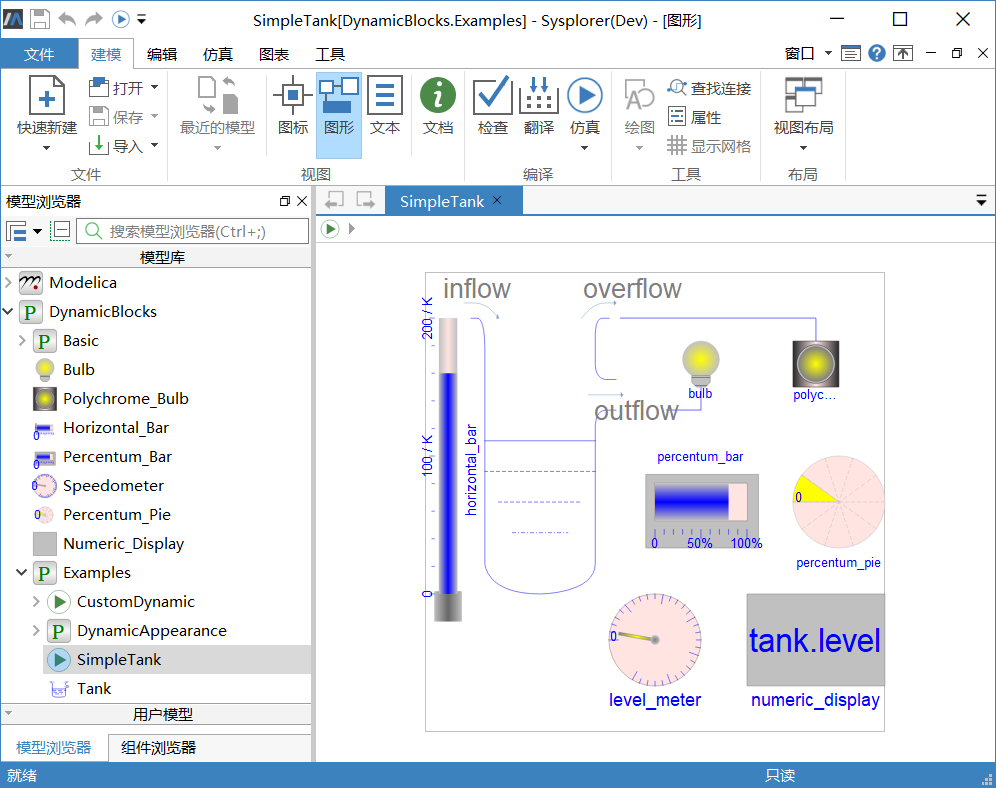
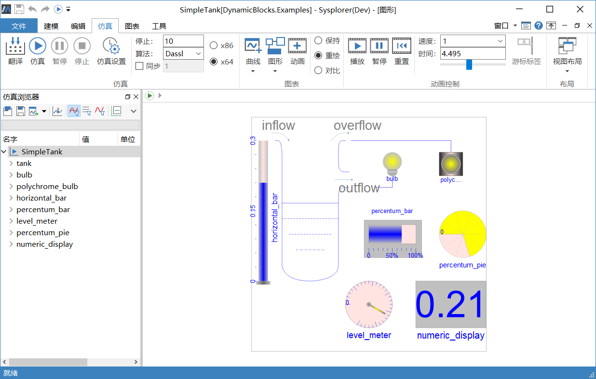

# 二维动画

对物理模型进行仿真的一个目的是通过仿真查看物理模型的状态与变化。MWorks.Sysplorer 提供了3 种窗口供用户观察模型的状态变化：曲线窗口、3D动画窗口、2D动画视图。

在曲线窗口中可以通过曲线查看模型的某个参数或变量在某个时间点的准确数据，但给用户的印象并不直观。3D动画窗口可以为机械多体模型播放拟真度很高的模型动画，给用户以逼真的印象；然而，对于非机械多体的模型，MWorks.Sysplorer 并不能为其提供多体动画。2D动画视图以图形方式表现模型的关系结构，进行组件的动画播放，供用户观察模型的状态变化，可以满足大部分模型的需求。

MWorks.Sysplorer 动态组件提供2D动画的动态演示，主要特征如下：

- 在建模窗口中插入动态组件( 插入动态组件与 插入一般组件方法一致) ，仿真时或者三维动画窗口播放时进行图形视图的动画播放；

- 在建模窗口中可以对动态组件像普通组件一样进行编辑与修改；

- MWorks.Sysplorer 提供的DynamicBlocks 库，包含7 种常用的动态组件，可以满足大多数应用场景的需求；

- 如果用户对动态组件有更多的需求，在文本视图中以annotation 语法定制自己的动态组件。

简单水箱SimpleTank 是动态组件的应用实例，其中动态组件来自DynamicBlocks 库。

进行下列操作来做动态组件的演示：

1. 点击快速访问工具栏中的，对SimpleTank进行编译与求解，系统会自动打开仿真环境，并且在仿真浏览器上生成求解实例SimpleTank。

2. 点击**仿真** > **图表** > ，打开实例SimpleTank的2D动画图形视图，并将视图缩放到合适大小。

3. 点击**仿真** > **动画控制** > ，开始播放动画。显示从0 时刻开始向水箱tank 中进水，动态组件反应水箱水位等信息的状态变化。

| 主题                                                         | 说明                                                   |
| ------------------------------------------------------------ | ------------------------------------------------------ |
| **[DynamicBlocks](#/forthExample/2D-Animation/DynamicBlocks)** | 动态组件库DynamicBlocks中有7个动态组件模型             |
| **[自定义动态组件](#/forthExample/2D-Animation/CustomizeDynamicComponent)** | 通过修改图元annotation中的动态属性，从而自定义动态组件 |

