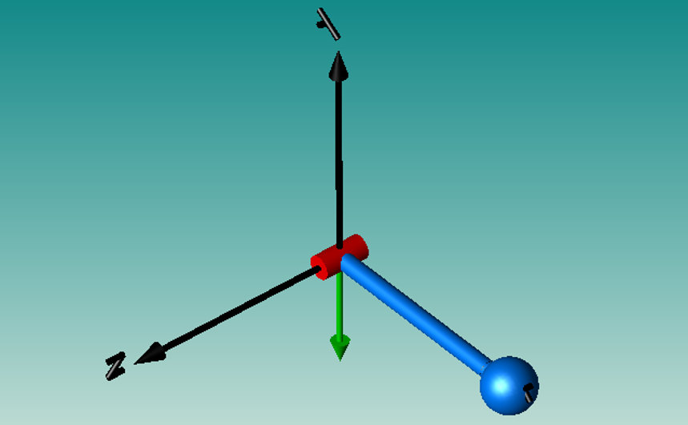
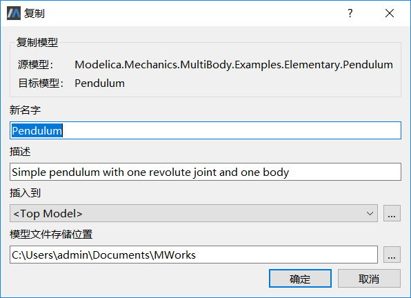
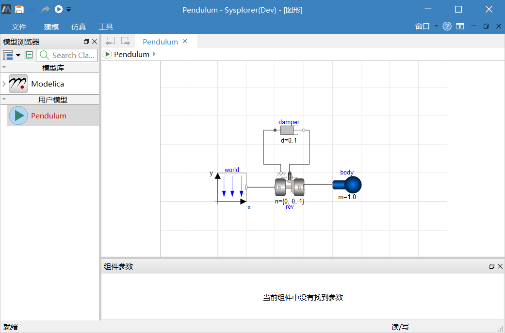
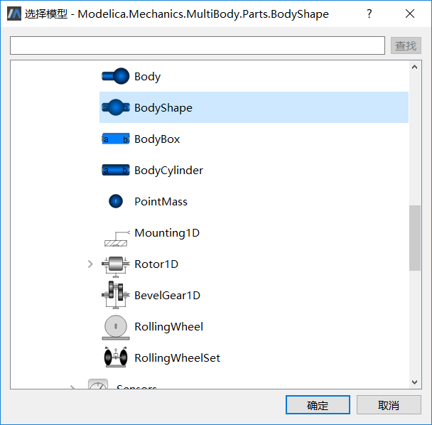
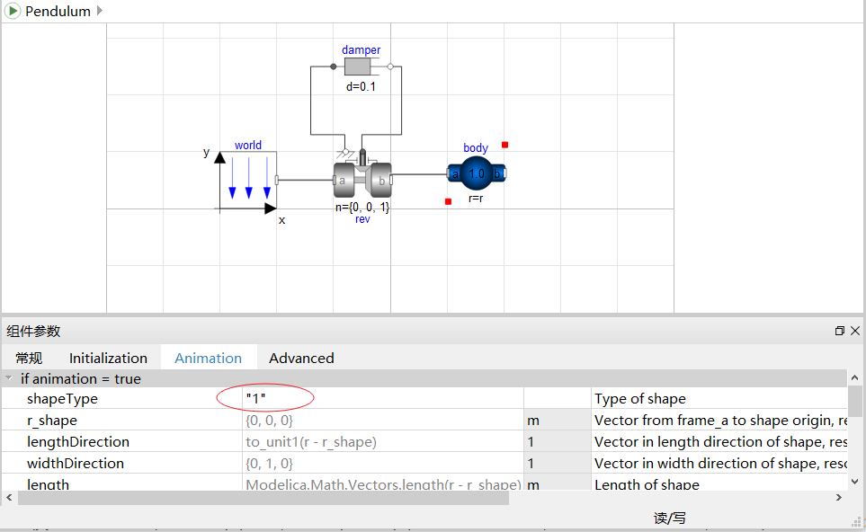
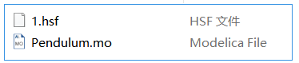
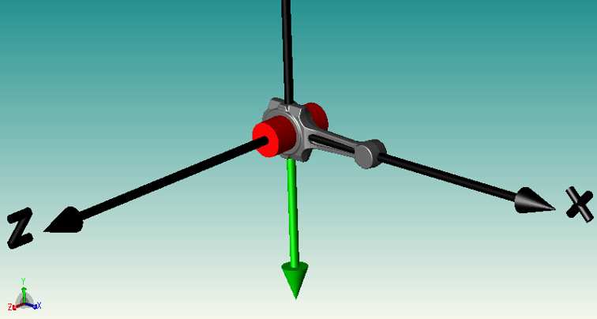

# 几何外形导入MWorks

将以单摆为例，简单介绍单摆的摆件关联外界导入图形文件(以.stl格式图形文件为例)的步骤及导入前后的效果分析。

缺省情况下，动画窗口中单摆模型显示。

1. 展开**模型浏览器**中的**Modelica > Mechanic > MuitiBody > Examples > Elementary** ，右击**Pendulum**，选择**复制模型**。

2. 在**复制模型**对话框中，选择插入到**Top Model**，单击**确定**。

   

3. 将**Pendulum**复制为顶层模型，并自动打开**Pendulum**的**组件视图**。

   

3. 右击**Pendulum**中的组件**body**，选择**改变组件类**。在**选择模型**对话框中，选择Modelica.Mechanics.MultiBody.Parts.BodyShape，单击**确定**。

   

4. 选中组件**body**，在**组件参数**窗口中，将**shapeType**改为“1”。

   

6. 保存单摆模型后，将.hsf格式的图形文件重命名为1.hsf，保存在单摆模型同一个目录。

   

7. 求解模型**Pendulum**，生成仿真实例，创建动画，适当改变图形位置，出现动画模型。

   