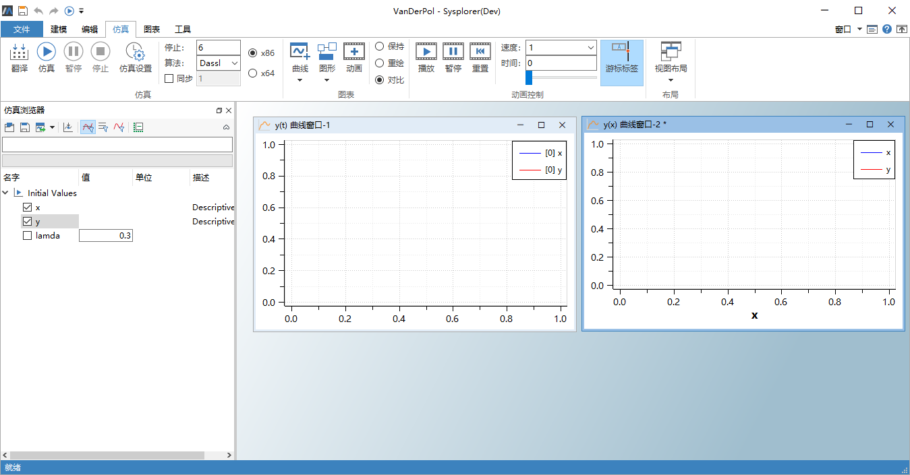
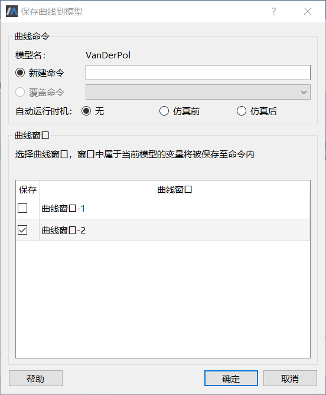
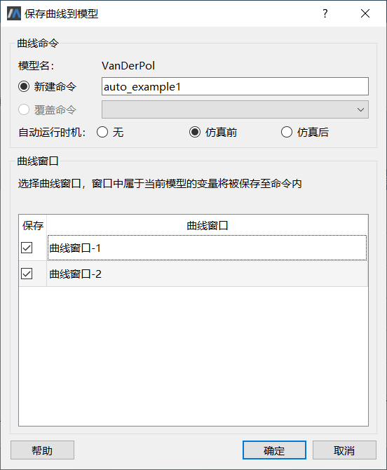
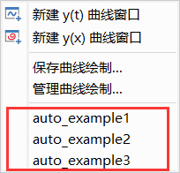
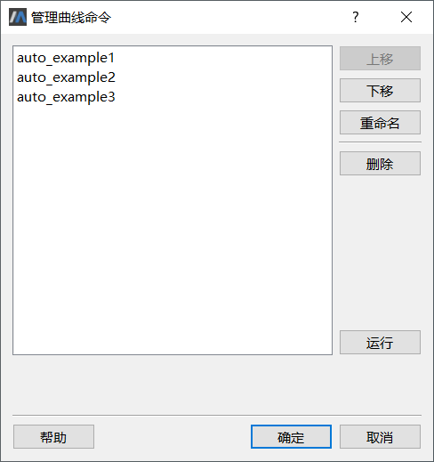
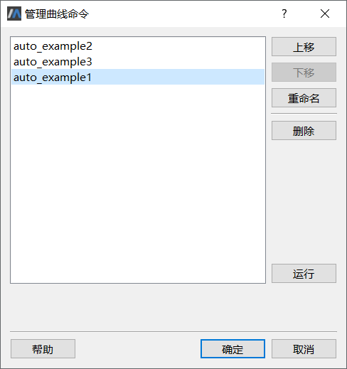

# 基本步骤

本节将以一个简单示例，介绍仿真结果自动呈现功能的使用步骤。

示例模型[**Vanderpol**](mworks://ref/static/Samples/VanDerPol.mo)

```
model VanDerPol
  Real x(start = 1) "Descriptive string for x";
  Real y(start = 1) "Descriptive string for y";
  parameter Real lamda = 0.3;
equation 
  der(x) = y;
  der(y) = -x + lamda * (1 - x * x) * y;
end VanDerPol;
```

### 使用前准备

仿真结果自动呈现功能的设置基于可写模型的仿真实例以及结果曲线进行，因此在使用该功能前需要进行一定步骤的准备：

1. 打开示例模型；

2. 切换至**建模**或**仿真**标签页，点击**翻译**生成求解器，此时**仿真浏览器**内新增 Initial Values；

3. 切换至**仿真**标签页，点击**曲线** > **新建y(t)曲线窗口**，创建空白的y(t)曲线窗口；

4. 勾选变量x,y至空白曲线窗口内；

5. 点击**曲线** > **新建y(x)曲线窗口**，创建空白的y(x)曲线窗口；

6. 勾选变量x，y至y(x)曲线窗口内。

此时界面如下图所示，仿真结果自动呈现功能使用前准备完成。



### 保存曲线绘制

1. 切换至**仿真**标签页，点击 **曲线** > **保存曲线绘制**，打开**保存曲线到模型**窗口；

   

2. 选择**新建命令**，命令名称填写auto_example1；

3. **自动运行时机**选择”无“；

4. **曲线窗口**一栏勾选“曲线窗口-1”，“曲线窗口-2”；

5. 设置完成后如下图所示，此时点击**确定**。

6. 按照上述步骤，创建如下命令：

   - **新建命令**：auto_example2，**自动运行时机**：“仿真前”，**曲线窗口**：”曲线窗口-1“
   - **新建命令**：auto_example3，**自动运行时机**：“仿真后”，**曲线窗口**：”曲线窗口-2“

   

完成上述设置后，仿真结果自动呈现的相关代码已被写入模型。切换到**建模**标签页，点击**文本视图**查看此时的模型代码，模型代码新增如下内容：

```
annotation (__MWorks(ResultViewerManager(resultViewers = {
    ResultViewer(name = "auto_example1", executeTrigger = executeTrigger.None, commands = {
    CreatePlot(id = 1, position = [33, 37, 600, 400], y = ["y", "x"], x_display_unit = "s", legends = ["y", "x"], legend_layout = 1), 
    CreatePlot(id = 6, position = [646, 37, 600, 400], x = "x", y = ["x", "y"], legends = ["x", "y"], legend_layout = 1)}), 
    ResultViewer(name = "auto_example2", executeTrigger = executeTrigger.SimulationStarted, commands = {
    CreatePlot(id = 4, position = [33, 37, 600, 400], y = ["y", "x"], x_display_unit = "s", legends = ["y", "x"], legend_layout = 1)}), 
    ResultViewer(name = "auto_example3", executeTrigger = executeTrigger.SimulationFinished, commands = {
    CreatePlot(id = 2, position = [646, 37, 600, 400], x = "x", y = ["x", "y"], legends = ["x", "y"], legend_layout = 1)})})));
```

代码详细含义见[代码说明](#/forthExample/AutomaticSimulationResults/Codedescription)。

### 命令运行

创建的命令可根据模型仿真的时机自动运行，有可以通过界面操作手动运行。

- 自动运行

  切换到**仿真**标签页，点击**仿真** ，对设置后的模型进行仿真，曲线绘制命令将根据设置在指定的时机自动运行。

- 手动运行

  1. 切换到**仿真**标签页，**曲线**的下拉菜单将显示当前实例对应模型的所有曲线命令，鼠标左键单击即可运行对应的命令。

     

  2. 点击**曲线** > **管理曲线绘制** ，在弹出的**管理曲线命令**窗口中选中需要执行的命令，点击右侧**执行**按钮，即可执行对应的命令。

### 管理曲线绘制

保存曲线到模型后，可通过图形界面对已保存的命令进行管理。

切换到**仿真**标签页，点击**曲线** > **管理曲线绘制**，打开**管理曲线命令**窗口。



该窗口中显示所有已创建的命令，可对每一个命令进行顺序调整、重命名、删除、运行等操作。

1. 顺序调整：

   选中auto_example2，点击右侧**上移**按钮，auto_example2上移一位；

   选中auto_example1，点击右侧**下移**按钮，auto_example1下移一位；

   

2. 重命名:

   选中auto_example3，点击右侧**重命名**按钮，在弹出的**重命名**窗口中将名称修改为auto_example3_rename,点击**确定**按钮，此时对应的命令名称发生变化。

3. 删除：

   选中auto_example1，点击右侧**删除**按钮，对应曲线命令从列表中删除。

4. 运行

   选中auto_example2，点击右侧**运行**按钮，则命令auto_example2运行，创建对应曲线窗口并绘制曲线。

> 注意：进行管理曲线命令的操作后，需要点击**确定**按钮保存设置。

