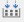
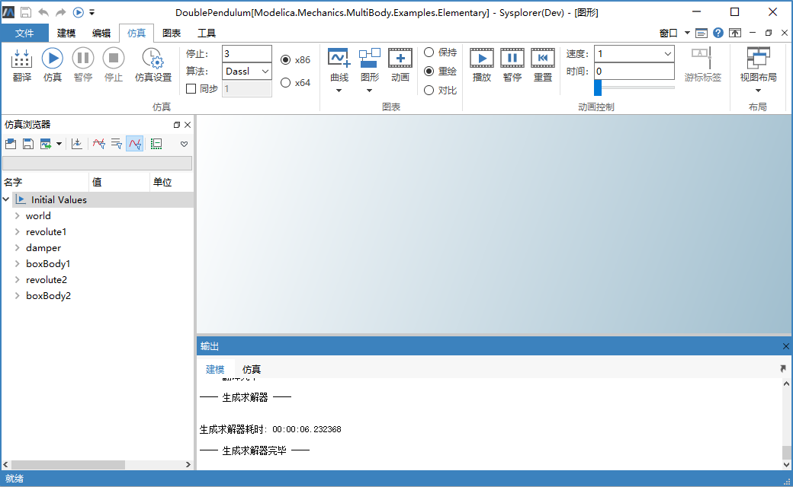

# 翻译模型

模型翻译是指转换文本格式的Modelica代码生成可运行的求解器程序，包括模型平坦化，方程系统生成、分析与优化，仿真代码生成与编译等步骤。

模型本身的正确性（包括语法的正确性和语义的正确性）是进行模型编译的前提，模型正确性检查见[语法检查](#/forthExample/CheckAndCompileModel/CheckGrammar)和[语义检查](#/forthExample/CheckAndCompileModel/CheckSemantic)。启动模型翻译，系统会在翻译模型前进行检查。

切换到**建模**标签页或**仿真**标签页，点击，系统开始翻译模型，在**仿真浏览器**上生成名为Initial Values的实例，并生成模型相关的结果文件，包括求解器文件(MWSolver.exe)、变量文件(Variable.xml)。此时即可对模型进行求解。

翻译的结果文件位于仿真结果目录（切换到**工具**标签页，点击**选项**，在弹出的对话框中点击**环境** > **系统目录**，可查看和修改仿真结果目录）。

