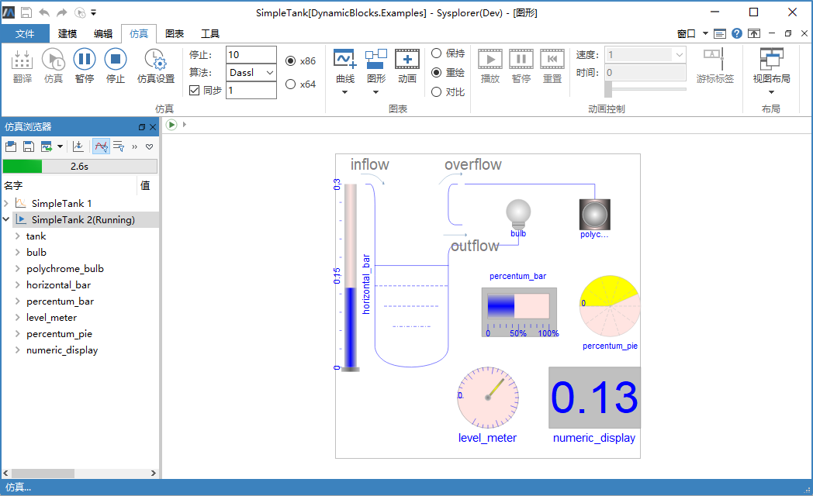

# 二维动画窗口

MWorks.Sysplorer 仿真环境中提供了**2D动画窗口**，以图形方式表现模型的关系结构，在仿真或动画播放时，动态组件进行2D动画演示，供用户观察模型的状态变化。切换到**仿真**标签页，点击**图形**创建二维动画窗口，通过下拉菜单可选择以**图标视图**或**图形视图**创建动画窗口。

下图模型显示从0 时刻开始向水箱tank中进水，动态组件反应水箱水位等信息的状态变化。

> **提示：**在仿真环境中的**2D动画窗口**只能查看模型结构，不能进行修改操作。 
