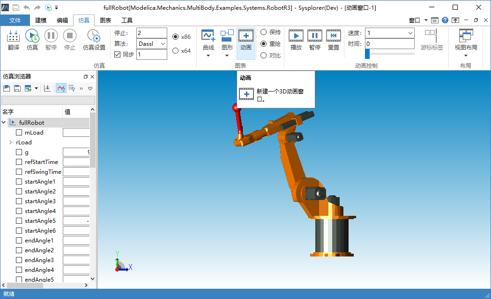

# 动画窗口

MWorks.Sysplorer 支持三维图形显示与动画播放。切换到**仿真**标签页，点击，可以新建一个动画窗口，如果当前实例包含机械多体模型中的组件并且具有动画属性，则新建的动画窗口将显示该实例的动画对象。

**动画窗口**提供了丰富的界面交互功能，包括动画控制工具栏、动画展示工具栏、上下文菜单等，详细内容参考动画窗口交互操作 。

在**动画窗口**中点击右键会弹出上下文菜单，菜单根据选中对象不同显示不同内容。

- 空白处点击右键

  

- 选中动画实体后点击右键

  

