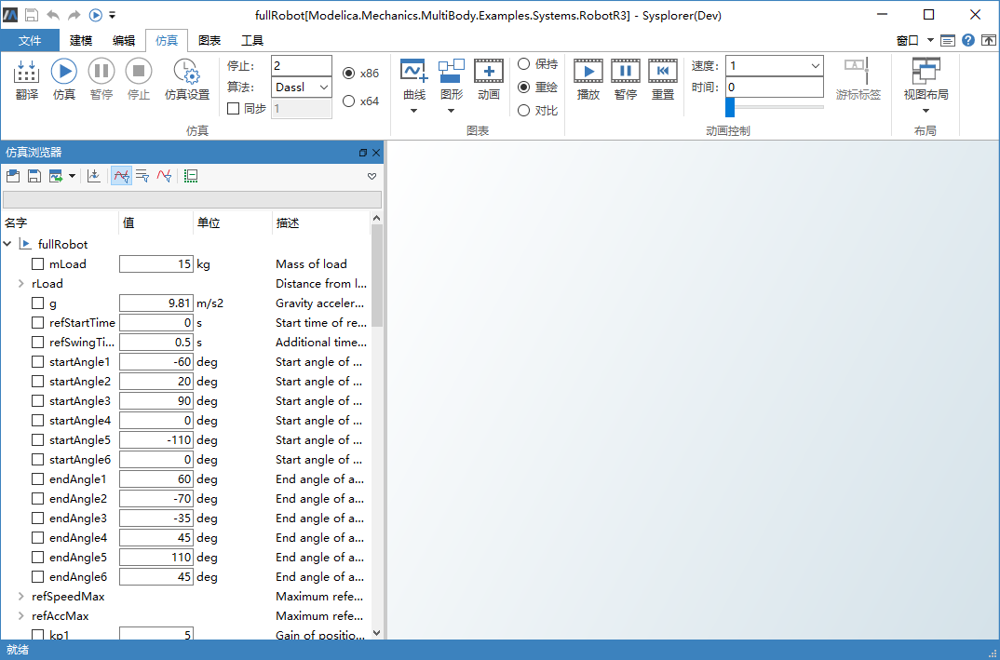
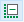
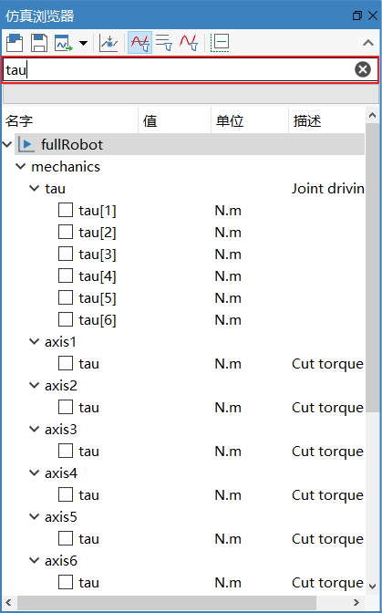
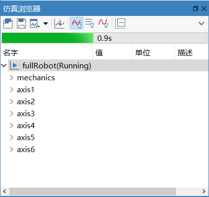
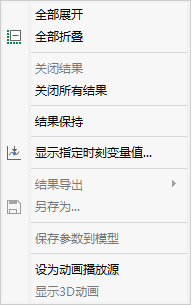
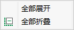
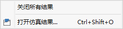

# 仿真浏览器

**仿真浏览器**默认停靠在主窗口的左边，可以根据需要或者使用习惯调整到其他合适的位置。**仿真浏览器**以树的形式显示模型的编译结果，列出了模型中的组件层次结构。

### 工具栏

各个按钮功能如下：

：打开仿真结果

：将当前仿真实例的结果导出，提供**仅导出曲线窗口结果**、**仅导出当前曲线子窗口结果**、**导出所有**三种选择

：将当前仿真实例另存为

：显示指定时刻变量值

：过滤实例，显示所有变量和参数

：过滤实例，仅显示参数

：过滤实例，仅显示变量

：全部折叠

### 搜索

**仿真浏览器**上方的搜索列表框可输入要查找的变量名。根据输入的关键字，搜索结果即时显示。

：显示、隐藏搜索框

### 进度条

工具栏的下方是仿真进度条。仿真过程中，根据当前仿真时间，显示进度。

### 实例显示

**仿真浏览器**中每个模型实例的显示内容包括四列：名字、值、单位、描述。

- 名字，按照组件层次结构显示出模型中的组件和变量。其中根节点名字由模型短名(最后一级模型名)和一个序号组成，同一个模型对应的不同实例根据序号进行区分；中间节点对应模型中的组件；叶子节点对应常量、参数和变量，从根节点到叶子节点逐级组合得到的复合名字(例如 damper.phi_rel)即为模型平坦化之后的变量名。 每个叶子节点前有一个检查框，选中之后可在曲线窗口中显示其变量曲线。

- 值，显示变量值。缺省列出常量、参数和变量初值。 

- 单位，对应变量的显示单位(displayunit)。一般Real类型的变量具有两个单位属性：(1) unit对应SI单位; (2) displayUnit 对应工程中常用的单位，仿真浏览器中第 2 列和第 3 列都默认使用 displayunit。

- 描述，显示变量的描述信息。对于模型(根节点)和组件(中间节点)，该列为空。 

### 上下文菜单

在**仿真浏览器**中的树节点上点击右键会弹出上下文菜单，菜单根据不同类型的节点显示不同的内容。 

- 在变量树的根节点上点击右键

- 在组件节点上点击右键

- 在变量节点上点击右键

- 在空白处点击右键

