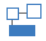
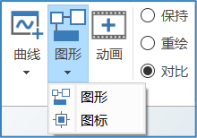
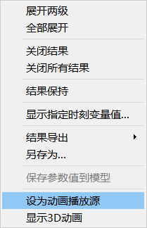
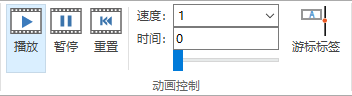
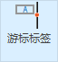

# 二维动画窗口交互操作

二维动画窗口可用于查看模型中的二维动画组件的实时变化，该动画窗口基于模型的**图标视图**或**图形视图**创建。

### 新建二维动画窗口

切换到**仿真**或**图表**标签页，展开**图形**的下拉菜单，选择**图形**，则以当前模型的**图形视图**创建二维动画窗口；选择**图标**，则以**图标视图**创建二维动画窗口。

软件仅允许显示一个二维动画窗口，多次创建时，新建的二维动画窗口将覆盖旧的二维动画窗口。

### 显示内容切换

二维动画窗口显示内容与建模界面下的**图标**/**图形视图**保持一致，因此只需在**建模**界面下切换当前模型，二维动画窗口中的显示内容将自动切换。

### 动画播放源

二维动画窗口显示内容切换后，若当前的动画播放源与二维动画窗口内的显示内容不匹配，则此时的二维动画无法播放，若要播放动画，则需要切换动画播放源，使之与二维动画显示内容匹配。

切换动画播放源有如下两种方法：

1. 仿真当前模型，则新生成的实例将被自动设置为动画播放源。

2. 在**仿真浏览器**中选中实例，鼠标右键单击，上下文菜单中选择**设为动画播放源**。

   

### 动画控制

在**仿真**标签页的**动画控制**中，可对二维动画的播放进行控制。

**动画控制**组的主要功能如下：

- 播放：从头或从上次暂停的时刻播放当前实例动画。
- 暂停：暂停播放。
- 重置：停止按钮，停止播放动画并恢复初始状态。
- 时间：实时显示动画播放时间。
- 进度条：显示动画播放进度。
- 速度：调节动画播放速度的快慢，提供文本输入框和下拉框供用户输入和选择速度。
- 动画游标标签：控制动画播放时是否显示曲线的值。