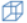
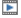

# 动画窗口交互操作

**图表**标签页的功能区，提供**新建3D动画**、**动画展示**等动画窗口操作选项。

> **提示：**当前活动窗口为3D动画窗口时，功能区中的**动画展示**才显示。 

### 新建3D动画

切换到**仿真**或**图表**标签页，点击 新建动画窗口，如果当前实例包含机械多体模型中的组件并且具有动画属性，新建的动画窗口将显示该模型的三维动画对象。

新建生成的**动画窗口**可能会出现如下图所示的特殊状态，该状态下，**动画窗口**不显示任何内容。

造成这一情况的原因为当前驱动类型与系统环境不匹配，此时可以在**动画窗口**内单击鼠标右键，上下文菜单中选择**动画选项**，在弹出的**三维动画设置**窗口中，选择**常规**选项卡，更改**驱动类型**。

更改驱动类型后，点击**确定**应用设置，该设置将在下次创建动画窗口时生效。

此时**新建动画窗口**，若动画窗口正常显示，则说明该驱动类型适用于当前的系统环境，否则请尝试其他驱动类型，直至动画窗口正常显示。

### 动画控制

动画播放过程能够生动再现三维模型的运动过程，帮助用户观察与分析模型的动态性能。**动画控制**中的操作选项不仅作用于3D 动画窗口，还能同时控制曲线和二维动画播放 。

### 视图切换

点击**动画展示**中的下拉箭头，弹出的下拉菜单中的选项 ，可以从不同视角观察模型结构。

- 前视图：沿 Z 轴逆向查看模型。

- 后视图：沿 Z 轴正向查看模型。

- 左视图：沿 X 轴正向查看模型 。

- 右视图：沿 X 轴逆向查看模型。

- 俯视图：沿 Y 轴逆向查看模型 。

- 仰视图：沿 Y 轴正向查看模型 。

-  轴测图（XYZ/ZXY）：坐标轴等夹角(120°)的方向查看模型。

如下图所示为双摆模型的ZXY轴测图和主视图。

### 改变显示模式

三维实体模型外观由一组封闭曲面包围，曲面边界是一系列首尾相连的线条，线条具有断点和内部控制点，这些元素需要在不同显示模式下进行观察。

支持**实体渲染模式**、**线框渲染模式**、**消隐渲染模式**、**透视图**、**显示阴影**等操作 ，可以改变动画窗口的显示模式。

- 实体渲染模式：为缺省设置，三维模型的所有面是可见的。

- 线框渲染模式：三维模型的面隐藏，曲面边界可见。

- 消隐渲染模式 ：从观察视角来看，三维模型中被遮挡的一部分面和边界线被隐藏，其他线条可见。

-  透视图：以透视投影方式显示三维模型。

- 显示阴影：显示三维模型的阴影效果图。

下图依次显示双摆模型的实体渲染图、线框渲染图和消隐渲染图。

### 模型操作

通过快捷键实现模型的旋转、缩放、平移、切换视图和显示模式等操作，对模型结构细节进行观察。

<table>
	<tr>
	    <th>分类</th>
	    <th>交互功能</th>
	    <th>快捷键</th>  
	</tr >
	<tr >
	    <td rowspan="7">旋转</td>
	    <td>按住鼠标左键并移动，实现旋转</td>
        <td><code>Ctrl</code> </td>
	</tr>
	<tr>
	    <td>绕-y轴旋转 </td>
        <td><code>Ctrl</code>+<code>←</code> </td>
	</tr>
	<tr>
	    <td>绕y轴旋转</td>
        <td><code>Ctrl</code>+<code>→</code></td>
	</tr>
	<tr>
	    <td>绕-x轴旋转</td>
        <td><code>Ctrl</code>+<code>↑</code></td>
	</tr>
	<tr><td>绕x轴旋转</td>
        <td><code>Ctrl</code>+<code>↓</code></td>
	</tr>
	<tr>
	    <td>绕-z轴旋转</td>
        <td><code>Ctrl</code>+<code>Shift</code>+<code>←</code></td>
	</tr>
	<tr>
        <td>绕z轴旋转</td>
        <td><code>Ctrl</code>+<code>Shift</code>+<code>→</code></td>
	</tr>
	<tr>
	    <td rowspan="4">缩放</td>
	    <td>按住鼠标左键并移动，实现缩放</td>
        <td><code>Shift</code></td>
	</tr>
	<tr>
	    <td>放大</td>
	    <td><code>Shift</code>+<code>↑</code></td>
	</tr>
	<tr>
	    <td >缩小</td>
	    <td ><code>Shift</code>+<code>↓</code></td>  
	</tr>
	<tr>
	    <td >缩放至最佳</td>
	    <td ><code>F</code></td>  
	</tr>
	<tr>
	    <td rowspan="4">平移</td>
        <td >向左平移</td>
	    <td ><code>←</code></td>
	</tr>
	<tr>
	    <td >向右平移</td>
	    <td ><code>→</code></td> 
	</tr>
	<tr>
	    <td >向上平移</td>
	    <td ><code>↑</code></td> 
	</tr>
	<tr>
	    <td >向下平移</td>
	    <td ><code>↓</code></td> 
	</tr>
	<tr>
	    <td rowspan="7">视图切换</td>
	    <td >前视图</td>
	    <td ><code>Shift</code>+<code>F</code></td>
	</tr>
	<tr>
	    <td >后视图</td>
	    <td ><code>Shift</code>+<code>B</code></td>
	</tr>
	<tr>
	    <td >左视图</td>
	    <td ><code>Shift</code>+<code>L</code></td>
	</tr>
	 <tr>
	    <td >右视图</td>
	    <td ><code>Shift</code>+<code>R</code></td>
	</tr>
	<tr>
	    <td >仰视图</td>
	    <td ><code>Shift</code>+<code>M</code></td>
	</tr>
	<tr>
	    <td >俯视图</td>
	    <td ><code>Shift</code>+<code>P</code></td>
	</tr>
	<tr>
	    <td >轴视图</td>
	    <td ><code>Shift</code>+<code>I</code></td>
	</tr>
	 <tr>
	 	<td >显示模式</td>
	    <td >切换实体/线框/消隐渲染模式</td>
	    <td ><code>Shift</code>+<code>S</code></td>
	</tr>
</table>

对动画视图进行操作时，鼠标显示不同的状态。

- ：平移模式

- ：旋转模式

- ：缩放模式

下图依次展示双摆模型旋转、缩放、平移的显示效果。

### 动画设置

MWorks为动画窗口提供了选项设置界面，用于改变动画窗口外观、支持运动轨迹跟踪与相机跟随等。点击**动画展示**中的或**动画窗口**上下文菜单选择**动画选项**，打开**三维动画设置**对话框。对话设置对话框中分为显示、相机跟随、背景和快捷键四个属性页。

##### 常规

- 驱动类型：选择与系统驱动类型向符合的动画驱动类型。

- 显示操纵系： 设置是否在动画窗口左下角显示一个操纵坐标系， 缺省勾选。如果勾选该选项， 则显示出操纵坐标系，其由三条线段组成，分别代表 X 轴( 蓝色) 、 Y 轴( 绿色) 和 Z 轴( 红色) ，移动操纵坐标系，窗口中对应的实体也跟随坐标系相应移动。

- 显示单位立方体参考：设置是否在全局坐标系原点处显示一个单位立方体，缺省不勾选。

- 显示轴参考： 设置是否在全局坐标系原点处显示一个参考坐标系， 缺省不勾选。如果勾选该选项， 则显示出参考坐标系，其由三条 1 米 长的线段组成，分别代表 X 轴( 蓝色) 、 Y 轴( 绿色) 和 Z 轴( 红色) 。

- 显示 X-Y/X-Z/Y-Z 平面栅格 ： 设置是否显示 X-Y/X-Z/Y-Z 平面栅格， 缺省不勾选。 

- 显示选中/所有实体轨迹：设置选中/所有实体的运动轨迹是否实时地显示在动画视图中，缺省“否”。勾选该选项后显示效果下图所示，对动画播放速度有影响。

##### 相机跟随

- 跟随选中的实体：当选中实体的运动范围超出动画窗口时，观察相机的位置和视角是否跟随变化，缺省“否”，即相机方位不随实体位置变化而改变。如果选中该选项，则相机方位变化由选中实体和下面具体的选项来决定，特别适用于运动范围较大的机械系统。

- 跟随实体X/Y/Z轴方向移动：控制相机方位是否跟随选中实体在X/Y/Z轴方向上同步平移。

- 跟随实体转动：控制相机方位是否跟随选中实体进行旋转。

##### 背景

- 背景颜色

  提供三种常用背景供选择，可自定义动画窗口顶部和底部的颜色。

- 背景图片

  设置选择的图片为动画窗口背景。

### 切换动画实体

MWorks支持将当前动画窗口内的动画实体切换为其他仿真实例的动画实体。

1. 选中任一三维动画窗口，将该动画窗口指定为当前窗口；

2. 选中需要切换的仿真实例，右键单击实例根节点，上下文菜单选择**显示3D动画**，此时当前窗口内的动画实体切换。

   

3D动画窗口仅支持播放当前实例的动画实体，若要播放切换后的动画实例，需要将对应的仿真实例设置为动画播放源：

1. 选中仿真实例，右键单击实例根节点，上下文菜单选择**设为动画播放源**

   

2. 在**仿真** > **动画控制**中，点击进行动画播放。

### 外部3D模型文件导入

目前，MWorks.Sysplorer仅能建立基本的三维几何元素，无法绘制细致的几何外形，但可将专业的三维软件建立的几何外形文件转换为MWorks可识别的格式，并关联到机械多体模型，从而导入MWorks中，在后处理界面的动画窗口显示出关联的几何外形，以达到逼真的仿真效果。

外部3D模型文件导入MWorks的方法详见[3D模型外部文件格式转换](#/thirdExample/3DShapeFilesFormatConversion)。