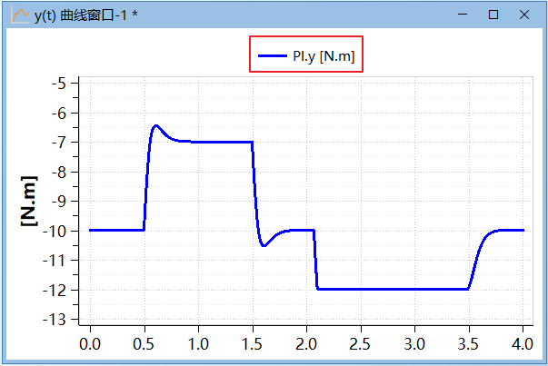

# 曲线窗口交互操作

曲线窗口分为**y(t)曲线窗口**和**y(x)曲线窗口**两类 ，两者使用方法大体一致 ，本章不做区分。

曲线窗口的交互操作是通过窗口的右键菜单，以及**图表** > **曲线工具**与**图表** > **曲线运算**提供的操作选项实现。


### 新建曲线窗口

y(t)曲线窗口有三种创建方式：

- 在**仿真** > **图表**中，点击**曲线**，即可新建y(t)曲线窗口。

- 在**仿真浏览器**内选中变量节点，长按鼠标左键拖拽至空白处，系统将新建一个y(t)曲线窗口，并显示该变量曲线。
- 当前无曲线窗口时，在**仿真浏览器**内选中变量节点，勾选该变量（点击该节点前的□或变量名）。

y(x)曲线窗口有两种创建方式：

- 在**仿真** > **图表**中，展开**曲线**的下拉菜单，点击**新建y(x)曲线窗口**，即可新建y(x)曲线窗口。

- 在**仿真浏览器**内选中变量节点，按住键盘Shift按键，长按鼠标左键拖拽变量节点至空白处，系统将新建一个y(x)曲线窗口，并将该变量作为曲线窗口的横坐标。

### 添加曲线至曲线窗口

添加曲线窗口的过程，如下：

1. 单击**仿真** > **图表** > **曲线**，新建**y(t)曲线窗口**或**y(time)曲线窗口**。

2. 在**仿真浏览器**中，进行以下任意方式：

   - 单击变量左侧的复选框
   
   - 按住变量，拖拽至**曲线窗口**
   
3. 在**曲线窗口**中绘制变量曲线。

支持一次绘制多个曲线，操作过程如下：

1. 单击**仿真** > **图表** > **曲线**，新建**y(t)曲线窗口**或**y(time)曲线窗口**。

2. 在**仿真浏览器**中，通过以下几种方式，多选变量：

   - 按住【ctrl】单击多个变量，进行拣选
   
   - 按住【shift】单击变量，进行连续多选
   
   - 在非变量节点，按住鼠标左键，拖拽鼠标，框选当前可见的变量
   
3. 右击任意一个选中的变量，弹出的上下文菜单中，选择**批量选中**。

   

4. **曲线窗口**绘制选中变量的曲线。

在曲线窗口的顶端显示了该曲线的图例与变量名(包括单位)，如果只有一条曲线，纵坐标轴标题文字与变量名相同。


### 曲线跟踪与动态提示

MWorks.Sysplorer 提供了曲线跟踪的功能，当鼠标在曲线窗口中某个变量曲线的数据点附近悬停一定时间后，系统弹出动态提示工具，列出该曲线与数据点的相关信息。

动态提示包括变量名字，该点的横坐标、纵坐标、横纵坐标单位、斜率以及该点附近的局部最小值和最大值。


如果鼠标点附近有多条曲线经过，则动态提示工具显示出所有相关曲线与数据点的信息，并将信息与曲线颜色对应，便于查找。

### 变量显示单位

Modelica支持设置Real类型变量的显示单位(displayUnit)属性，在MWorks仿真环境中，显示单位用于绘制变量曲线。

以模型实例DoublePendulum-1为例，在双摆模型中，组件“damper”中的变量“phi_rel”使用Modelica预定义单位类型Modelica.SIunits.Angle进行定义，代码如下。

```
 SI.Angle phi_rel(start = 0);  
```

其中类型SI.Angle实为Modelica.SIunits.Angle，进一步查看其代码：

```
 type Angle = Real(
	final  quantity = "Angle",   
	final  unit = "rad",     
	displayUnit = "deg");  
```

可以看出，Modelica.SIunits.Angle声明了单位(unit)为“弧度rad”，显示单位(displayUnit)为“角度deg”。如果没有使用变型机制重新设置变量“phi_rel”的显示单位，其缺省显示单位总是“角度deg”。

由于显示单位(displayUnit)更加符合工程上的观测习惯，**仿真浏览器**中显示出变量“damper.phi_rel”的单位为“角度deg”，变量曲线也按照显示单位(本例中为“角度deg”)进行显示。 

                       

单位(unit)与显示单位(displayUnit)之间的换算关系通过系统配置文件“【MWorks安装目录】\Setting\MWorks.DisplayUnit.xml”进行定义，该文件内置了一部分工程上常用的显示单位，可以根据需要自行添加。其中关于弧度与角度的换算参数定义摘录如下。

```
<unit name="rad">
	<displayUnit name = "deg" scale = "57.295779513082320876846364344191" />
</unit>  
```

> **注意**： 57.295779513082320876846364344191= 180/Modelica.Constants.pi。

MWorks提供了灵活的操作方式用于重置变量的显示单位。

- 在曲线窗口属性对话框中设置

  选择曲线窗口上下文菜单中**属性**，打开**曲线窗口属性**对话框，选择**曲线**标签页。在**属性**栏显示出该变量的“unit”属性，在**显示单位**下拉菜单中显示出候选的显示单位，并缺省选中当前显示单位。在**显示单位**下拉菜单中选择另一个单位，点击**确定**，随后曲线窗口按照选定的单位绘制其变量曲线。

  

- 曲线的右键菜单**显示单位**中设置

  右击曲线，在上下文菜单中单击**显示单位**，选择显示单位列表中的单位，随后曲线窗口按照选定的单位绘制其变量曲线。

  

### 曲线窗口标题

**曲线窗口**上沿、左测、右侧、下沿分别居中显示曲线窗口标题、左纵坐标轴标题、右纵坐标轴标题和横坐标轴标题。缺省情况下显示内容如下：

- 窗口标题文字为空。

- 仅显示一个变量时，纵坐标轴标题文字为该变量的显示单位，显示多个变量时，纵坐标轴标题为空。

- 在Y(time)曲线窗口中，横坐标轴标题为空；Y(X) 曲线窗口中，若当前未引入自变量，则横坐标轴标题为空，若引入了自变量，则横坐标轴标题为自变量的名字及其显示单位。

在**曲线窗口属性**对话框的**标题**属性页，可以设置曲线窗口的标题、横坐标轴标题、左纵坐标轴标题、右纵坐标标题。


对于横坐标轴和左（右）纵坐标轴标题和标题：

- 选择**无**时不显示任何文字；

- 选择**默认**时按照缺省规则显示标题；

- 选择**自定义**时按照编辑框中的输入的内容显示标题。


### 曲线图例

变量图例常见于曲线窗口，显示在曲线上方，作为变量曲线的形象标记，据此可以很容易地识别出不同的变量。



图例由两个部分组成：

- 醒目的短线：使用与变量曲线相同的颜色、线型和线宽进行绘制，不同的图例，短线颜色不同；

- 图例名：默认为“实例编号+组件名.变量名+[显示单位]”，如“[1] PI.y [N.m]”。在**曲线窗口属性**对话框的**曲线**标签页，可以修改各个曲线的图例名。


在**曲线窗口属性**对话框的**图例**标签页中，可以设置图例的位置和样式。


- 隐藏：隐藏图例显示

- 嵌入：图例嵌入显示，可通过下拉菜单选择图例的嵌入位置，包括“上方”、“左侧”、“右侧”、“下方”，默认选项为上方。

- 浮动：图例浮动显示，选择该选项后，下方浮动位置设置解禁,可设置图例的浮动位置，包括“左上、左中、左下、正上、正下、右上、右中、右下”，其中默认选项为“正上”。

- Set as Default Layout：设置为默认布局，下次打开曲线窗口时生效。

### 曲线显示属性

单击曲线窗口中的曲线或图例，曲线和图例同时高亮显示。


通过曲线上下文菜单或**曲线窗口属性**窗口的**曲线**属性页，可设置各条曲线的颜色、线型、数据点、线宽等外观。


对曲线“damper.a_rel ”进行外观设置。


如下图为设置前与设置后的曲线样式对比。


### 曲线显示范围

曲线显示范围由横坐标轴区间和纵坐标轴区间决定，缺省情况下，由系统按显示变量的最大/ 最小值自行设置。

- 纵坐标轴区间：根据变量数据的最大/ 最小值计算得到，如果显示单位有效，则按换算后的数值计算。

- 横坐标轴区间：Y(time) 曲线窗口的横坐标轴区间由变量的仿真区间决定，Y(X) 曲线窗口由自变量结果数据的最大/ 最小值决定。

MWorks.Sysplorer 提供多种显示范围设置方法，可以根据实际需求选择合适的操作方式来设置曲线显示范围。

- 非精确缩放

  - 使用鼠标框选操作：在曲线窗口内按下鼠标左键并拖动，在合适的位置松开，鼠标拖动过程中框选的矩形范围随即被放大至整个曲线窗口进行显示。

  - 鼠标滚轮缩放操作：按下键盘按键“Ctrl ”，将鼠标移动至曲线窗口内，并滚动鼠标滚轮即可缩放曲线窗口，滚轮向前滚动为放大，向后滚动为缩小。

  - 缩放至最佳：无论曲线窗口当前是放大还是缩小状态，选择曲线工具中的“缩放至最佳”菜单，总能将窗口显示范围进行缩放，使其中的变量曲线全部显示。曲线窗口上下文菜单中还提供“横轴缩放至最佳”和“纵轴缩放至最佳”功能，使曲线窗口横轴或纵轴全部显示。

- 平移

    鼠标拖拽操作：按下键盘按键"Ctrl"，将鼠标移动至曲线窗口内，长按鼠标左键并移动鼠标，即可平移曲线窗口的画布，实现曲线显示范围的移动。
    
- 坐标轴范围设置

  选择曲线窗口上下文菜单中的**设置坐标轴范围**，输入横、纵坐标轴的范围进行坐标轴范围设置。


### 曲线子窗口

默认情况下，一个曲线窗口只包含一个图表，可以通过**图表** > **曲线工具**中的**添加子窗口**添加多个图表，这里的图表又称为曲线子窗口。

在曲线窗口中始终只有一个子窗口处于活动状态，该子窗口由封闭的矩形框标识。**曲线**工具中的功能只对当前活动状态下的子窗口生效。


注意：同一个**Y(X) 曲线窗口**添加的曲线子窗口X 轴自变量始终保持一致。

### 曲线运算

MWorks仿真环境提供在变量结果集的基础上进行变量相减、相加、积分、微分等曲线运算操作。这些操作以工程数学为基础，具有一定的物理意义和几何上的直观性，帮助设计者进一步了解仿真模型的性能。当前只支持Y(time) 曲线窗口的曲线运算。

例如，通过观察变量相减得到的结果曲线，可以明确一个模型实例中的不同变量或不同模型实例中的同一个变量之间的差异；曲线微分给出了变量随时间的变化趋势。

选中曲线，右击鼠标，在弹出菜单中选择**运算**，其子菜单中列出相加、相减、积分、微分等运算操作。


- 相加

  选中两个或多个变量曲线加法运算，产生新的结果变量。初始显示两个变量曲线J1.w 、J2.w ，相加结果曲线J1.w+J2.w 。

  


​	加法运算是将变量值在时间点上逐步进行相加，得到新的结果变量。

- 相减

  曲线二元运算，选择两个变量曲线进行减法运算，产生新的结果变量。初始显示两个变量曲线J1.w 、J2.w ，相减结果曲线J1.w-J2.w 。

  

- 积分

  曲线一元运算，选择一个变量，对其计算相对“时间”的积分，产生新的结果变量。初始显示一个变量曲线J1.w ，积分结果曲线Int<J1.w> 。

  

- 微分

  曲线一元运算，选择一个变量，对其计算相对“时间”的微分，产生新的结果变量。初始显示一个变量曲线J1.a ，微分结果曲线Diff<J1.a> 。

  

### 曲线游标

点击**图表** > **曲线工具 **中的**曲线游标**，可以控制游标的启动与关闭。打开曲线游标后，在曲线窗口左上角文本框中显示游标所在处的所有曲线值。文本框可通过鼠标拖拽的方式移动至曲线窗口内的任意位置。


鼠标移动至游标附近，待鼠标图标样式变为 时长按鼠标左键并拖拽，此时游标跟随鼠标拖拽移动，直至松开鼠标。

曲线游标遵循以下规则：

1. 曲线窗口正在绘制曲线，游标始终保持在仿真曲线的最右侧，无法被鼠标拖拽。

2. 游标只能在曲线的采样点集合上移动，无法移动至曲线外的空白处。

3. 当前曲线窗口内存在子窗口，在一个子窗口中拖拽游标移动时（控制游标），其他子窗口内的游标都会跟随移动( 随动游标) ，使各个游标的横坐标值保持一致。

### 调整边距

在**图表** > **曲线工具**中点击**调整边距**按钮，当前曲线窗口开启调整边距功能，各子窗口将出现红色虚线。

   

将鼠标移至任意红线上，待鼠标变为时，长按左键沿箭头所指方向移动，即可调整子窗口的边距。

