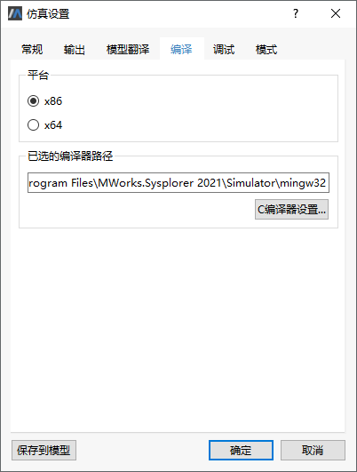
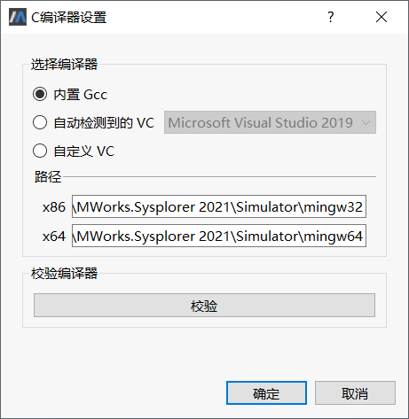

# 仿真设置-编译

切换到**仿真**标签页，单击，弹出**仿真设置**对话框，点击**编译**切换至编译标签页。

- 平台

  x86：选择后将当前编译器切换为32位。

  x64：选择后将当前编译器切换为64位。

- 已选的编译器路径

  文本框：用于显示当前使用的编译器路径，无法编辑

  C编译器设置：点击后弹出C编译器设置窗口，可用于设置当前使用的C编译器，设置方法同[选项-仿真](#/forthExample/CustomizedEnvironment/Options?target=Options_simulation)中的C编译器设置。

