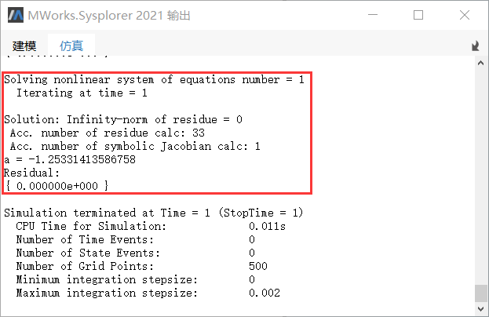
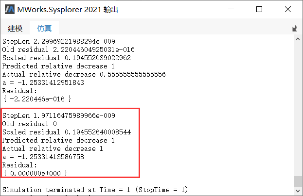

# 仿真设置-调试

切换到**仿真**标签页，单击，弹出**仿真设置**对话框，点击**调试**切换至调试标签页。


### 正常的警告信息

- 功能说明

  若当前模型在仿真过程中存在警告信息（如仿真实例的仿真终止时间等于开始时间），勾选该选项后，系统将在仿真时输出相关的警告信息。

- 示例

  将仿真设置保存到模型后，在文本视图中修改仿真的开始时间，使其仿真开始时间大于结束时间。仿真后，系统输出内容如下图所示，显示仿真区间以及仿真步长无效的警告。

  

### 仿真中的事件

- 功能说明

  勾选后，仿真相应模型，系统输出仿真过程中触发的事件信息。

- 示例： [T11](mworks://ref/static/Samples/ToolsOptions/T11.mo)

  ```
  model T11
    Real a;
  equation 
    if time > 0.5 then 
      a = sin(time);
    else
      a = cos(time);
    end if;
  end T11;
  ```

  仿真示例模型，系统输出内容如图所示。其中显示了两个事件的详细信息。

  

### 动态状态变量选择

- 功能说明

  勾选该功能后，仿真模型，若在仿真过程中发生动态状态变量切换，则系统输出动态选择的状态变量。模型求解失败时，可以使用该功能查看动态状态变量切换的详细信息，辅助定位问题。

- 示例： [T12](mworks://ref/static/Samples/ToolsOptions/T12.mo)

  ```
  model T12
      Real x(start = 1);
      Real y;
      Real u(start = 0);
      Real v;
      Real F;
      parameter Real L = 1;
      parameter Real m = 1;
      constant Real g = 9.81;
    equation 
      u = der(x);
      v = der(y);
      m * der(u) = -x * F / L;
      m * der(v) = -y * F / L - m * g;
      x ^ 2 + y ^ 2 = L ^ 2;
    end T12;
  ```

  仿真示例模型，系统输出内容如图所示。其中显示了在0.410、0.797两个时间点，系统的状态变量进行切换的过程。

  

- 注意事项

  在**仿真设置** > **模型翻译**标签页中勾选**记录所选的连续时间状态变量**后，可根据模型翻译的输出结果判断模型仿真过程中是否有可能存在动态状态变量切换。若无状态变量集合，则不可能发生动态状态变量切换。

  

### 非线性解

- 功能说明

  模型求解失败或结果不符合预期时，可以启用该选项，系统会输出每一步仿真过程中非线性方程的求解结果信息(包括变量值、残余量等)，用于辅助定位问题。

- 示例：[T13](mworks://ref/static/Samples/ToolsOptions/T13.mo)

  ```
  model T13
    Real a;
  equation 
    sin(a ^ 2) = time;
  end T13;
  ```

  仿真示例模型，由于每一个仿真步长都会迭代求解非线性方程sin(a^2) = time,因此系统会输出每一步非线性方程解的信息。如图所示框选的是单次非线性方程解的输出信息。

  


### 非线性迭代

- 功能说明

  模型求解失败或结果不符合预期时，可以启用该选项，系统输出仿真过程中每一次非线性方程求解的迭代信息，细致地展现非线性求解的过程。

- 示例： [T13](mworks://ref/static/Samples/ToolsOptions/T13.mo)

  ```
  model T13
    Real a;
  equation 
    sin(a ^ 2) = time;
  end T13;
  ```

   仿真示例模型，由于每一个仿真步长都会经过若干次迭代，因此系统会输出每一次迭代的信息，包括：变量值、残差、步长等。如图所示框选的内容为单次迭代的信息。

  

- 注意事项

  启用该功能时，信息输出的频率较高，会带来较大的额外时间开销。

### 记录线性奇异

- 功能说明

  仿真过程中出现线性方程求解失败时，可启用该选项，辅助定位求解失败方程。启用后仿真模型，若线型方程求解过程中出现了线性奇异，则系统输出线性奇异方程的变量信息。

- 示例：[T14](mworks://ref/static/Samples/ToolsOptions/T14.mo)

  ```
  model T14
    Real a;
    Real b;
  equation 
    a + b = 1;
    a + b = 2;
  end T14;
  ```

  启用该功能后，仿真示例模型，系统输出如下图所示，框选内容为线性奇异相关信息。

  

- 注意事项

  若该线性奇异为矛盾奇异，则线性方程会求解失败并报错，若是相容奇异，则系统会使用最小二乘法求解，并输出警告。

### 错误信息中包含函数调用环境

- 功能说明

  若模型仿真在调用函数时失败，则可以启用该功能，然后仿真相应模型，系统输出错误信息及函数调用的栈信息，以此来辅助问题的定位。

- 示例： [T16](mworks://ref/static/Samples/ToolsOptions/T16.mo)

  ```
  model T16
    function fun1
      input Integer n;
      output Real b;
    protected 
      Real a[2] = {1, 2};
    algorithm 
      b := a[n];
    end fun1;
    Integer n;
    Real x;
  equation 
    if time > 0.5 then 
      n = 3;
    else
      n = 2;
    end if;
    x = fun1(n);
  end T16;
  ```

  示例模型中，函数fun1出现下标越界的问题。启用该功能后，仿真示例模型，报错时输出调用的函数栈，如图所示。框选部分显示错误位置为T16.fun1，与实际情况一致。

  

  

  

  

  