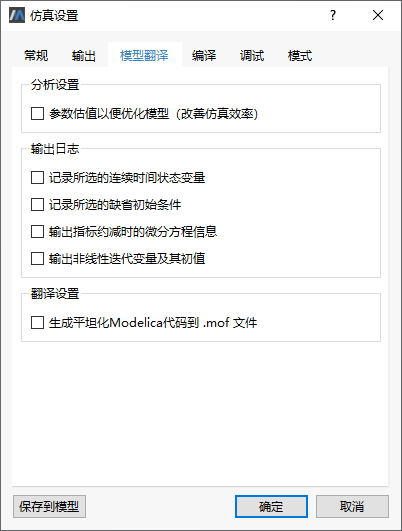
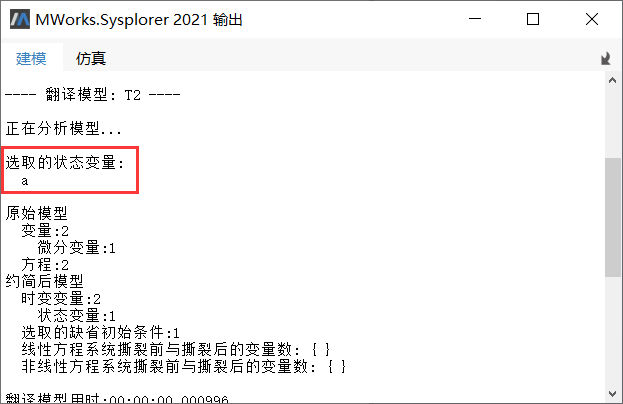
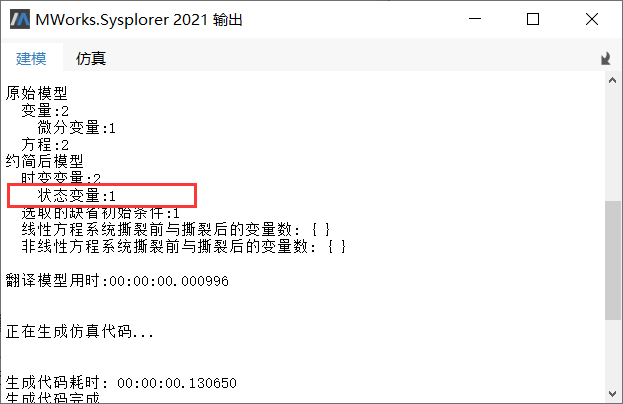
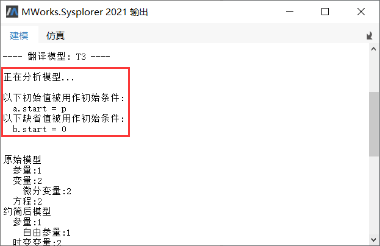
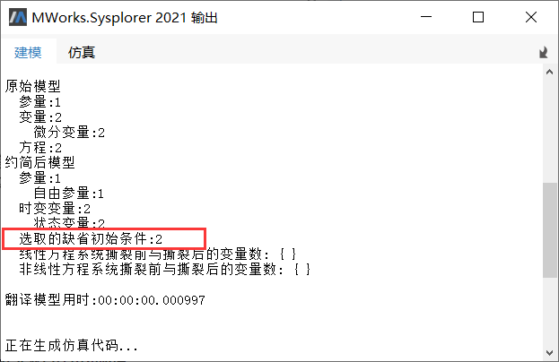
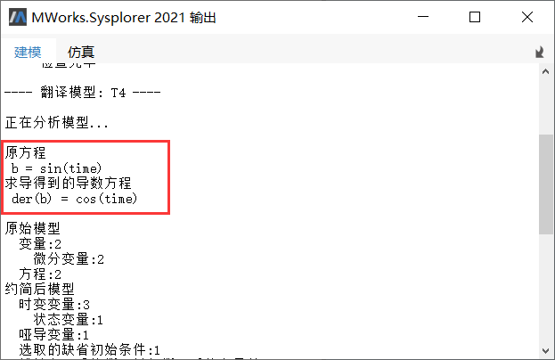
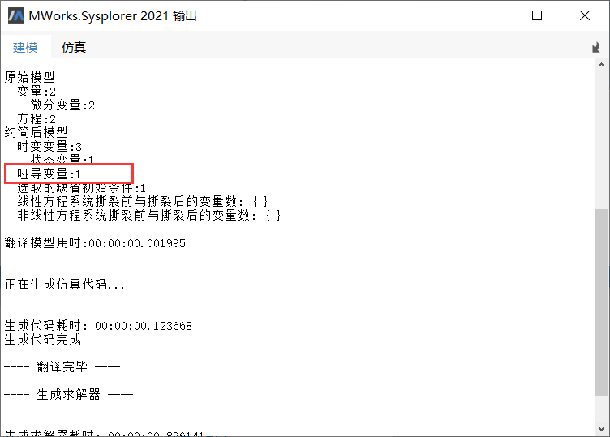
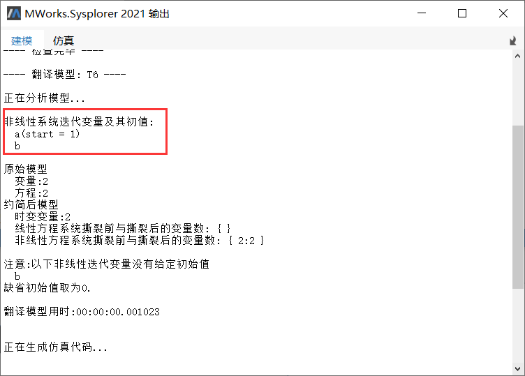
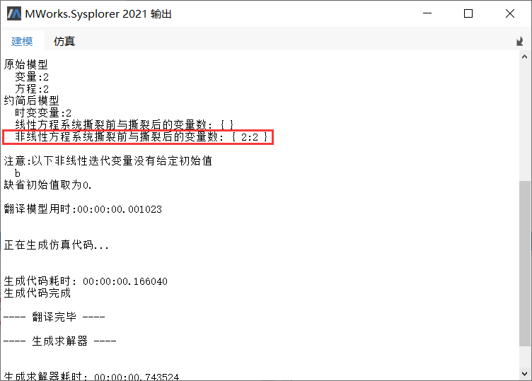

# 仿真设置-模型翻译

切换到**仿真**标签页，单击，弹出**仿真设置**对话框，点击**模型翻译**切换至模型翻译标签页。



### 参数估值以便优化模型（改善仿真效率）

- 功能说明

  当模型求解缓慢时，勾选该功能，然后翻译模型，系统会自动对模型中的参数进行估值，并用估值得到的结果（一个常数）替换仿真实例中的参数（需要计算），以减少计算过程中的开销，改善仿真效率，解决模型仿真缓慢的问题。

- 示例： [T1](mworks://ref/static/Samples/ToolsOptions/T1.mo)

  ```
  model T1
    function fun1
      input Real a;
      output Real b;
    algorithm 
      b := 1;
      b := sin(a);
    end fun1;
    parameter Real p = 1;
    Real a;
  equation 
    der(a) = fun1(p) + time;
  end T1;
  ```

  翻译上述示例时，若已打开参数估值功能，则系统将对函数fun1(p)进行估值得到结果0.8414，并使用该结果替换实例中的fun1(p)，减少了函数fun1(p)被调用的开销。

- 注意事项

  该选项提升求解效率仅对特定情况有效，且被估值后的参数变为固定值，在当前仿真实例中无法修改，仿真浏览器的参数操作面板中将不显示参数，由于以上局限性，该功能默认为关闭状态。

### 记录所选的连续时间状态变量

- 功能说明

  勾选该功能，翻译模型，系统自动将模型选定的变量名输出至输出面板中。当模型求解失败或与预期不一致，可能是由于选定的状态变量导致，此时可以改变选定的状态变量后再次求解模型。

- 示例： [T2](mworks://ref/static/Samples/ToolsOptions/T2.mo)

  ```
  model T2
      Real a;
      Real b = time;
    equation
      der(a) = time;
  end T2;
  ```
  启动该功能后翻译示例模型，输出结果中显示选取的状态变量。
  
  
  
- 注意事项

  该功能生效的前提是模型存在状态变量。模型是否存在状态变量可以通过翻译模型时输出的统计报表判断，如图所示，“状态变量：1”表示模型存在1个状态变量。
  
  

### 记录所选的缺省初始条件

- 功能说明

  勾选该功能，翻译模型，系统自动输出模型选定的变量初值。当模型求解失败或与预期不一致，可能是由于选定变量的初值导致，此时可以改变状态变量的初值后再次求解模型。

- 示例： [T3](mworks://ref/static/Samples/ToolsOptions/T3.mo)

  ```
  model T3
    parameter Real p = 0.5;
    Real a(start = p);
    Real b;
  equation 
    der(a) = sin(time);
    der(b) = cos(time);
  end T3;
  ```

  该模型中，a、b为状态变量，启用该功能后翻译模型，系统输出如下图所示。其中a设置了初始值，b使用变量的缺省值。

  

- 注意事项

  该功能生效的前提是模型选定的状态变量使用缺省的初始条件。选取的变量是否使用缺省初值可以通过翻译模型时输出的统计报表判断。如图所示，“选取的缺省初始条件：1”表示模型选定的状态变量使用了缺省的初始条件，若模型不使用缺省初始条件，该条目不会输出。

  

### 输出指标约减时的微分方程信息

- 功能说明

  系统在翻译模型过程中通过求导对某些方程进行降指标，将这些方程从DAE(微分代数方程)系统地转化为ODE(常微分方程)。在调试模型时，若要了解模型降指标的详细情况，可勾选该功能，然后翻译模型，系统自动输出模型的降指标方程信息(包括原方程和求导得到的方程)。

- 示例： [T4](mworks://ref/static/Samples/ToolsOptions/T4.mo)

  ```
  model T4
    Real a;
    Real b;
  equation 
    der(a) + der(b) = time;
    b = sin(time);
  end T4;
  ```

  系统在翻译示例模型时，对b=sin(time)求导，得到的der(b)=cos(time)，启动该功能后翻译模型，系统输出原方程和求导之后的方程。

  

- 注意事项

  该功能生效的前提是翻译时存在降指标的过程。该过程是否存在可以通过翻译时输出的统计报表判断，如图所示，“哑导变量：1”表示模型存在1个降指标的过程，若模型中不存在降指标过程，则该条目不会输出。

  

### 输出非线性迭代变量及其初值

- 功能说明

  勾选该功能后，系统在翻译模型时输出选定的非线性求解变量及其初值，若未给定初值，则输出该变量的缺省值。

- 示例： [T6](mworks://ref/static/Samples/ToolsOptions/T6.mo)

  ```
  model T6
    Real a(start = 1);
    Real b;
  equation 
    a ^ 2 + sin(b ^ 3) = sin(time);
    cos(a ^ 3) + b ^ 2 = cos(time);
  end T6;
  ```

  勾选该功能后，翻译示例模型，输出窗口中显示非线性迭代的变量及其初值。

  

- 注意事项

  该功能生效的前提是模型中存在非线性方程。模型中是否存在非线性方程可以通过翻译输出的统计报表判断。如图所示，“非线性方程系统撕裂前与撕裂后的变量数：{2:2}”表明系统中存在非线性方程，其变量数为2。

  

### 生成平坦化Modelica代码

- 功能说明

  勾选后，当前模型执行仿真操作时，在模型所在目录生成对应的平坦化（.mof）文件。