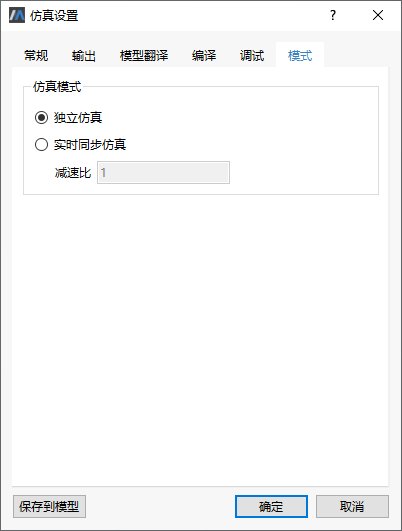

# 仿真设置-模式

切换到**仿真**标签页，单击，弹出**仿真设置**对话框，点击**模式**切换至模式标签页。

- 独立仿真

  仿真过程连续。

- 实时同步仿真

  在仿真过程中会实时更新模型图元动态属性，呈现动画效果。

- 减速比

  为了避免仿真时间太快看不到动画效果，设置减速比，可以对仿真时间进行延迟。表示实际仿真时间跟虚拟仿真时间的比值。该比值用于控制实时仿真速度，默认值为1。当时减速比大于1，则减速；当减速比小于1，则加速。时间比必须大于等于0。

当遇到以下两种情况时，系统自动使用独立仿真模式：

1. 减速比比小到一定程度；

2. 区间长度小于1ms。