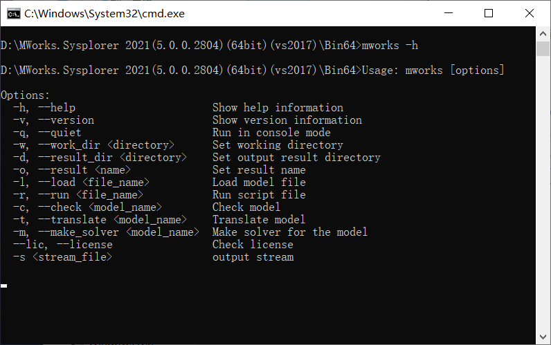
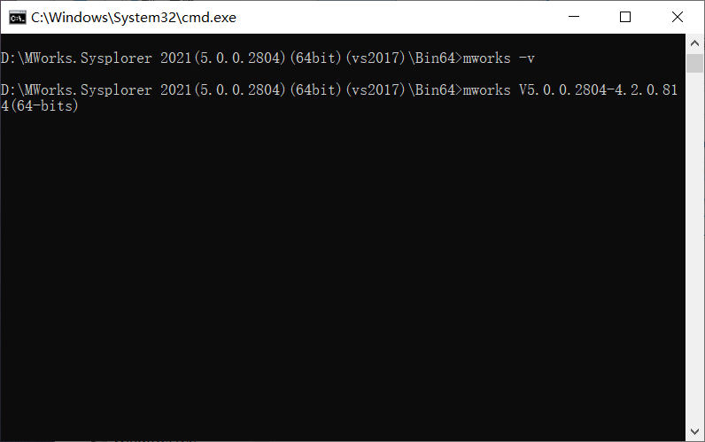
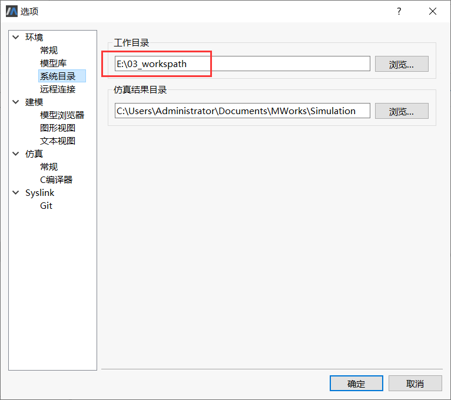
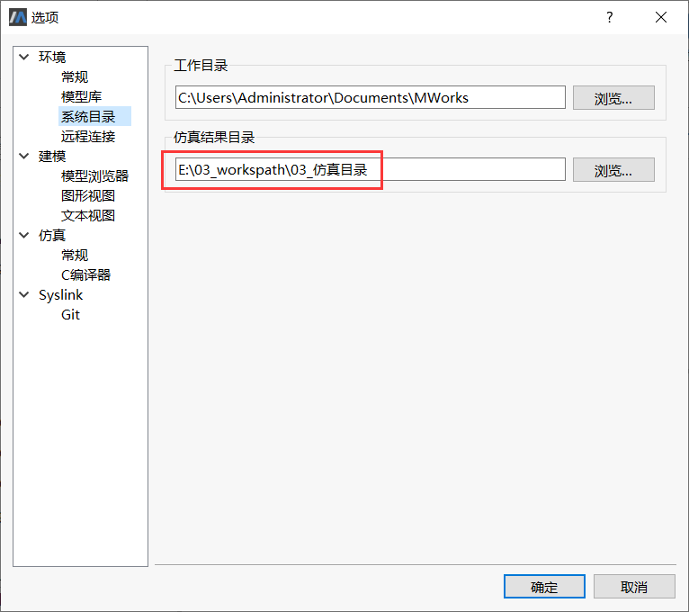
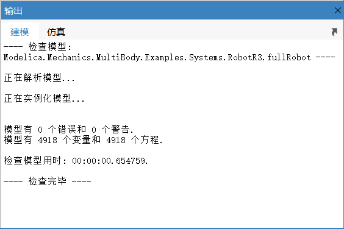
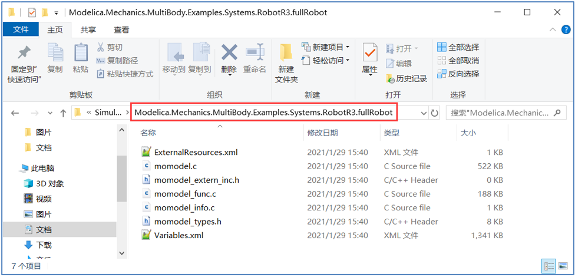
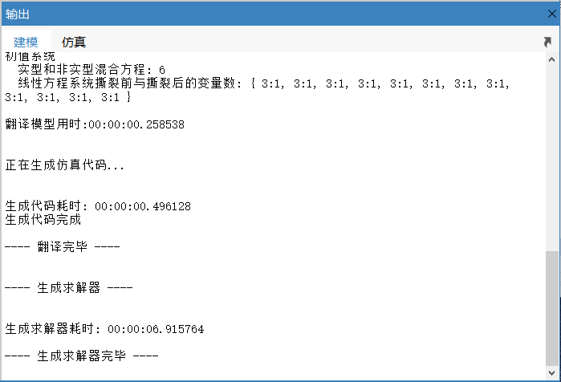
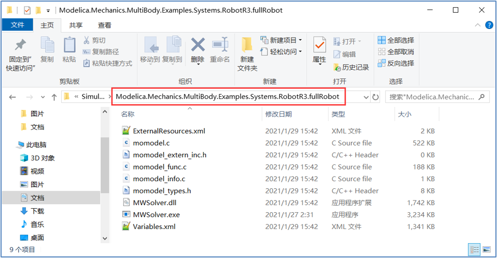
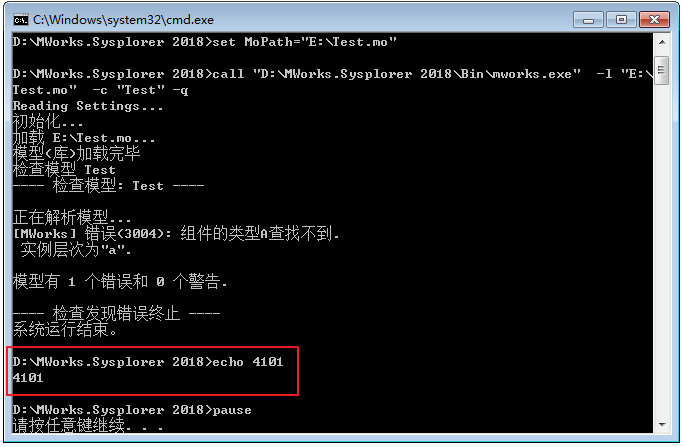

# CMD命令

以命令行的方式启动MWorks.Sysplorer ，传入一些特定命令行参数，完成特定操作。本章主要介绍了一些命令行参数及其使用说明。

### 启动模式

MWorks.Sysplorer 启动时支持2 种模式：GUI 模式和控制台模式。

1. GUI 模式

   这是默认常规启动模式，软件启动之后显示软件界面，用户可以交互建模、仿真等。

2. 控制台模式

   这种模式启动软件后，软件根据传入的命令行参数，完成指定操作任务，任务结束之后，软件进程结束。此模式下软件没有GUI 界面。

### 命令使用格式

命令行操作需要在cmd.exe 中切换到软件安装目录的Bin 文件夹，输入命令格式如下：

```
【MWorks安装路径】\Bin>MWorks 命令
```

### 查询所有命令

命令行格式：

```
-h
```

说明：输入命令之后，控制台会打印所有命令及其用法，如下图所示。



### 版本信息

命令行格式：

```
-v
```

说明：在控制台中显示当前MWorks.Sysplorer.Sysporer 的版本信息。



### 后台启动

命令行格式：

```
-q
```

说明：如果命令行有 -q 或者 –quiet 参数，则以控制台的方式启动，软件没有GUI 界面。控制台模式比较适合结合模型检查、翻译、求解等命令行进行批量操作。模型的输出信息（如检查模型）会打印在控制台中。

### 设置建模工作目录

命令行格式：

```
-w dir  /-work_dir dir
```

例子：

```
-w “E:\03_workspath”
```

说明：如果-w 指定了正确的建模工作目录，则用户配置xml 文件中所设定的建模工作目录就不起作用，如下图所示；否则工作目录根据用户配置xml 文件而定。

注意：只对本次执行有效，下次启动后，仍使用xml 文件中所设定的建模工作目录。



### 设置仿真结果目录

命令行格式：

```
-d dir  /  -output_dir dir
```

例子：

```
-d “E:\03_workspath\03_仿真目录”
```

说明：如果-d 指定了正确的仿真结果目录，则用户配置xml 文件中所设定的仿真结果目录就不起作用，如下图所示；否则仿真结果目录根据用户配置xml 文件而定。

注意：命令行启动的设置不会保存到配置文件中，重新启动软件后，仍使用xml 配置文件的设置。



### 设置启动时要加载的模型

命令行格式：

```
-l file  /  -load file
```

例子：

```
-l “C:\Program Files (x86)\MWorks.Sysplorer\Library\Modelica 3.2\Modelica\package.mo”
```

 说明：启动时可以加载多个模型，命令行形式如“-l file –l file –l file ”，加载信息会显示在状态栏中。

### 设置仿真实例名称

命令行格式：

```
-o name  / -output name
```

例子：

```
-o SimFile
```

说明：每个仿真实例有一个单独的文件目录，命令参数可以配置此目录的名称（即为仿真实例名称）。

 设置仿真实例名称一般需要结合设置仿真结果目录、加载模型、翻译模型、生成求解器等命令行操作进行。

### 检查模型

检查的结果包含两部分：一是模型检查是否成功，二是检查的详细信息（输出面板打印的检查信息）。

命令行格式：

```
-c name  /  -check name
```

例子：

```
-c Modelica.Mechanics.MultiBody.Examples.Systems.RobotR3.fullRobot
```

说明：要进行检查模型，命令行参数中还需要包含启动时要加载的模型，输入如下命令。

```
-l “C:\Program Files (x86)\MWorks.Sysplorer\Library\Modelica 3.2\Modelica\package.mo” -c Modelica.Mechanics.MultiBody.Examples.Systems.RobotR3.fullRobot
```

在输出面板中打印的检查信息，如下图所示。



### 翻译模型

翻译指定全名的模型，翻译生成的c 代码放置到仿真结果目录中。

命令行格式：

```
-t name  /  -translate name
```

例子：

```
-t Modelica.Mechanics.MultiBody.Examples.Systems.RobotR3.fullRobot
```

说明：要进行翻译模型，命令行参数中还需要包含启动时要加载的模型，输入如下命令。

```
-l “C:\Program Files (x86)\MWorks.Sysplorer\Library\Modelica 3.2\Modelica\package.mo” -t Modelica.Mechanics.MultiBody.Examples.Systems.RobotR3.fullRobot
```

在输出面板中打印的翻译信息，如下图所示。


如果设置了仿真实例名称，则翻译模型的结果文件将生成在仿真结果目录下的该文件夹中；如果未设置仿真实例名称，翻译模型的结果文件将生成在仿真结果目录下该模型全名的文件夹中，如下图所示。



### 生成求解器

对指定全名的模型，为其生成仿真求解器程序。生成的求解器，仿真配置文件等放置到仿真结果目录中。

命令行格式：

```
-m name   /  -make_solver name
```

例子：

```
-m Modelica.Mechanics.MultiBody.Examples.Systems.RobotR3.fullRobot
```

说明：要进行生成求解器，命令行参数中还需要包含启动时要加载的模型，输入如下命令。

```
-l “C:\Program Files (x86)\MWorks.Sysplorer\Library\Modelica 3.2\Modelica\package.mo” -m Modelica.Mechanics.MultiBody.Examples.Systems.RobotR3.fullRobot
```

在输出面板中打印的生成求解器信息，如下图所示。



如果设置了仿真实例名称，则生成求解器的结果文件将生成在仿真结果目录下的该文件夹中；如果未设置仿真实例名称，生成求解器的结果文件将生成在仿真结果目录下该模型全名的文件夹中，如下图所示。



### 执行脚本

执行.py 脚本文件。

命令行格式：

```
-r file     /  -run file
```

例子：

```
-r “C:\Users\Administrator\Documents\MWorks.Sysplorer\loadfile.py”
```

 说明：输入命令后，软件自启动，运行loadfile.py 脚本命令。

### 返回值

利用bat 脚本执行命令时，通过控制台输出的返回值，判断和和定位错误。

新建一bat 文件，输入如下的脚本命令，并保存：

```
@echo on
set ExePath=” C:\Program Files (x86)\MWorks.Sysplorer \Bin\mworks.exe”
set MoPath=”E:\Test.mo”
call %ExePath% -l %MoPath% -q
echo %errorlevel%
pause
```

双击bat 文件，在控制台输出返回值为“4101 ”，说明模型加载错误。



更多的返回值的含义参见下表。

| **返回值** | **含义**                                                     |
| ---------- | ------------------------------------------------------------ |
| 0          | 正确                                                         |
| 4096       | 脚本退出码上限，如果返回此值，则说明脚本执行出错，且退出码超出上限 |
| 4097       | 未知错误                                                     |
| 4098       | 暂不支持的特性                                               |
| 4099       | 命令参数错误                                                 |
| 4100       | 模型加载错误                                                 |
| 4101       | 模型检查错误                                                 |
| 4012       | 模型翻译错误                                                 |
| 4103       | 模型编译错误                                                 |
| 4104       | 模型仿真错误                                                 |
| 8192       | 缺少license授权                                              |

### 命令汇总

| **编号** | **功能描述**                 | **命令行名称**              |
| -------- | ---------------------------- | --------------------------- |
| **1**    | 查询所有命令                 | -h                          |
| **2**    | 查询MWorks.Sysplorer的版本   | -v                          |
| **3**    | 设置MWorks.Sysplorer启动模式 | -q   / -quiet               |
| **4**    | 设置建模工作目录             | -w dir  / -work_dir dir     |
| **5**    | 设置仿真结果工作目录         | -d dir  / -output_dir dir   |
| **6**    | 设置启动时要加载的模型       | -l file  / -load file       |
| **7**    | 设置仿真实例名称             | -o name / -output name      |
| **8**    | 检查模型                     | -c name / -check name       |
| **9**    | 翻译模型                     | -t name  / -translate name  |
| **10**   | 生成求解器                   | -m name / -make_solver name |
| **11**   | 执行脚本                     | -r file   / -run file       |

 