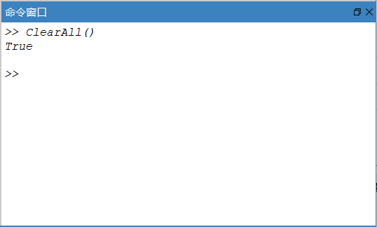
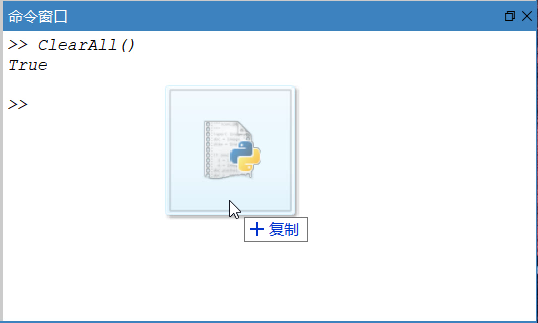
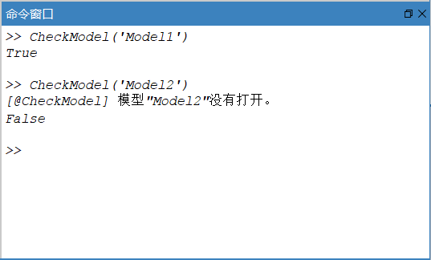
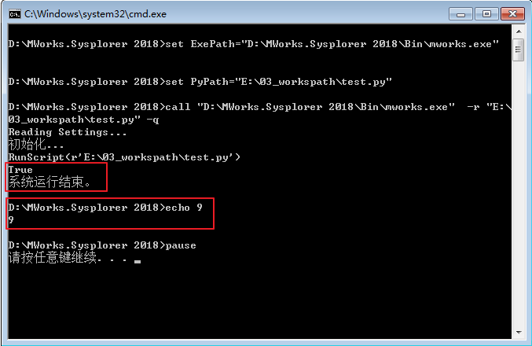
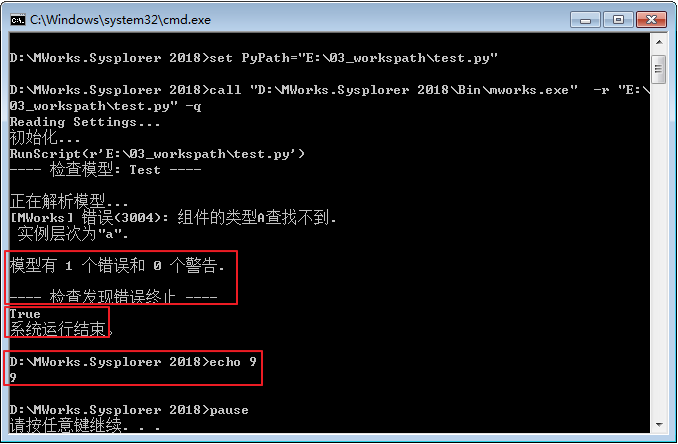
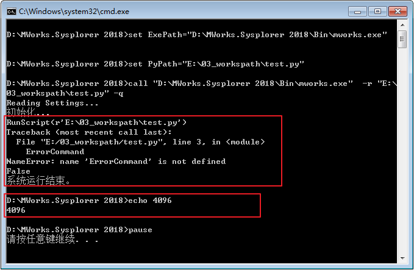

# Python脚本命令

MWorks.Sysplorer 命令窗口支持Python 界面功能命令、编译器命令等接口，供开发脚本程序时参考。

### 概述

1. 命令交互输入

   在**命令窗口**“>> ”标识后输入命令，键盘“↑”和“↓”方向键可以在历史输入记录中前后查找，输入完毕后按回车键执行命令。

   

2. 脚本批量执行

   可以将命令脚本文件（*.mos 、*.scr 或.py ）鼠标拖拽到**命令窗口**执行脚本。

   

3. 命令输出

   执行命令后，根据命令的定义，返回相应的值。

   命令原型：

   ```
    Boolean CheckModel(String model_name="") 
   ```

   检查模型，若命令正确执行则返回True ，执行错误则返回False ，并说明错误的可能原因。

   

4. 数据类型说明

   命令接口与选项的参数/ 返回值类型如下。

   - 关键字"**void**" 表示无返回值。

   - 布尔类型 **bool** ，按照Python 语法，输入/ 返回 True/false 。

   - 整型 **int** 和浮点数 **double** 无需特别解释。

   - 字符串类型 **string** 作为参数输入时使用单引号或双引号表示，例如 CheckModel('Simple') 或CheckModel("Simple")

   - 集合类型 **list** ，表示数组。

5. 缺省参数

   如果某个命令接口带有缺省参数，调用时可以不给出实参，这时系统自动取其缺省值。以命令接口 SimulateModel() 为例进行说明。

   接口原型，

   ```
    boolean  SimulateModel ( string  model_name,  /*模型名称*/ double  start_time= 0,  /*开始时间*/ double  stop_time = 1,  /*终止时间*/ int  number_of_intervals=500,  /*输出步数*/ string  algo='Dassl',  /*算法*/ double  tolerance=0.0001,  /*精度*/ double  integral_step= 0.002,  /*积分步长*/ double  store_double=False,  /*结果是否保存为double*/ double  store_event =False)  /*是否保存事件点*/ 
   ```

   在命令窗口输入，

   ```
    SimulateModel (“Simple”) 
   ```

   表示仿真模型Simple ，仿真开始时间为0 ，结束时间为1 ，输出步数为500 ，选用'Dassl' 算法，精度为0.0001 ，初始积分步长为0.002 ，结果保存为Float 精度，不保存事件点，将结果文件保存在仿真目录下。

   对于路径参数，若为空，表示默认为工作目录或者仿真目录。

### 基本帮助命令

##### Help

显示帮助信息。

```
Help()
```

输出如下，

```
help(): 显示本信息。
help(String command_name): 显示指定命令的文档。
ListFunctions(): 列出所有函数。
ListVariables(): 列出所有变量。
```

使用 Help("COMMAND_NAME") 可显示命令的含义及其使用方法，例如 Help("CheckModel") 输出如下，

```
语法:
  Boolean CheckModel(String model_name="")
说明:
  检查模型。
  model_name:  模型名。
```

##### ListFunctions

列出所有命令接口的函数名，包括返回类型和参数列表。

```
ListFunctions ()
```

输出如下，

```
AnimationSpeed  "设置动画播放速度。"
CalibrateModel  "模型标定，通过比对模型仿真数据与试验测量数据的差异，使得模型输出与测量结果达到最大程度的吻合。"
ChangeDirectory  "更改工作目录。"
ChangeSimResultDirectory  "更改仿真结果目录。"
CheckModel  "检查模型。"
CheckParameterSenstivity  "检查参数灵敏度，使用模型标定算法对参数之间的相关性进行分析。"
ClearAll  "移除所有。"
ClearPlot  "清除曲线窗口内容。"
ClearScreen  "清空命令窗口。"
CreateAnimation  "新建动画窗口。"
CreatePlot  "按指定的设置创建曲线窗口。"
…… 此处省略部分输出
```

##### ListVariables

列举出所有已定义变量。

```
ListVariables()
```

输出如下，

```
Advanced.CheckExtendsRestriction  "检查基类限制性。"
Advanced.CheckTransitivelyNonReplaceable  "检查递归非可替换限制性。"
Advanced.CheckTypeOfClassCompatibility  "检查类的类别相容限制性。"
AxisTiTleType.Custom  "自定义的轴标题。"
AxisTiTleType.Default  "使用默认的轴标题。"
AxisTiTleType.None_  "无轴标题。"
FMI.Type.CoSimulation  "联合仿真类型的FMI。"
FMI.Type.ModelExchange  "模型交换类型的FMI。"
…… 此处省略部分输出
```

##### Status.ExitCode

表示脚本退出代码（整型），用于多个脚本之间执行状态存取。在CMD 命令行运行“-r xxx -q ”时，xxx 脚本有错误则返回4096 ；脚本没错误则返回设置的Status.ExitCode 。

注意，Status.ExitCode 设置的范围0-4095 （默认为0 ），否则不论脚本是否执行正确，返回的都为4096 。

1. 新建一个名为test.py 文件，并在其中输入以下文本并保存。

   ```
   Status.ExitCode =9
   OpenModelFile(r'E:\Test.mo')
   ```
    此处OpenModelFile()指令不会执行，因此该指令中的参数E:\Test.mo无论是否存在均不影响结果。

2. 新建一个名为run.bat 文件，并在其中输入以下文本并保存。

   ```
   @echo on
   set ExePath="【MWorks安装目录】\Bin64\mworks.exe"
   set PyPath="【test.py文件目录】\test.py"
   call %ExePath% -r %PyPath% -q
   echo %errorlevel%
   pause
   ```

3. 双击run.bat ，执行正确，在控制台将打印返回值9 。

   
   
   若py 命令中的某命令在程序里执行错误，如在test.py ，添加一行CheckModel("Test") ，检查模型Test(Test 有错误，会检查失败) ，但整个脚本是执行正确的，则仍返回Status.ExitCode 。

   

4. 修改test.py ，添加一行不识别的命令行，如"ErrorCommand" ，再次双击run.bat ，则返回4096 。

   

### 系统命令

##### ClearScreen

- **功能说明**

  ```
  语法:
    ClearScreen()
    cls()
  说明:
    清空命令窗口。
  ```

- **举例**

  ```
  例子：
    ClearScreen()
  说明:
    将命令行中的所有内容清除
  ```

##### SaveScreen

- **功能说明**

  ```
  语法:
    Boolean SaveScreen(String file_name)
  说明:
    将命令窗口当前显示的内容保存到文件。
    file_name:  文件名。
  ```

- **举例**

  ```
  例子：
    SaveScreen(r"E:\a.txt")
  说明:
    将命令行中的所有输出内容保存到E:\a.txt中
  ```

##### ChangeDirectory

- **功能说明**

  ```
  语法:
    Boolean ChangeDirectory(String work_dir="")
    Boolean cd(String work_dir="")
  说明:
    设置工作目录，并打印（设置后的）当前目录到命令窗口。
    work_dir:  工作目录更改为此目录，如果是空字符串，则显示当前工作目录。
  ```

- **举例**

  ```
  例子：
    ChangeDirectory(r"E:\03_workspath")
  说明:
    将工作目录修改为E:\03_workspath。
  ```

##### ChangeSimResultDirectory

- **功能说明**

  ```
  语法:
    Boolean ChangeSimResultDirectory(String sim_result_dir="")
  说明:
    修改仿真结果目录，并打印（设置后的）结果目录到命令窗口。
    sim_result_dir:  仿真结果目录更改为此目录，如果是空字符串，则显示当前仿真结果目录。
  ```

- **举例**

  ```
  例子：
    ChangeSimResultDirectory(r"E:\03_workspath")
  说明:
    将仿真结果工作目录修改为E:\03_workspath。
  ```

##### RunScript

- **功能说明**

  ```
  语法:
    Boolean RunScript(String script_file)
  说明:
    执行脚本文件。
    script_file:  脚本文件。
  ```

- **举例**

  ```
  例子：
    RunScript(r"E:\03_workspath\test.py")
  说明:
    运行E:\03_workspath下test.py脚本。
  ```

##### GetLastErrors

- **功能说明**

  ```
  语法:
    String[:] GetLastErrors()
  说明:
    获取上一条命令的错误信息，若上一条的命令是正确的，即没有错误信息，将返回空。
  ```

- **举例**

  ```
  例子：
    GetLastErrors()
  说明:
    获取上一条命令的错误信息。
  ```

##### ClearAll

- **功能说明**

  ```
  语法:
    ClearAll()
  说明:
    清除系统所有内容，恢复到启动状态
  ```

- **举例**

  ```
  例子：
    ClearAll()
  说明:
    软件恢复到启动状态。
  ```

##### Echo

- **功能说明**

  ```
  语法:
    boolean Echo (boolean on=None)
  说明:
    设置/获取是否反馈每条语句的执行结果。如果不传入参数，则返回当前状态。
    on:  是否反馈，默认值为None，表示获取当前状态。
  ```

- **举例**

  ```
  例子：
    Echo(on=True)
  说明:
    返回此后命令的执行结果。此时在命令行中执行其他命令如：ClearScreen()，将会输出该命令执行结果”True”。
  ```

##### Exit

- **功能说明**

  ```
  语法:
    Exit()
  说明:
    退出MWorks.Sysplorer，若此时存在修改而未保存的实例或模型时，不会弹出是否保存提示框。
  ```

- **举例**

  ```
  例子：
    Exit()
  说明:
    退出MWorks.Sysplorer。
  ```

### 文件命令

##### OpenModelFile

- **功能说明**

  ```
  语法:
    Boolean OpenModelFile(String path, Boolean auto_reload = True)
  说明:
    加载指定的Modelica模型文件，支持.mef和.mo文件。
    path:         Modelica模型文件的全路径。
    auto_reload:  如果文件已经加载是否自动重新加载。
  ```

- **举例**

  ```
  例子：
    OpenModelFile(r"E:\03_workspath\TestModel101.mef",True)
  说明:
    打开TestModel101.mef文件，若已经打开了，重新加载。
  ```

##### LoadLibrary

- **功能说明**

  ```
  语法:
    Boolean LoadLibrary(String lib_name,
  String lib_version=MSLVersion.Default)
  说明:
    加载模型库。如果已经加载，则不再加载，如果加载了不同版本的模型库，则卸载已加载的并重新加载。
    lib_name:     模型库名.
    lib_version:  模型库版本，不指定版本时，加载第一个。
  ```

- **举例**

  ```
  例子：
    LoadLibrary('Modelica','3.2')或
    LoadLibrary('Modelica', MSLVersion.V3_2)
  说明:
    加载Modleica3.2
  ```

##### ImportFMU

- **功能说明**

  ```
  语法:
    Boolean ImportFMU(String fmu_path)
  说明:
    导入FMU文件，若已经导入过，则自动卸载并重新导入。
    fmu_path:  FMU文件的全路径。
  ```

- **举例**

  ```
  例子：
    ImportFMU(r"E:\03_workspath\TestModel.fmu")
  说明:
    导入TestModel.fmu文件
  ```

##### EraseClasses

- **功能说明**

  ```
  语法:
    Boolean EraseClasses(String[:] class_list)
  说明:
    删除子模型或卸载顶层模型。
    class_list:  模型名列表。
  ```

- **举例**

  ```
  例子1：
    EraseClasses(['TestModel.M2','TestModel.P1'])
  说明:
    删除TestModel模型下的子模型M2,P1
  例子2：
    EraseClasses(['TestModel'])
  说明:
    卸载TestModel
  ```

##### ExportIcon

- **功能说明**

  ```
  语法:
    Boolean ExportIcon(String model_file, Integer width=400, Integer height=400)
  说明:
    把图标视图导出为图片。
    model_name:  模型全名。
    image_file:  图片文件路径。
    width:       图片宽度，默认为400像素。
    height:      图片高度，默认为400像素。
  ```

- **举例**

  ```
  例子：
    ExportIcon ('TestModel', r'E:\03_workspath\Icon.png',600,600)
  说明:
    将TestModel的图标视图生成为600*600像素的图片，导出到E:\03_workspath下，命名为Icon.png。
  ```

##### ExportDiagram

- **功能说明**

  ```
  语法:
    Boolean ExportDiagram (String model_file, Integer width=400, Integer height=400)
  说明:
    把组件视图导出为图片。
    model_name:  模型全名。
    image_file:  图片文件路径。
    width:       图片宽度，默认为400像素。
    height:      图片高度，默认为400像素。
  ```

- **举例**

  ```
  例子：
    ExportDiagram ('TestModel', r'E:\03_workspath\Diagram.png',600,600)
  说明:
    将TestModel的组件视图生成为600*600像素的图片，导出到E:\03_workspath下，命名为Diagram.png。
  ```

##### ExportDocumentation

- **功能说明**

  ```
  语法:
    Boolean ExportDocumentation (String model_name,String doc_file)
  说明:
    把模型文档信息导出到文件（仅支持导出为htm/html格式）。
    model_name:  模型全名。
    doc_file:    文档文件名。
  ```

- **举例**

  ```
  例子：
    ExportDocumentation ('TestModel', r'E:\03_workspath\aa.html')
  说明:
    将TestModel的文档视图导出到E:\03_workspath\aa.html文件中。
  ```

##### ExportFMU

- **功能说明**

  ```
  语法:
    Boolean ExportFMU(String model_name, String fmi_type=FMI.Type.ModelExchange, String fmi_verision=FMI.Version.V1, String fmu_path="")
  说明:
    模型导出为FMU。
    model_name:    模型全名。
    fmi_type:      FMI类型(参见变量"FMI.Type","cs"-联合仿真，"me"-模型交换)。
    fmi_verision:  FMI版本(参见变量"FMI.Version"，"1"-FMI 1.0，"2"-FMI 2.0)。
    fmu_path:      FMU文件保存路径。
  ```

- **举例**

  ```
  例子：
    ExportFMU('TestModel','cs','2',r'E:\03_workspath')
  说明:
    将模型Tsetmodel导出FMU，导出的FMI版本为V1，类型为Co-Simulation,保存位置为E:\03_workspath
  ```

##### ExportVeristand

- **功能说明**

  ```
  语法:
    Boolean ExportVeristand(String model_name,String veristand_file)
  说明:
    模型导出为Veristand模型。
    model_name:      模型全名。
    veristand_file:  Veristand模型文件。
  ```

- **举例**

  ```
  例子：
    ExportVeristand('TestModel', r'E:\03_workspath\TestModel.dll')
  说明:
    将模型TestModel导出为Veristand文件，导出文件的全路径为E:\03_workspath\TestModel.dll
  ```

##### ExportSFunction

- **功能说明**

  ```
  语法:
    Boolean ExportSFunction(String model_name, String sfunction_path, String sfunction_name = "")
  说明:
    模型导出为Simulink的S-Function。
    model_name:      模型名。
    sfunction_path:  s-function文件保存路径。
    sfunction_name:  s-function名字。
  ```

- **举例**

  ```
  例子：
    ExportSFunction('TestModel', r'E:\03_workspath','AA')
  说明:
    将模型TestModel导出为S-Function文件，并生成在E:\03_workspath下，生成的文件名为AA.c, AA_func.c, momodel_info.c
  ```

### 仿真命令

##### OpenModel

- **功能说明**

  ```
  语法:
    Boolean OpenModel(String model_name, String view_type=ModelView.Diagram)
  说明:
    打开模型窗口。
    model_name:  模型全名。
    view_type:   视图类别(参见变量"ModelView","icon"-图标视图,"diagram"-图形视图,"text"-文本视图,"info"-文档视图)。
  ```

- **举例**

  ```
  例子：
    OpenModel ('TestModel','Text')
  说明:
    打开模型TestModel的文本视图
  ```

##### CheckModel

- **功能说明**

  ```
  语法:
    Boolean CheckModel(String model_name="")
  说明:
    检查模型。
    model_name:  模型全名。
  ```

- **举例**

  ```
  例子：
    CheckModel('TestModel')
  说明:
    检查TestModel。
  ```

##### TranslateModel

- **功能说明**

  ```
  语法:
    Boolean TranslateModel (String model_name="")
  说明:
    翻译模型。
    model_name:  模型全名。
  ```

- **举例**

  ```
  例子：
    TranslateModel ('TestModel')
  说明:
    翻译TestModel。
  ```

##### SimulateModel

- **功能说明**

  ```
  语法:
    Boolean SimulateModel(String model_name="", Real start_time=0, Real stop_time=1, Integer number_of_intervals=500, String algo=Integration.Dassl, Real tolerance=0.0001, Real integral_step=0.002, Boolean store_double = false, Boolean store_event = false, String result_file="")
  说明:
    仿真模型。
    model_name:           模型名。
    start_time:           仿真开始时间。
    stop_time:            仿真终止时间。
    number_of_intervals:  输出区间个数。
    algo:                 积分算法(参见变量"Integration"，可选择算法有"Dassl", "Radau5", "Euler", "Rkfix2", "Rkfix3", "Rkfix4", "Rkfix6", "Rkfix8")。
    tolerance:            积分算法误差。
    integral_step:        初始积分步长或定步长。
    store_double:         结果是否存为双精度。
    store_event:          是否存储事件时刻的变量值。
    result_file:          仿真结果的文件存放的文件夹路径。
  ```

- **举例**

  ```
  例子：
    SimulateModel(model_name="TestModel",algo="Euler",result_file =r"E:\aa")
  说明:
    仿真模型TestModel，选用Euler算法，将实例文件生成在E:\aa文件夹下，其余仿真设置采用缺省设置,即：仿真开始时间为0，结束时间为1，输出步数为500，精度为0.0001，积分步长为0.002，结果保存为Float精度，不保存事件点。
  ```

##### RemoveResults

- **功能说明**

  ```
  语法:
    Boolean RemoveResults()
  说明:
    移除所有结果。
  ```

- **举例**

  ```
  例子：
    RemoveResults()
  说明:
    清除所有实例，包括未保存的。
  ```

##### RemoveResult

- **功能说明**

  ```
  语法:
    Boolean RemoveResult()
  说明:
    移除最后一个结果，不保存，也不询问用户。
  ```

- **举例**

  ```
  例子：
    RemoveResult()
  说明:
    移除最后一个结果，不保存，也不询问用户。
  ```

##### ImportInitial

- **功能说明**

    ```
    语法:
      Boolean ImportInitial(String initial_file)
    说明:
      导入初值文件。
      initial_file:  初值文件路径,注意初值文件只可以为.txt文件。
    ```

- **举例**

  ```
  例子：
    ImportInitial(r'E:\03_workspath\Initial.txt')
  说明:
    导入初值文件Initial.txt至仿真浏览器当前的实例中。
  ```

##### ExportInitial

- **功能说明**

  ```
  语法:
    Boolean ExportInitial(String initial_file)
  说明:
    导出初值文件。
    initial_file:  初值文件路径。注意初值文件只支持导出到.txt文件中。
  ```

- **举例**

  ```
  例子：
    ExportInitial(r'E:\03_workspath\Initial.txt')
  说明:
    导出当前实例的初值至Initial.txt。
  ```

##### GetInitialValue

- **功能说明**

  ```
  语法:
    Real GetInitialValue(String var_name)
  说明:
    获取变量初值。
    var_name:  变量全名
  ```

- **举例**

  ```
  例子：
    GetInitialValue('f_cut')
  说明:
    获取变量f_cut的初值。
  ```

##### SetInitialValue

- **功能说明**

  ```
  语法:
    Boolean SetInitialValue(var_name, var_value)
  说明:
    设置变量初值。
    var_name:        变量名
    Real var_value:  变量初值
  ```

- **举例**

  ```
  例子：
    SetInitialValue('f_cut',1.0)
  说明:
    设置变量f_cut的初值为1.0。
  ```

##### ExportResult

- **功能说明**

  ```
  语法:
    Boolean ExportResult(String file_name, String format_type=ResultFormat.Default, String[:] vars=[])
  说明:
    导出结果文件，支持csv、mat、msr格式，并支持导出整个实例。
    file_name:    文件名。
    format_type:  文件格式(参见变量"ResultFormat",可选项有"csv","mat","msr")。
    vars:         变量名，默认为空，表示导出所有结果变量。
  ```

- **举例**

  ```
  例子1：
    ExportResult(r'E:\03_workspath\Result.csv','csv')
  说明:
    将当前实例结果保存至Result.csv文件中。
  例子2：
    ExportResult(r'E:\03_workspath','msr')
  说明:
    在E:\03_workspath下生成与实例名相同的文件夹，文件夹中放置该实例的所有文件。
  ```

### 曲线命令

##### CreatePlot

- **功能说明**

  ```
  语法:
     Boolean CreatePlot (Int id = 0，Int position[4], String x=”time”, List<String> y, String heading=””, Boolean grid=True, Int legend_layout=5, Boolean legend_frame=False, List<String> legends, string x_display_unit = “s”,List<String> y_display_units,Int left_title_type=1, String left_title=””, Int bottom_title_type=1, String bottom_title=””, Int right_title_type=1, String right_title=””, Boolean curve_vernier=False, Boolean fix_time_range=False, Real fix_time_range_value=10, String result_file="", Int sub_plot = 1);
  说明:
    新建曲线窗口。当x使用默认参数时，创建y(time)窗口。当x被设置时，检查x与所有y是否都来自同一个实例，来自同一个实例则创建y(x)窗口，否则创建失败。如果id和sub_plot所唯一指定的子窗口已存在，则清空子窗口中已有变量。
    id:                    窗口编号。id=0,表示新建曲线窗口;id>0,表示创建编号id的曲线,若指定id的窗口已存在且窗口类型一致，直接覆盖创建，否则新建窗口。
    position:              窗口位置。以左上角坐标为位置坐标，宽和高表示窗口大小。电脑屏幕的最左上角为原点即坐标为[0,0]，屏幕上边界向右为x轴正方向，屏幕左边y轴正方向。
    x:                     x轴的变量，即自变量，默认是time。
    y:                     变量列表。
    heading:               标题。
    grid:                  显示网格。
    legend_layout:         图例位置，1-嵌入上方，2-嵌入下方，3-嵌入左方，4-嵌入右方，5-浮动于左上，6-浮动于正上方，7-浮动于右上，8-浮动于左边中央，9-浮动于右边中央，10-浮动于左下，11-浮动于正下方，12-浮动于右下，13-隐藏，默认6
    legend_frame:          是否绘制图例边框（暂不支持）。     
    legends:               图例列表（与变量一一对应）。
    x_display_unit         x轴显示单位。
    y_display_units        变量的显示单位。
    left_title_type:       左纵坐标标题类型(参见变量"AxisTiTleType"，1-无，2-默认，3-自定义)。
    left_title:            自定义的左纵坐标标题。
    bottom_title_type:     横坐标标题类型(参见变量"AxisTiTleType"，1-无，2-默认，3-自定义)。
    bottom_title:          自定义的横坐标标题。
    right_title_type:      右纵坐标标题类型(参见变量"AxisTiTleType"1-无，2-默认，3-自定义)。
    right_title:           自定义的右纵坐标标题。
    curve_vernier:         显示曲线游标。
    fix_time_range:        限定时间范围。
    fix_time_range_value:  限定的时间范围值。
    result_file:           结果文件，需填写结果文件的全路径。
    sub_plot：             子窗口序号。
  ```

- **举例**

  ```
  例子：
    CreatePlot(id=2,x='boxBody2.frame_b.r_0[2]',y=['boxBody2.frame_a.r_0[1]', 'boxBody2.frame_a.r_0[2]'],legend_layout =10,curve_vernier=True, result_file=r'E:\03_workspath\DoublePendulum\Result.msr')
  说明:
    创建编号为2的曲线窗口，显示实例DoublePendulum中以boxBody2.frame_b.r_0[2]为X轴的boxBody2.frame_a.r_0[1],boxBody2.frame_a.r_0[2]的曲线，图例悬浮在坐下，并在该曲线窗口显示游标。
  ```

##### Plot

- **功能说明**

  ```
  语法:
    Boolean Plot(String[:] y, String[:] legends, Integer[:] colors, LineStyle[:] line_styles, MarkerStyle[:] marker_styles, Integer[:] thicknesses, String[:] display_units, VerticalAxis[:] vertical_axes)
  说明:
    在最后一个窗口中绘制指定变量的曲线，如果没有窗口则按系统默认设置新建一个窗口。
    y:              变量名列表。若某变量在最后一个曲线窗口中存在，则取消该变量的绘制。
    legends:        图例文字列表。
    colors:         曲线颜色(参见变量"LineColor")列表。
    line_styles:    曲线线型(参见变量"LineStyle")列表。
    marker_styles:  曲线数据点样式(参见变量"MarkerStyle")列表。
    thicknesses:    线宽(参见变量"LineThickness")列表(。
    display_units:  显示单位列表。
    vertical_axes:  纵轴类型(参见变量"VerticalAxis")列表。
  ```

- **举例**

  ```
  例子：
  Plot(y=['boxBody2.frame_a.r_0[2]','boxBody1.frame_a.r_0[1]','damper.phi_rel'], colors=[LineColor.Black, LineColor.Red, LineColor.Purple], display_units=['cm','m','rad'],vertical_axes=[VerticalAxis.Left, VerticalAxis.Left, VerticalAxis.Right])
  说明:
    在曲线窗口按照如下设置显示以下三个曲线
    boxBody2.frame_a.r_0[2]：颜色为黑色，显示单位为cm，显示为左纵坐标轴
    boxBody1.frame_a.r_0[1]：颜色为红色，显示单位为m，显示为左纵坐标轴
    damper.phi_rel：颜色为紫色，显示单位为rad，显示为右纵坐标轴
  ```

##### RemovePlots

- **功能说明**

  ```
  语法:
    Boolean RemovePlots()
  说明:
    关闭所有曲线窗口。
  ```

- **举例**

  ```
  例子：
    RemovePlots()
  说明:
    关闭所有曲线窗口。
  ```

##### ClearPlot

- **功能说明**

  ```
  语法:
    Boolean ClearPlot(Boolean remove=False, Int id=-1)
  说明:
    清除曲线窗中当前子窗口内容。如果remove为True，则移除当前子窗口。最后一个子窗口不会被移除，并且总是返回True。
    remove :  是否移除子窗口。
    id:       窗口编号。
  ```

- **举例**

  ```
  例子：
    ClearPlot(remove=True,id=3)
  说明:
    清除“曲线窗口-3”中的所有曲线，并移除当前子窗口。
  ```

##### ExportPlot

- **功能说明**

  ```
  语法:
    Boolean ExportPlot(String file.file_format, Int id=-1)
  说明:
    曲线导出。
    file_path:      存储路径。
    file_format:    文件格式，支持图片(.jpg/.png/.bmp)、csv、mat、txt(参见变量"PlotFileFormat"，1-图片，2-csv，3-mat，4-txt)。
    id:             窗口编号，默认为-1，表示最后一个窗口。
    W:              图片宽度，默认为-1，表示图片宽度为曲线窗口当前宽度。
    h:              窗口高度，默认为-1，表示图片高度为曲线窗口当前高度。
  ```

- **举例**

  ```
  例子：
    ExportPlot('E:/plot.png',1,3,200,200)
  说明:
    将曲线窗口-3作为200*200大小的图片导出，导出的文件路径为'E:\Plot.png'。
  ```

### 动画命令

##### CreateAnimation

- **功能说明**

  ```
  语法:
    Boolean CreateAnimation()
  说明:
    新建动画窗口。
  ```

- **举例**

  ```
  例子：
    CreateAnimation()
  说明:
    新建动画窗口。
  ```

##### RemoveAnimations

- **功能说明**

  ```
  语法:
    Boolean RemoveAnimations()
  说明:
    关闭所有动画窗口。
  ```

- **举例**

  ```
  例子：
    RemoveAnimations()
  说明:
    关闭所有动画窗口。
  ```

##### RunAnimation

- **功能说明**

  ```
  语法:
    Boolean RunAnimation()
  说明:
    播放动画。
  ```

- **举例**

  ```
  例子：
    RunAnimation()
  说明:
    播放动画。
  ```

##### StopAnimation

- **功能说明**

  ```
  语法:
    boolean StopAnimation ()
  说明:
    停止动画播放。
  ```

- **举例**

  ```
  例子：
    StopAnimation()
  说明:
    播放动画。
  ```

##### AnimationSpeed

- **功能说明**

  ```
  语法:
    Boolean AnimationSpeed (Real speed)
  说明:
    设置动画播放速度。
    speed:  加速因子。大于1表示加速，小于1表示减速，在播放的过程中设置为0则停止播放。
  ```

- **举例**

  ```
  例子：
    AnimationSpeed (0.1)
  说明:
    设置动画播放速度为0.1。
  ```

### 模型对象操作命令

##### GetClasses

- **功能说明**

  ```
  语法:
    String[:] GetClasses(String model_name)
  说明:
    获取指定模型的嵌套类型。
    model_name:  模型全名。当给定空字符串时，则获取模型浏览器上所有顶层模型列表。
  ```

- **举例**

  ```
  例子：
    GetClasses('Modelica')
  说明:
    获取Modleica的嵌套模型，执行该命令后将返回('UsersGuide', 'Blocks', 'ComplexBlocks', 'StateGraph', 'Electrical', 'Magnetic', 'Mechanics', 'Fluid', 'Media', 'Thermal', 'Math', 'ComplexMath', 'Utilities', 'Constants', 'Icons', 'SIunits')
  ```

##### GetComponents

- **功能说明**

  ```
  语法:
    String[:] GetComponents(String model_name)
  说明:
    获取指定模型的嵌套组件。
    model_name:  模型全名。
  ```

- **举例**

  ```
  例子：
    GetComponents('Modelica.Blocks.Examples.PID_Controller')
  说明:
    获取模型Modelica.Blocks.Examples.PID_Controller中的所有嵌套组件，执行该命令后将返回('driveAngle', 'PI', 'inertia1', 'torque', 'spring', 'inertia2', 'kinematicPTP', 'integrator', 'speedSensor', 'loadTorque')
  ```

##### GetParamList

- **功能说明**

  ```
  语法:
    (param_name, param_type)[:] GetParamList(String pre_name)
  说明:
    获取指定组件前缀层次中的参数列表。返回值列表中的元素为：<参数名-参数类型名>的键-值对。
    pre_name:  组件前缀名。缺省值为空，表示获取模型顶层参数。
  ```

- **举例**

  ```
  例子：
    GetParamList('kinematicPTP')
  说明:
    获取模型Modelica.Blocks.Examples.PID_Controller中组件kinematicPTP的参数列表，执行该命令后将返回(('nout', 'Integer'), ('deltaq', 'Real'), ('qd_max', 'Real'), ('qdd_max', 'Real'), ('startTime', 'Modelica.SIunits.Time'))
  ```

##### GetModelDescription

- **功能说明**

  ```
  语法:
    String GetModelDescription(String model_name)
  说明:
    获取指定模型的描述文字。
    model_name:  模型全名。
  ```

- **举例**

  ```
  例子：
    GetModelDescription('Modelica.Blocks.Examples.PID_Controller')
  说明:
    获取Modelica.Blocks.Examples.PID_Controller的模型描述，执行该命令后将返回'Demonstrates the usage of a Continuous.LimPID controller'
  ```

##### SetModelDescription

- **功能说明**

  ```
  语法:
    Boolean SetModelDescription(String model_name, String description)
  说明:
    设置指定模型的描述文字,替换原来的描述。注意，对于模型库或加密模型该命令不可用。
    model_name:   模型全名。
    description:  描述文字。
  ```

- **举例**

  ```
  例子：
    SetModelDescription('TestModel.P1','测试Test')
  说明:
    设置模型TestModel.P1的描述信息为”测试Test”
  ```

##### GetComponentDescription

- **功能说明**

  ```
  语法:
    String GetComponentDescription(String model_name, String component_name)
  说明:
    获取指定模型中组件的描述文字。
    model_name:      模型全名。
    component_name:  组件名。
  ```

- **举例**

  ```
  例子：
    GetComponentDescription('Modelica.Blocks.Continuous.PI','u')
  说明:
    获取模型Modelica.Blocks.Continuous.PI中组件u的描述，执行该命令后将返回'Connector of Real input signal'
  ```

##### SetComponentDescription

- **功能说明**

  ```
  语法:
    Boolean SetComponentDescription(String model_name, String component_name, String description))
  说明:
    设置指定模型中组件的描述文字。注意，对于模型库或加密模型该命令不可用。
    model_name:      模型名。
    component_name:  组件名。
    description:     描述文字。
  ```

- **举例**

  ```
  例子：
    SetComponentDescription('TestModel','Con2','连接组件2')
  说明:
    设置模型TestModel中的组件Con2的描述信息为”连接组件2”。
  ```

##### SetParamValue

- **功能说明**

  ```
  语法:
    Boolean SetParamValue(String param_name, String value)
  说明:
    设置当前模型指定参数的值，支持设置内置类型属性。
    param_name:  参数全名。
    value:       参数值。
  ```

- **举例**

  ```
  例子1：
    SetParamValue('integrator.k', '99')
  说明:
    设置当前模型的组件integrator中，参数k的值为99。
  
  例子2：
    SetParamValue('x.displayUnit ', 'cm')
  说明:
    设置当前模型中，参数x的显示单位为'cm'。
  ```

##### SetModelText

- **功能说明**

  ```
  语法:
    Boolean SetModelText(string model_name, string model_txt)
  说明:
    修改模型的Modelica文本内容。
    model_name:  模型全名。
    model_txt:   Modelica文本。
  ```

- **举例**

  ```
  例子：
    SetModelText('TestModel', 'model a Real x=time; end a;')
  说明:
    将模型TestModel的文本修改为'model a Real x=time; end a;'。
  ```

##### GetExperiment

- **功能说明**

  ```
  语法:
    Experiment GetModelExperiment(String model_name)
  说明:
    获取模型仿真配置。
    model_name:  模型全名。
  ```

- **举例**

  ```
  例子：
    GetModelExperiment('Modelica.Mechanics.Rotational.Examples.First')
  说明:
    获取Modelica.Mechanics.Rotational.Examples.First的仿真配置，包括仿真开始时间，结束时间，数据点数，使用输出步长，算法，精度，初始积分步长，不存在的对应项将不会列出。
  ```

### 命令汇总

##### [基本帮助命令](#/forthExample/Command/PythonScriptCommand?target=Pythonscriptcommand_Basichelpcommand)

| **命令接口**    | **含义**                 |
| --------------- | ------------------------ |
| Help()          | 显示帮助信息             |
| ListFunctions() | 列出所有命令接口的函数名 |
| ListVariables() | 列举出所有已定义变量     |
| Status.ExitCode | 退出码存/取              |

##### [系统命令](#/forthExample/Command/PythonScriptCommand?target=Pythonscriptcommand_Systemcommand)

| **命令接口**               | **含义**                     |
| -------------------------- | ---------------------------- |
| ClearScreen()              | 清空命令窗口                 |
| SaveScreen()               | 保存命令窗口内容至文件       |
| ChangeDirectory()          | 更改工作目录                 |
| ChangeSimResultDirectory() | 更改仿真结果目录             |
| RunScript()                | 执行脚本文件                 |
| GetLastErrors()            | 获取上一条命令的错误信息     |
| ClearAll()                 | 移除所有模型                 |
| Echo()                     | 打开或关闭命令执行状态的输出 |
| Exit()                     | 退出MWorks.Sysplorer         |

##### [文件命令](#/forthExample/Command/PythonScriptCommand?target=Pythonscriptcommand_Filecommand)

| **命令接口**          | **含义**                       |
| --------------------- | ------------------------------ |
| OpenModelFile()       | 加载指定的Modelica模型文件     |
| LoadLibrary()         | 加载Modelica模型库             |
| ImportFMU()           | 导入FMU文件                    |
| EraseClasses()        | 删除子模型或卸载顶层模型       |
| ExportIcon()          | 把图标视图导出为图片           |
| ExportDiagram()       | 把组件视图导出为图片           |
| ExportDocumentation() | 把模型文档信息导出到文件       |
| ExportFMU()           | 模型导出为FMU                  |
| ExportVeristand()     | 模型导出为Veristand模型        |
| ExportSFunction()     | 模型导出为Simulink的S-Function |

##### [仿真命令](#/forthExample/Command/PythonScriptCommand?target=Pythonscriptcommand_Simulationcommand)

| **命令接口**     | **含义**     |
| ---------------- | ------------ |
| OpenModel()      | 打开模型窗口 |
| CheckModel()     | 检查模型     |
| TranslateModel() | 翻译模型     |
| SimulateModel()  | 仿真模型     |
| RemoveResults()  | 移除所有结果 |
| ImportInitial()  | 导入初值文件 |
| ExportInitial()  | 导出初值文件 |
| ExportResult()   | 导出结果文件 |

##### [曲线命令](#/forthExample/Command/PythonScriptCommand?target=Pythonscriptcommand_Curvecommand)

| **命令接口**  | **含义**                           |
| ------------- | ---------------------------------- |
| CreatePlot()  | 按指定的设置创建曲线窗口           |
| Plot()        | 在最后一个窗口中绘制指定变量的曲线 |
| RemovePlots() | 关闭所有曲线窗口                   |
| ClearPlot()   | 清除曲线窗口中的所有曲线           |
| ExportPlot()  | 曲线导出                           |

##### [动画命令](#/forthExample/Command/PythonScriptCommand?target=Pythonscriptcommand_Animationcommand)

| **命令接口**       | **含义**         |
| ------------------ | ---------------- |
| CreateAnimation()  | 新建动画窗口     |
| RemoveAnimations() | 关闭所有动画窗口 |
| RunAnimation()     | 播放动画         |
| AnimationSpeed()   | 设置动画播放速度 |

##### [模型对象操作命令](#/forthExample/Command/PythonScriptCommand?target=Pythonscriptcommand_Modelobjectoperationcommand)

| **命令接口**                                                 | **含义**                           |
| ------------------------------------------------------------ | ---------------------------------- |
| GetClasses() | 获取指定模型的嵌套类型             |
| GetComponents() | 获取指定模型的嵌套组件             |
| GetParamList() | 获取指定组件前缀层次中的参数列表。 |
| GetModelDescription() | 获取指定模型的描述文字             |
| SetModelDescription() | 设置指定模型的描述文字             |
| GetComponentDescription() | 获取指定模型中组件的描述文字       |
| SetComponentDescription() | 设置指定模型中组件的描述文字       |
| SetParamValue() | 设置当前模型指定参数的值           |
| SetModelText() | 修改模型的Modelica()文本内容       |
| GetExperiment() | 获取模型仿真配置                   |

### 变量汇总

| **变量**                                 | 命令中缩写 | **含义**                                 |
| ---------------------------------------- | ---------- | ---------------------------------------- |
| Advanced.CheckExtendsRestriction         |            | 检查基类限制性                           |
| Advanced.CheckTransitivelyNonReplaceable |            | 检查递归非可替换限制性                   |
| Advanced.CheckTypeOfClassCompatibility   |            | 检查类的类别相容限制性                   |
| AxisTiTleType.Custom                     | 3          | 自定义的轴标题                           |
| AxisTiTleType.Default                    | 2          | 使用默认的轴标题                         |
| AxisTiTleType.None_                      | 1          | 无轴标题                                 |
| FMI.Type.CoSimulation                    | "cs"       | 联合仿真类型的FMI                        |
| FMI.Type.ModelExchange                   | "me"       | 模型交换类型的FMI                        |
| FMI.Version.V1                           | "1"        | FMI 1.0                                  |
| FMI.Version.V2                           | "2"        | FMI 2.0                                  |
| Integration.Dassl                        | "Dassl"    | 积分算法: Dassl                          |
| Integration.Euler                        | "Euler"    | 积分算法: Euler                          |
| Integration.Radau5                       | "Radau5"   | 积分算法: Radau5                         |
| Integration.Rkfix2                       | "Rkfix2"   | 积分算法: Rkfix2                         |
| Integration.Rkfix3                       | "Rkfix3"   | 积分算法: Rkfix3                         |
| Integration.Rkfix4                       | "Rkfix4"   | 积分算法: Rkfix4                         |
| Integration.Rkfix6                       | "Rkfix6"   | 积分算法: Rkfix6                         |
| Integration.Rkfix8                       | "Rkfix8"   | 积分算法: Rkfix8                         |
| LineColor.Black                          |            | 黑色                                     |
| LineColor.Brown                          |            | 棕色                                     |
| LineColor.Green                          |            | 绿色                                     |
| LineColor.Magent                         |            | 洋红                                     |
| LineColor.Purple                         |            | 紫色                                     |
| LineColor.Red                            |            | 红色                                     |
| LineColor.Yellow                         |            | 黄色                                     |
| LineStyle.DashDot                        |            | 点划线                                   |
| LineStyle.DashDotDot                     |            | 双点划线                                 |
| LineStyle.Dashed                         |            | 虚                                       |
| LineStyle.Dotted                         |            | 点线                                     |
| LineStyle.Solid                          |            | 实线                                     |
| LineThickness.Double                     |            | 双倍线宽                                 |
| LineThickness.Quad                       |            | 四倍线宽                                 |
| LineThickness.Single                     |            | 单倍线宽                                 |
| MSLVersion.Default                       |            | MWorks.Sysplorer使用的最新Modelica标准库 |
| MSLVersion.V2_2_2                        | "2.2.2"    | Modelica 标准库版本 2.2.2                |
| MSLVersion.V3_2                          | "3.2"      | Modelica 标准库版本 3.2                  |
| MSLVersion.V3_2_1                        | "3.2.1"    | Modelica 标准库版本 3.2.1                |
| MSLVersion.V3_2_3                        | "3.2.3"    | Modelica 标准库版本 3.2.3                |
| MarkerStyle.Circle                       |            | 圆形                                     |
| MarkerStyle.Cross                        |            | 交叉形                                   |
| MarkerStyle.Diamond                      |            | 菱形                                     |
| MarkerStyle.FilledCircle                 |            | 实心圆                                   |
| MarkerStyle.FilledSquare                 |            | 实心正方形                               |
| MarkerStyle.None_                        |            | 不显示数据点                             |
| MarkerStyle.Square                       |            | 正方形                                   |
| MarkerStyle.TriangleDown                 |            | 倒三角形                                 |
| MarkerStyle.TriangleUp                   |            | 正三角形                                 |
| ModelView.Diagram                        |            | 组件视图                                 |
| ModelView.Documentation                  |            | 文档视图                                 |
| PlotFileFormat.Csv                       | 2          | 曲线导出为csv文件                        |
| PlotFileFormat.Image                     | 1          | 曲线导出为图片                           |
| PlotFileFormat.Mat                       | 3          | 曲线导出为".mat"文件                     |
| PlotFileFormat.Text                      | 4          | 曲线导出为文本文件                       |
| ResultFormat.Csv                         | "csv"      | csv( 逗号分隔) 文件格式                  |
| ResultFormat.Csv                         | "mat"      | csv( 逗号分隔) 文件格式                  |
| ResultFormat.Default                     | "msr"      | 默认的结果文件格式                       |
| VerticalAxis.Left                        |            | 左纵轴                                   |
| VerticalAxis.Right                       |            | 右纵轴                                   |

### 脚本示例

 Python 示例文件在【安装目录】\static\Samples\PythonDemo\Demo.py ，打开MWorks.Sysplorer ，将脚本拖入命令窗口即可执行。该示例命令包括：加载模型、参数修改、仿真、曲线查看与保存、动画播放。
