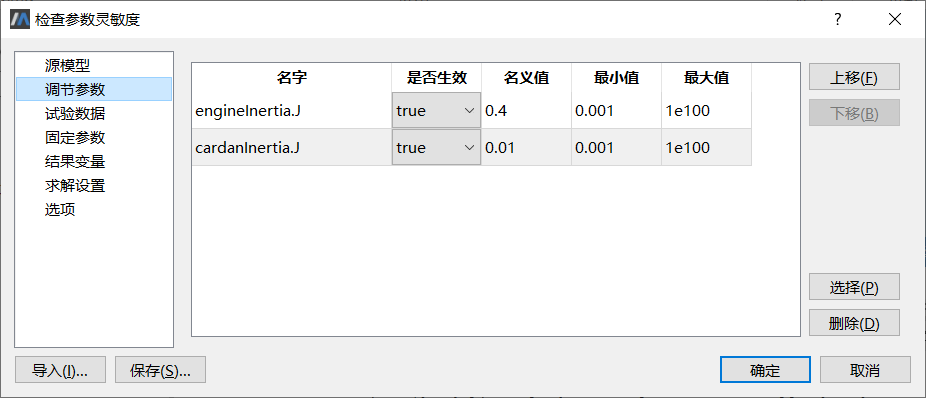
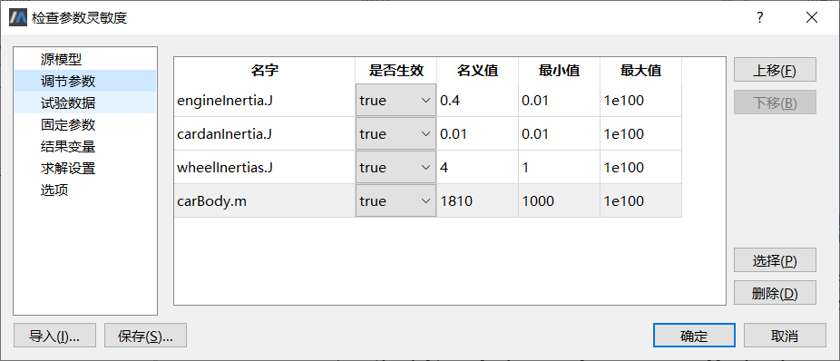

# 检查参数灵敏度

根据前面的分析，对于进行调节的模型参数有一个基本要求，即必须能影响关联变量的结果，否则，优化过程不会收敛，模型标定必定失败。但是仅仅了解这些是不够的。有时候，两个或多个参数可能以某种相似的方式对关联变量产生影响，这意味着不能独立地调节其中一个或某几个参数。
检查参数灵敏度功能使用模型标定算法对参数之间的相关性进行分析，指出他们是否存在某种线性组合关系。

### 检查gearBox.lossTable[1,2]、engineTorque.tau_0

首先测试调节参数gearBox.lossTable[1,2]（变速箱效率损耗）和engineTorque.tau_0（发动机扭矩）。
点击**工具** > **检查参数灵敏度** ，弹出**检查参数灵敏度**界面，这时读入上次进行**参数标定**时保存的配置文件。为便于阅读，其他属性页配置如前所述。

点击**确定**按钮执行，参数标定结果如下表所示。

| 组别 | 调节参数               | 是否生效 | 初始值 | 最优解   | 验证准则 | 迭代次数 |
| ---- | ---------------------- | -------- | ------ | -------- | -------- | -------- |
| 1    | gearBox.lossTable[1,2] | 是       | 1.0    | 0.78831  | 0.243407 | 15       |
| 1    | engineTorque.tau_0     | 是       | 320.0  | 268.458  | 0.243407 | 15       |
| 2    | gearBox.lossTable[1,2] | 是       | 1.0    | 0.763353 | 1.0503   | 5        |
| 2    | engineTorque.tau_0     | 否       | 320.0  | 320.0    | 1.0503   | 5        |
| 3    | gearBox.lossTable[1,2] | 否       | 1.0    | 1.0      | 25.2039  | 9        |
| 3    | engineTorque.tau_0     | 是       | 320.0  | 74.9486  | 25.2039  | 9        |

特别提示，上表中标记的“是否生效”是由检查参数灵敏度工具在处理过程中自动设置，目的在于检查参数扰动之后验证结果能够回到最优解的状态，因此在**调节参数**属性页进行配置时，不要人为改变参数的“是否生效”标记。

从后面2组数据看出，如果给gearBox.lossTable[1,2]或engineTorque.tau_0增加一点扰动，验证结果无法回到最优解的状态（超出最优解0.243407），表明验证准则对于gearBox.lossTable[1,2]和/或engineTorque.tau_0的变动相当敏感。

输出栏提示如下：

The calibration criteria are sensitive for small variations around the nominal values in all tuner parameters and in all their linear combinations.

检查结果表明，参数gearBox.lossTable[1,2]与engineTorque.tau_0之间不存在任何相关性，二者可以独立地进行调节。

### 检查engineInertia.J、cardanInertia.J

考虑另外一组参数，engineInertia.J、cardanInertia.J，参数初值分别设为0.4和0.01。



结果如下表所示：

| 组别 | 调节参数        | 是否生效 | 初始值 | 最优解  | 验证准则 | 迭代次数 |
| ---- | --------------- | -------- | ------ | ------- | -------- | -------- |
| 1    | engineInertia.J | 是       | 0.4    | 1.14081 | 1.039    | 5        |
| 1    | cardanInertia.J | 是       | 0.01   | 1.41868 | 1.039    | 5        |
| 2    | engineInertia.J | 是       | 0.4    | 1.39162 | 1.0392   | 5        |
| 2    | cardanInertia.J | 是       | 0.01   | 0.01    | 1.0392   | 5        |
| 3    | engineInertia.J | 是       | 0.4    | 0.4     | 1.03884  | 6        |
| 3    | cardanInertia.J | 是       | 0.01   | 5.44515 | 1.03884  | 6        |

从后面2组数据看出，如果给engineInertia.J或cardanInertia.J增加一点扰动，验证结果仍会回到最优解的状态（接近最优解1.039），表明验证准则对于engineInertia.J和/或cardanInertia.J的变动是不敏感的。

输出栏提示如下：

The calibration criteria are insensitive for small variations around the nominal values in the following linear parameter combinations:
engineInertia.J + 0.182789 * cardanInertia.J

检查结果表明，参数engineInertia.J与cardanInertia.J之间有较强的依赖关系，尽管可以改变engineInertia.J和/或cardanInertia.J的初始值，但只要保持“engineInertia.J + 0.182789 * cardanInertia.J”的结果不变，对模型验证结果来说，总可以回到最优解的状态。

这意味着，不能对参数engineInertia.J或cardanInertia.J单独进行调节，但可以对engineInertia.J与cardanInertia.J的参数组合进行调节。

对照模型组件图，注意到engineInertia与cardanInertia是通过减速齿轮gearBox刚性连接的，参数engineInertia.J与cardanInertia.J共同对汽车性能参数“加速度”产生影响。

### 检查engineInertia.J、cardanInertia.J、wheelInertias.J、carBody.m

接下来测试更多的参数组合，engineInertia、cardanInertia、wheelInertias、carBody共4个部件之间都是刚性连接，可以通过类似的操作进行相关性测试。

4个参数engineInertia.J、cardanInertia.J、wheelInertias.J、carBody.m初值分别设为0.4、0.01、4、1810（注意分别设置不小于0.01、0.01、1.0、1000.0）。



结果如下表所示。

| 组别 | 调节参数        | 是否生效        | 初始值 | 最优解  | 验证准则 | 迭代次数 |
| ---- | --------------- | --------------- | ------ | ------- | -------- | -------- |
| 1    | engineInertia.J | 是              | 0.4    | 1.11867 | 1.03902  | 5        |
| 1    | cardanInertia.J | 是              | 0.01   | 1.43776 | 1.03902  | 5        |
| 1    | wheelInertias.J | 是              | 4      | 5.12388 | 1.03902  | 5        |
| 1    | carBody.m       | 是              | 1810   | 1810.89 | 1.03902  | 5        |
| 2    | engineInertia.J | 是              | 0.4    | 1.39162 | 1.0392   | 5        |
| 2    | cardanInertia.J | 否              | 0.01   | 0.01    | 1.0392   | 5        |
| 2    | wheelInertias.J | 否              | 4      | 4       | 1.0392   | 5        |
| 2    | carBody.m       | 否              | 1810   | 1810    | 1.0392   | 5        |
| 3    | engineInertia.J | 否              | 0.4    | 0.4     | 1.03884  | 6        |
| 3    | cardanInertia.J | 是              | 0.01   | 5.44515 | 1.03884  | 6        |
| 3    | wheelInertias.J | 否              | 4      | 4       | 1.03884  | 6        |
| 3    | carBody.m       | 否              | 1810   | 1810    | 1.03884  | 6        |
| 4    | engineInertia.J | 否              | 0.4    | 0.4     | 1.03888  | 9        |
| 4    | cardanInertia.J | 否              | 0.01   | 0.01    | 1.03888  | 9        |
| 4    | wheelInertias.J | 是              | 4      | 69.0581 | 1.03888  | 9        |
| 4    | carBody.m       | 否              | 1810   | 1810    | 1.03888  | 9        |
| 5    | engineInertia.J | engineInertia.J | 0.4    | 0.4     | 1.03851  | 11       |
| 5    | cardanInertia.J | cardanInertia.J | 0.01   | 0.01    | 1.03851  | 11       |
| 5    | wheelInertias.J | wheelInertias.J | 4      | 4       | 1.03851  | 11       |
| 5    | carBody.m       | carBody.m       | 1810   | 2373.76 | 1.03851  | 11       |

从后面4组数据看出，如果给engineInertia.J、cardanInertia.J、wheelInertias.J、carBody.m分别增加一点扰动，验证结果仍会回到最优解的状态（接近最优解1.03902），表明验证准则对于engineInertia.J、cardanInertia.J、wheelInertias.J、carBody.m的变动是不敏感的。

输出栏提示如下：

```
The calibration criteria are insensitive for small variations around the nominal values in the following linear parameter combinations:

engineInertia.J + 0.182779 * cardanInertia.J + 0.0152847 * wheelInertias.J + 0.00176401 * carBody.m
```

