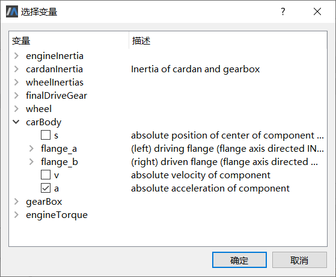

# 模型验证

模型验证用于比较模型仿真结果变量与测量指标变量之间的差异，可以在模型标定的前后进行，前者适用于名义参数，从中查看二者差异；后者适用于优化参数，检查经过标定的参数值是否适用于其他场景。
从操作过程上来看，模型验证类似模型标定但比后者简单，区别是模型验证不需要设置调节参数。具体的操作步骤通过下面的实例分别介绍。
点击**工具** > **模型验证**，打开**模型验证**窗口。

模型验证参数配置向导包括5个属性页。

1. 源模型：选择将要进行模型验证的仿真实例，系统将自动调用与该实例关联的求解器。

2. 试验数据：浏览外部测量数据。

3. 固定参数：选择一个或多个固定不变的参数。如果把模型的参数关联到具体的产品参数、运行工况选项等，这些参数在实际的物理场景中是保持不变的。

4. 结果变量：选择一个或多个结果变量，并指定所关联的测量指标。这些变量将以曲线形式进行展示，从中可以直观地看出二者之间的差异。

5. 求解设置：设置求解起止时间、步长、算法、误差等选项。

### 选择源模型

首先选择进行参数分析的仿真实例。“源模型”列表中显示了当前候选的仿真实例，当前实例“SimpleCar”缺省已被选中。

### 浏览试验数据

1. 点击左侧属性页列表的**试验数据**，切换至**试验数据**属性页。

2. 点击**选择**按钮，弹出**打开文件**对话框，选择“【安装目录】\Docs\static\Samples\Acceleration _measurements.csv”（如前所述），系统读取测量数据并显示于列表框中。

   

3. 其中列出了包含“时间（time）”在内的所有变量。注意，为了后续在采样时间点上进行计算，要求测量数据文件中必须包含时间数据，并且变量名必须为“time”。

### 选择固定参数

1. 点击左侧属性页列表的**固定参数**，切换至**固定参数**属性页。

2. 点击**选择**按钮，弹出**选择变量**对话框。

   注意不同的运行工况需要不同的参数设置，对于状态变量，还需要设置对应的变量初值。回顾本文模拟的运行时间区间为3.8—6秒，此时第2级齿轮处于啮合状态，需要设置汽车在3.8秒时的初始速度（变量初值已设定）以及第2级齿轮的传动比，因此本例选择参数gearBox.i（传动比）。

   

   注意，选择变量对话框与MWorks.Sysplorer**仿真浏览器**面板中的显示内容不同，这一步中只列出允许修改的参数（非独立参数和非参数节点已排除）。

3. 完成参数选择之后，点击**确定**回到**固定参数**属性页，在其中的列表框中显示出已选中的参数集。

   

   - 名字：即参数全名。为避免出错，限制不能修改参数名。
   - 值：固定参数值，缺省来自仿真实例，允许修改。注意，如果此处“值”表示变量初值（start），那么该值必须与求解选项中的“开始时间”相关，对应求解开始时刻的数值。

本例中，gearBox.i设为2.34。

> 提示：使用“上移”、“下移”按钮可以改变固定参数显示顺序；使用“删除”按钮可以去除多余的参数。

### 选择结果变量

1. 点击左侧属性页列表的**结果变量**，切换至**结果变量**属性页。

   

2. 结果变量同样来自仿真模型，点击**选择**按钮，弹出**选择变量**对话框。

3. 按本例要求，从中勾选变量“carBody.a”，即汽车加速度。注意，这一步的树形列表中不显示参数。

   

4. 完成选择之后，点击**确定**回到结果变量属性页，在其中的列表框中显示出已选中的变量集。

   

   - 名字：即变量全名。为避免出错，限制不能修改变量名。
   - 关联数据：此时，该栏以下拉列表形式显示测量数据文件中的指标变量（时间“time”除外）。

   本例中选择“carBody.a”作为输出变量，设置加速度指标“acc”与之关联，二者在仿真区间内各个测量时间点上残差的平方和将作为验证准则。注意，测量数据所使用的单位必须与仿真变量的单位（“unit”属性）相同，不同时则应预先进行换算（这种数值换算操作在Excel中很容易实现）。本例中二者均取SI单位制“m/s2”。

   > 提示：使用“上移”、“下移”按钮可以改变输出变量在列表中的显示顺序，同时改变了结果变量的输出顺序；使用“删除”按钮可以去除多余的变量。

### 设置求解选项

点击左侧属性页列表的**结果变量**，切换至**结果变量**属性页。

本例中，求解起止时间设为3.8—6秒，步数设为1100，误差设为0.0001，步长与积分算法等取缺省选项。

### 查看验证结果

参数配置完成，点击**确定**按钮执行模型验证，结果如图所示。

- 曲线窗口中显示了仿真结果变量以及与其关联的测量数据在仿真区间内的变化趋势，其中，红色曲线表示测量指标“acc”，蓝色曲线表示仿真数据“carBody.a”。

- 在输出栏中给出了具体的差值∑(ysi-ymi)² = 93.8572 。

图中展示了仿真模型在3.8—6秒范围内的结果曲线，二者在时间轴上有相似的趋势，但偏差较大。仿真结果变量给出的加速度相比测量数据更大一些，这个差异将由模型标定进行解决，通过调整模型参数使之达到吻合。