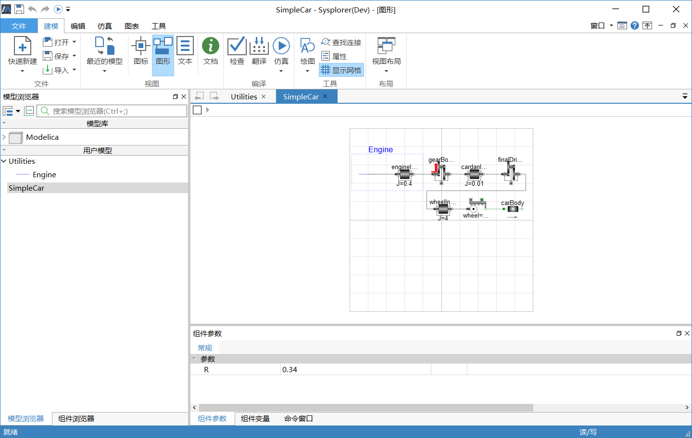
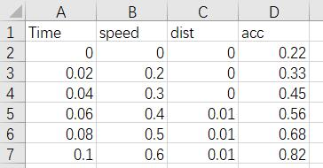
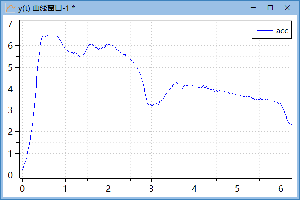

# 使用前准备

使用参数分析工具之前做好下列准备工作。

1. 启动MWorks.Sysplorer，打开模型，翻译生成可运行的求解器。

2. 在仿真浏览器中找到并确认对应生成的仿真实例。

3. 测量数据文件是进行参数标定的重要依据，要求其尽可能准确。

具体的操作步骤结合MWorks.Sysplorer实例库中的模型SimpleCar进行说明（详细的文件路径为“【安装目录】\Docs\static\Samples\SimpleCar.mo”）。

### SimpleCar模型

1. 启动MWorks.Sysplorer；

2. 点击**文件** > **模型库** > **Modelica 2.2.2**，加载模型库Modelica 2.2.2；

3. 点击**文件** > **打开**，选择“【安装目录】\Docs\static\Samples\Utilities.mo”，打开所需的库文件；

4. 再次点击菜单**文件** > **打开**，选择“【安装目录】\Docs\static\Samples\ SimpleCar.mo”打开SimpleCar模型。

   

   其中，左半部分表示汽车发动机（Engine），输出的扭矩通过变速箱（gearBox）连接到4个轮子（wheel），轮子的转动使得汽车产生平移。设R表示轮子半径，那么1/R可理解为转动与平移之间的比例因子。模型中定义了初始参数R=0.34，并且关联到另外一个参数wheel.ratio = 1/R，参考模型组件图。汽车质量（carBody.m）设为1810 kg，包括车身、发动机以及测量设备等。

5. 点击菜单**仿真** > **仿真设置**，打开**仿真设置**弹窗。

6. 将**仿真区间**的停止时间设置为6；

7. 点击菜单 **仿真** > **仿真**，对模型进行仿真。

### 测量数据文件

本例中使用的测量数据文件采用标准CSV格式（Comma Separated Values），具体参考【安装目录】\Docs\static\Samples\Acceleration_measurements.csv。其中第一行表示测量指标“名字”，从第二行开始逐行记录各个时间点的指标“值”，并且必须有一列表示时间（time）数据。

该测量数据是使用某型号汽车在试验环境中得到的，测量区间0—6.24秒，测量时间间隔0.02秒一次，测量指标包括速度（speed km/h）、距离（dist）和加速度（acc），其中“acc”将用于仿真模型的参数标定，其时域曲线如图所示。

本文模拟的运行时间区间为3.8—6秒，此时第2级齿轮处于啮合状态。

### 模型验证与标定准则

本文借鉴最小二乘法的思路，通过计算模型仿真结果变量 与对应的测量指标变量 在各个测量时间点上残差的平方和 ，以此作为模型验证准则，并将该值的最小化作为参数标定的目标。