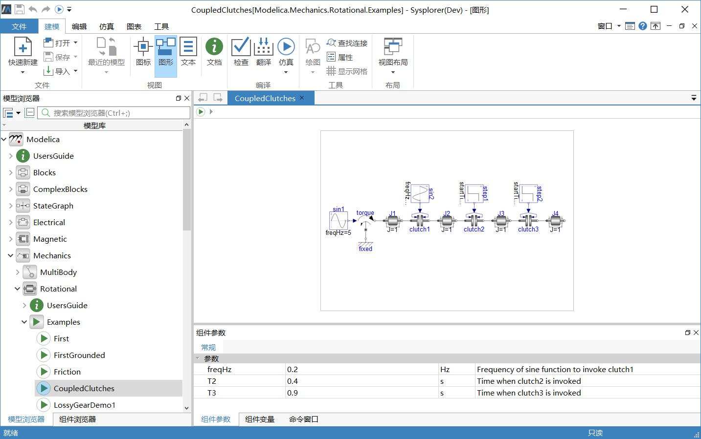
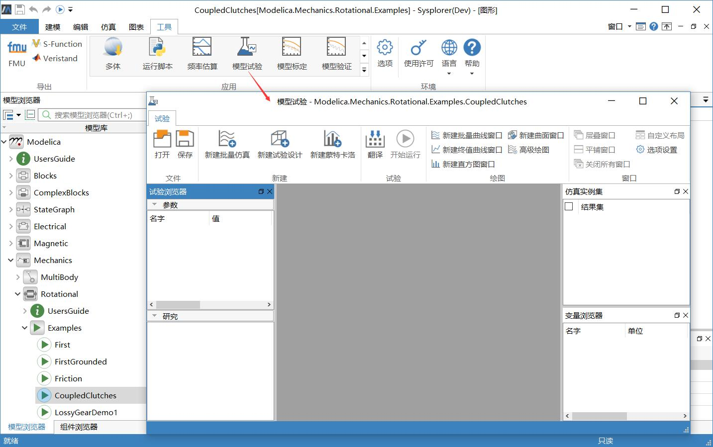

# 使用前准备

使用模型试验之前需启动MWorks.Sysplorer，打开模型。具体的操作步骤结合Modelica标准库中的模型CoupledClutches（详细路径为Modelica.Mechanics.Rotational.Examples.CoupledClutches）进行说明。

1. 启动MWorks.Sysplorer，加载Modelica标准库，打开CoupledClutches模型，初始界面如下图所示。

    

    模型CoupledClutches包含4个转动元件J1、J2、J3、J4，通过3个离合器clutch1、clutch2、clutch3连接起来并相互作用。

2. 点击**工具** > **模型试验**，软件将对当前模型进行翻译，翻译完成后弹出**模型试验**窗口，此时可在该窗口中进行各项参数分析。本文中参数分析目的是考察转动元件的参数——转动惯量J1.J、J2.J、J3.J和J4.J对输出变量——角速度J1.w、J2.w、J3.w和J4.w的影响。

    

