# 单目标优化

### 简单的数学算例

##### 问题描述

已知一个矩形的周长，求当长度和宽度分别为何值时矩形的面积最大？

```
model rectangle_area
  parameter Real perimeter = 400 "矩形周长";
  parameter Real length = 10 "矩形长度";
  Real width "矩形宽度";
  Real area "矩形面积";
equation 
  width = perimeter / 2 - length;
  area = length * width;
end rectangle_area;
```

基于算例创建Modelica模型，其中矩形初值设为：周长perimeter = 400，长度length = 10；此时，宽度width = 190，面积area = 1900。

对上述问题，可取参数length为优化变量、area为优化目标建立优化模型，该问题视为无约束的单目标优化问题。

##### 使用前准备

进行参数优化之前的操作步骤如下：

1. 启动MWorks.Sysplorer，点击**文件** > **打开**，选择“【安装目录】\Docs\static\Samples\rectangle_area.mo”打开rectangle_area模型。

   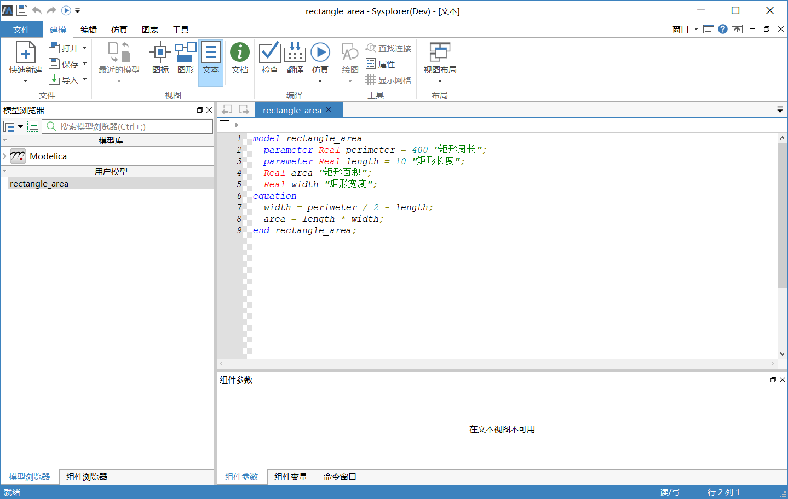

2. 点击**仿真** > **仿真**，生成可运行的求解器。仿真完成后仿真实例“rectangle_area”会出现在**仿真浏览器**中。如果仿真浏览器未出现，可以通过**窗口** > **仿真浏览器**打开**仿真浏览器**。

   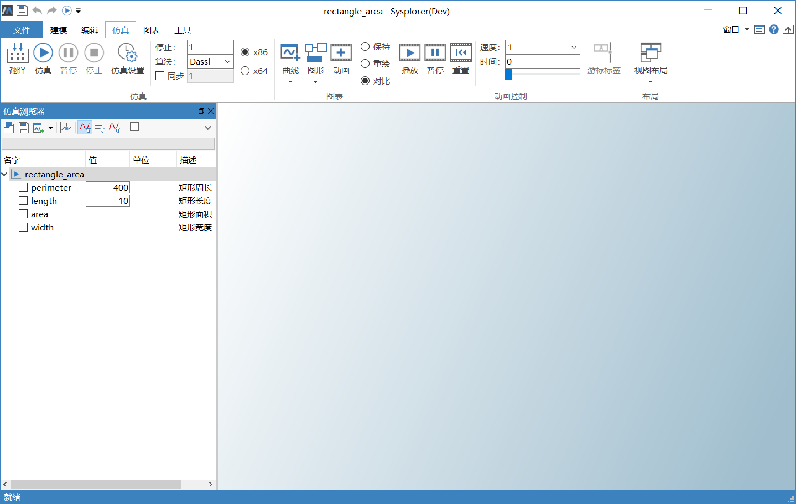

3. 至此准备工作结束，点击 **工具** > **模型参数优化**即可进行参数优化。

##### 参数优化

点击 **工具** > **模型参数优化**后弹出模型参数优化窗口。

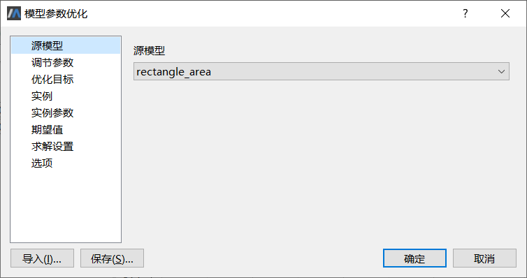

模型参数优化配置向导包括8个属性页。

- 源模型：选择将要进行参数优化的仿真实例，当参数变动时，系统自动调用与该实例关联的求解器。

- 调节参数：选择一个或多个进行调节的参数，对应优化问题的优化变量。显然，所选择的参数必须对目标变量有影响才是可行的，如果改变调节参数之后目标变量输出不变，参数优化将失败。

- 优化目标：选择一个或多个目标变量。目标变量泛指模型所需要优化的性能指标，对于优化问题来说，目标变量既可用来计算目标函数值，也可以用来计算约束条件值。

- 实例：设置进行多实例优化的实例选项。这里，“实例”对应仿真模型所处的工作条件，由实例参数来定义，例如不同的产品型号、运行工况等。多实例优化是通过改变调节参数，使得仿真模型在不同情况的性能指标均达到最优。

- 实例参数：选择一个或多个固定不变的参数，设置各个实例所对应的参数值，这些参数在优化过程中是保持不变的。在多实例优化中，通过不同的实例参数来区分“实例”。

- 期望值：设置目标变量对应的期望值。目标变量用来计算目标函数值时，该值视为“权值”；否则视为约束值。对于单目标优化问题，“权值”被忽略。

- 求解设置：设置求解起止时间、步长、算法、误差等选项。

- 选项：设置优化算法选项，例如收敛误差、最大迭代步数等。

下面结合rectangle_area模型介绍具体的操作步骤（其中部分属性页在后续的实例中进行说明）。

1. 选择源模型

   首先选择进行参数优化的仿真实例。**源模型**列表中显示了当前候选的仿真实例，其中，当前实例“rectangle_area”缺省已被选中。

2. 选择调节参数

   在**调节参数**属性页，点击**选择**按钮弹出**选择变量**弹窗，用于选择变量，勾选参数“length”（矩形长度）。点击“确定”回到调节参数属性页，在其中的列表框中显示出已选中的参数集。

   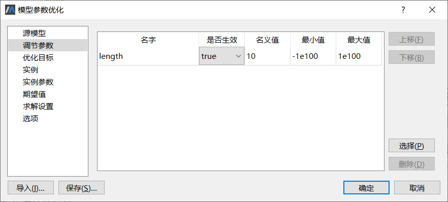

   图中列出了选择的参数列表及其全部属性。

   - 名字：即参数全名。为避免出错，限制不能修改参数名。

   - 是否生效：指定该参数是否要进行调节（缺省为true）。如果选择不生效（设为false），该参数在模型优化过程中视为固定参数（将调节参数设为不生效实际上改变了模型参数的缺省值，对应改变了模型的运行状态）。MWorks. Sysplorer参数优化工具要求必须提供至少1个有效的调节参数。

   -  名义值：调节参数初始值，缺省来自仿真模型实例，允许修改。

   - 最小值：设置调节参数的下界，“－1e100”表示不作限制。

   - 最大值：设置调节参数的上界，“＋1e100”表示不作限制。

   调节参数由优化算法根据优化目标来确定，并且保证不会超出所指定的参数范围。另外，调节参数的最小值和最大值可以简化算法运行，建议总是设置参数上下界。

   本例中，调节参数“length”的**名义值**设为“10.0”，**参数上下界**均不作限制。

   > 提示：使用**上移**、**下移**按钮可以改变调节参数生效顺序；使用**删除**按钮可以去除多余的参数。

3. 设置优化目标

   在**优化目标**属性页，点击**选择**按钮，弹出**选择变量**弹窗，勾选变量“area”(矩形面积)，点击**确定**按钮。

      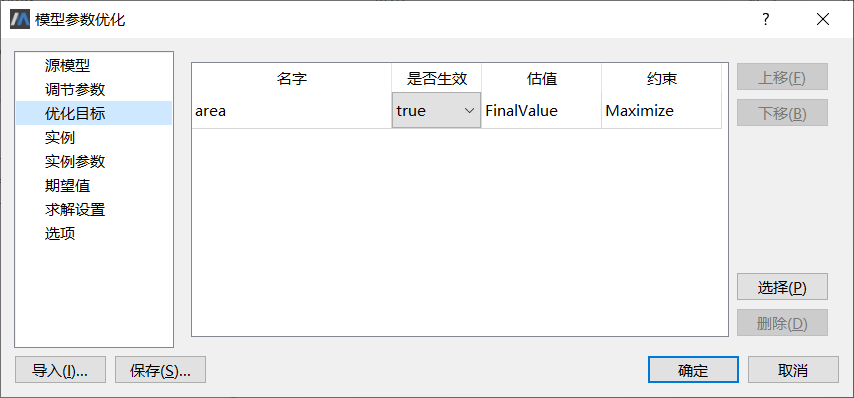

      图中列出了选择的变量列表及其全部属性。

      - 名字：即变量全名。为避免出错，限制不能修改变量名。

      - 是否生效：缺省为true，如果选择不生效（设为false），该变量在模型优化过程中将不参与计算目标函数（或约束条件）。

      - 估值：选择变量估值函数，本例中的仿真模型为一般非线性时不变模型，选择缺省选项“FinalValue”表示使用变量在求解终止时刻的值计算目标函数（或约束条件）。更多其他选项参考MWorks_Toolkit_Parameter_Analysis.pdf。

      - 约束：根据“估值”一栏中选择的变量估值函数对仿真结果进行处理后得到一个标量值，“约束”一栏中的属性确定该值的用途，或者是目标函数值，或者是约束条件值。图中选择“Maximize”（最大化）是根据优化问题来确定的，表示矩形面积越大越好。对应的目标权值或约束值在“期望值”属性页设置。

   > 提示：使用**上移**、**下移**按钮可以改变目标变量在列表中的显示顺序，同时改变了其计算顺序；使用**删除**按钮可以去除多余的变量。
   >

   ​	其中与约束相关的目标类型和约束条件如下表。

   | 约束类型    | 含义             | 备注                    |
   | ----------- | ---------------- | ----------------------- |
   | Minimize    | 作为目标函数使用 | 希望目标最小化          |
   | Maximize    | 作为目标函数使用 | 希望目标最大化          |
   | EqualTo     | 作为约束条件使用 | 要求等于(==)期望值      |
   | GreaterThan | 作为约束条件使用 | 要求大于或等于(≥)期望值 |
   | LessThan    | 作为约束条件使用 | 要求小于或等于(≤)期望值 |

4. 设置优化实例

   点击左侧属性页列表中的**实例**切换至**实例**属性页。

     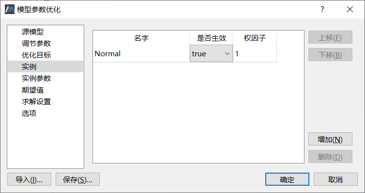

   其中字段含义为：

   - 名字：用于标识不同的优化实例，允许修改。如果有多个实例，实例名不能重复。

   - 是否生效：缺省为true。如果选择不生效（设为false），该实例将不参与优化过程计算，等同于没有定义。MWorks.Sysplorer参数优化工具要求必须提供至少1个有效的优化实例。

   - 权值：使用“权值”设置优化实例对于优化目标的不同期望，只有1个实例时，该值被忽略。显然，权值必须大于0

   本例中使用缺省实例“Normal”，使用**上移**、**下移**按钮可以改变优化实例在列表中的显示顺序，同时改变了其生效顺序；使用**增加**按钮设置新的（缺省）实例；使用**删除**按钮可以去除多余的实例。

5. 选择实例参数

   点击左侧属性页列表中的**实例参数**切换至**实例参数**属性页。

   实例参数与优化实例对应的工作条件相关，对于一个具体的实例来说，实例参数是固定不变的。

   本例中实际不需要设置实例参数，但为了说明界面元素，选择“perimeter”（矩形周长）作为示例。对本例中的优化问题，改变“perimeter”没有使问题的性质发生变化，但直接影响最终的优化结果。为了不破坏前述假设，仍然设置perimeter = 400。

   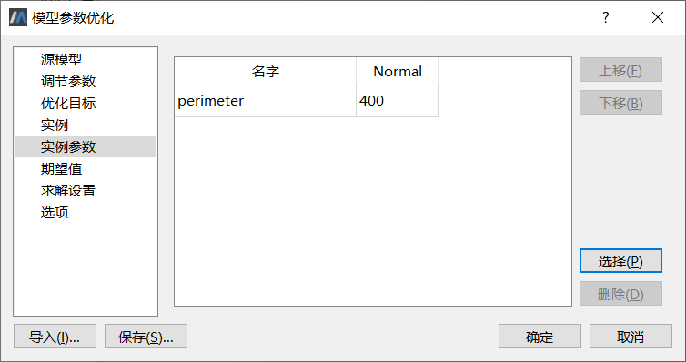

     使用**上移**、**下移**按钮可以改变实例参数在列表中的显示顺序；使用**选择**按钮选择实例参数；使用**删除**按钮可以去除多余的参数。

6. 设置期望值

   点击左侧属性页列表中的**期望值**切换至**期望值**属性页。

     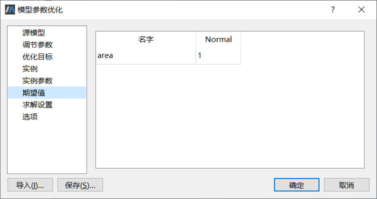

   - 期望值列表栏目根据**优化目标**和**实例**属性页中设置的目标变量和优化实例建立，横向对应：目标变量名字、实例1、实例2、…；纵向逐行显示具体的目标变量，行列顺序与对应属性页中的变量和实例保持一致，例如本例中的目标变量“area”和实例“Normal”。

   - 目标变量作为优化目标使用时，期望值视为“权值”（要求大于0）；如果作为约束条件，期望值根据优化问题进行赋值。

   本例中优化实例为1个缺省实例“Normal”，目标变量有1个“area”，并且作为优化目标使用，故期望值视为“权值”，此处设为缺省值“1.0”（单目标优化时该值被忽略）。

7. 设置模型求解选项

   点击左侧属性页列表中的**求解设置**切换至**求解设置**属性页。

     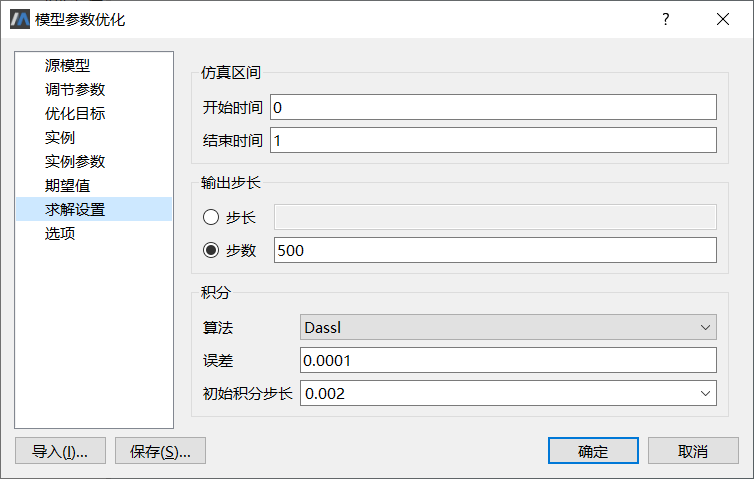

     考虑本例中的仿真模型为非线性时不变模型，故全部属性取缺省选项。
     对于其他时变模型，需要根据所选目标变量的变化趋势、对应的变量估值函数等因素设置合理的仿真区间、输出步长和积分选项。

8. 设置优化算法选项

   点击左侧属性页列表中的**选项**切换至**选项**属性页。

     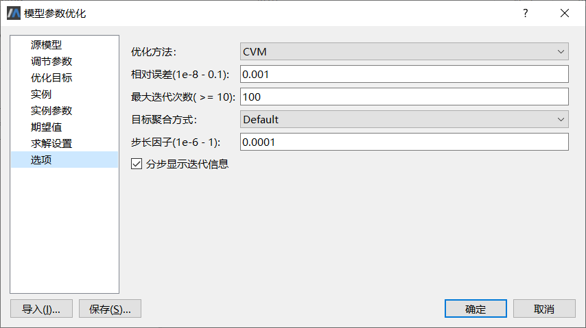

   - 优化方法：选择优化算法，缺省为“IPOPT”。
   - 相对误差：作为迭代收敛误差，该值范围为1e-8—0.1，缺省值为1e-005。
   - 最大迭代步数：不能小于10，缺省为100。
   - 目标聚合方式：适用于多目标优化，只有1个优化目标时该选项被忽略。缺省为“Default”，表示由优化算法决定如何处理。
   - 步长因子：控制调节参数变更精度，该值范围为1e-6—1.0，缺省为5e-3。
   - 分步显示迭代信息：缺省true，这样，在迭代过程中输出栏将分步显示调节参数的变动细节，以及对应的优化目标和约束条件在该步的结果。

   本例中，优化方法设为CVM（约束变尺度法），相对误差和步长因子分别设为0.001、0.0001，其余取缺省选项。

   参数配置完成，建议将本次参数配置结果保存为外部脚本文件，以便复用。 

9. 查看模型优化结果

   点击**确定**执行模型优化，经过7次迭代之后得到结果。

   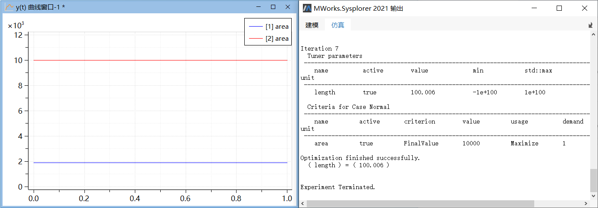

   - 曲线窗口中显示了目标变量在优化前后的结果，分别用蓝色曲线和红色曲线表示。本例中优化前后area（矩形面积）分别等于1900、9999.99997，优化结果对比精确解的相对误差小与1e-8。

   - 在输出栏中给出了调节参数的最优解。本例中length = 100.006，优化结果对比精确解的相对误差小于1e-4。如果选中了“分步显示迭代信息”，在迭代过程中输出栏还将分步显示调节参数的变动细节，以及对应的优化目标值和约束条件值。

   - 变量浏览器中生成了模型标定之后的仿真实例“rectangle_area 1”，其中调节参数已设为其最优解（如果存在实例参数，其参数值也并入实例中），可以从中观察模型其他变量指标在优化前后的差异情况。

   从上图看出，参数优化后得到期望的结果。

### 典型的OPB算例

##### 问题描述

接下来测试OPB算法库中的考题7，这是一个典型的非线性、单目标约束优化问题，数学模型如下。

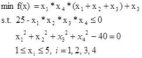

该问题的理论最优值如下：

 min f(x)=7.0140173  x[] = {1,4.7429994,3.8211503,1.3794082}

下面建立该问题对应的Modelica模型，使用参数优化工具进行求解。对应的模型文件参考“【安装目录】\Docs\static\Samples\opb_cvm_ex7.mo”。

```
model opb_cvm_ex7
  parameter Real x1 = 1 "参数1";
  parameter Real x2 = 5 "参数2";
  parameter Real x3 = 5 "参数3";
  parameter Real x4 = 1 "参数4";
  Real f "目标函数";
  Real eq_c "等式约束 == 40";
  Real ne_c "不等式约束 >= 25";
equation 
  f = x1 * x4 * (x1 + x2 + x3) + x3;
  eq_c = x1 * x1 + x2 * x2 + x3 * x3 + x4 * x4;
  ne_c = x1 * x2 * x3 * x4;
end opb_cvm_ex7;
```

本例中，取参数x1、x2、x3、x4为优化变量，初值x[] = {1,5,5,1}、f为优化目标（初始时极值等于16），eq_c、ne_c为约束条件建立优化模型。

> 注意，所选的参数初值不满足等式约束条件ne_c，因而是“不可行点”。

##### 使用前的准备

1. 启动MWorks.Sysplorer，点击菜单**文件** > **打开**，选择“【安装目录】\Docs\Samples\ opb_cvm_ex7.mo”打开opb_cvm_ex7模型。

   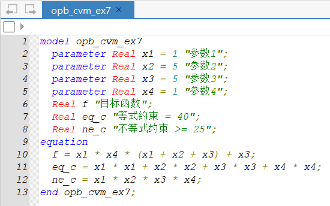

2. 点击**仿真** > **仿真**，生成可运行的求解器。仿真完成后仿真实例“opb_cvm_ex7”会出现在**仿真浏览器**中。

   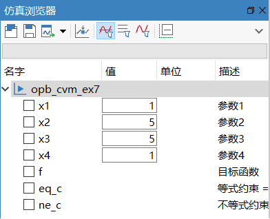

##### 参数优化

点击**工具** > **模型参数优化**，弹出**模型参数优化**界面。


1. 选择调节参数

     按本例要求，选择 x1、x2、x3、x4为调节参数，初值x[] = {1, 5, 5, 1}，参数上下界 1≤xi≤5，i = 1,2,3,4。

     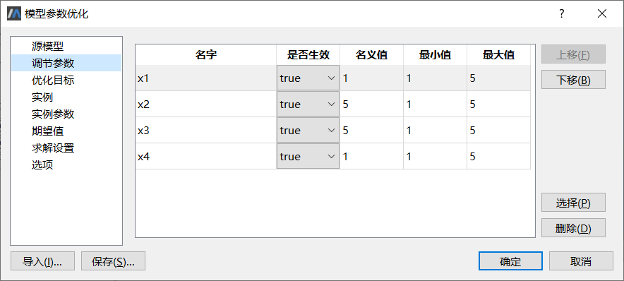

2. 选择优化目标

     按本例要求，选择f、eq_c、ne_c为目标变量，其中f作为目标函数，eq_c为等式约束条件（“EqualTo”），ne_c为不等式约束条件（“GreaterThan”）。

     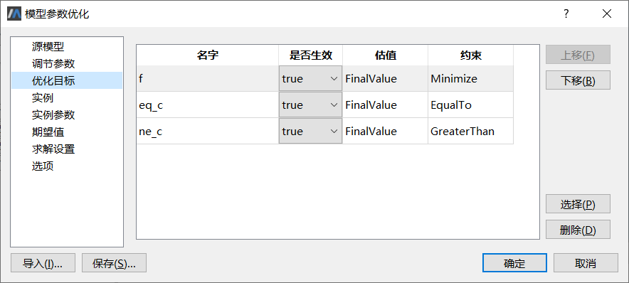

3. 设置期望值

     按本例要求，目标变量f权值取缺省值1.0、等式约束变量 eq_c约束值设为40（表示eq_c ==40）、不等式约束变量ne_c约束值设为25（表示ne_c ≥25）。

     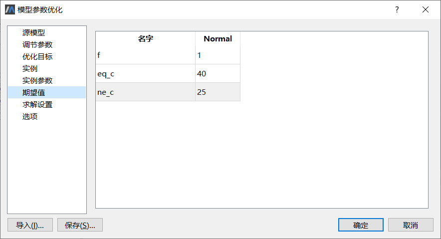

4. 设置优化算法选项

     切换至**选项**属性页，设置优化算法选项为“CVM”。

     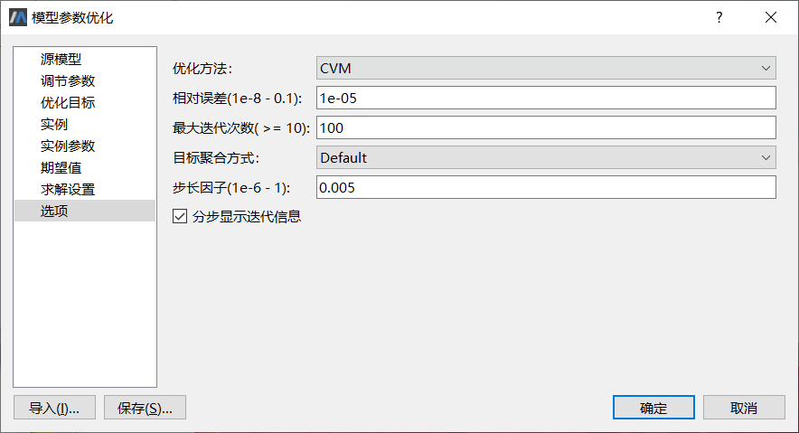

     本例中没有特别说明的选项全部取缺省值。

     参数配置完成，建议将本次参数配置结果保存为外部脚本文件，以便复用。

5. 查看模型优化结果

     点击**确定**执行模型优化，经过6次迭代之后得到结果。

   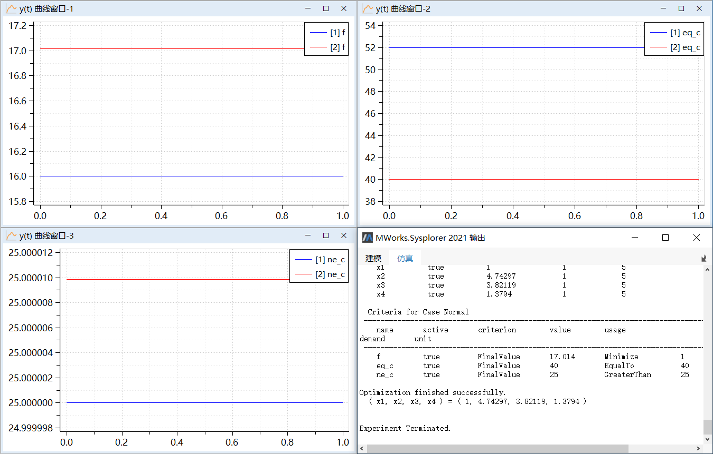

     参数优化工具得到的最优解如下：

     x[] = {1,4.74297,3.82119,1.3794}; min f(x) = 17.014

     可以看出与理论最优值非常接近。

     如果提高求解器的计算精度和优化算法的收敛精度，适当减小其步长因子，结果精度会进一步提高，但导致迭代次数因此而增加。