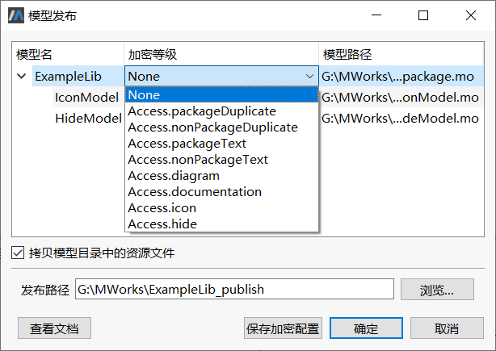
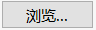

# 界面设置模型保护级别

建立模型库后， 通过**文件** > **发布模型**可以打开**模型发布**窗口，进行模型库发布。模型发布窗口列出模型所在文件及文件中的类。

> 提示: ① 无法列出类中的子类； ② 可预先读取模型中的加密等级。

- 加密等级：下拉列表提供了**None** 、**Access.packageDuplicate** 、**Access.nonPackageDuplicate** 、**Access.packageText** 、**Access.nonPackageText** 、**Accessdiagram** 、**Access.documentation** 、**Access.icon** 、**Access.hide** 九种加密等级，由上往下加密等级逐步提高。具体加密等级对应的限制显示和限制操作信息可以参见表“保护级别对模型操作的控制”。

- 拷贝模型目录中的资源文件：勾选后，发布后将模型中的资源文件（即模型库所在的文件夹下的.html 、.png 、.txt 等文件）一起拷贝到发布目录中。注意：非结构化模型时该功能置灰。

- 发布路径：发布模型的存储路径。可通过点击按钮 选择发布路径。

- 保存加密配置：保存加密配置到原模型。选择**None** 加密等级时保存加密配置Access.None 到原模型。

- 确定：对模型进行加密，并在发布路径生成加密文件.mef ，同时加密配置信息写入当前模型注解中。选择“None ”加密等级点击**确定**按钮时不对模型进行加密。

- 查看文档：可以查看模型发布的用户文档。

发布模型时自动修正父模型与子模型的加密配置冲突。父模型不得高于子模型的加密等级。发布路径选择的文件必须为空文件夹。

| 保护级别                   | 功能限制                                                     | 备注                       |
| -------------------------- | ------------------------------------------------------------ | -------------------------- |
| Access.packageDuplicate    | 对于任意类型的模型(含package类型)，可以复制模型，也可另存；除以上功能限制外，其他功能不做限制 | 不区分package              |
| Access.nonPackageDuplicate | 对于非package类型的模型，可以复制模型，也可另存；对于package类型的模型，不能复制模型，且不能另存；对于非package类型的模型，可以查看模型的所有内容，包括模型文本视图内容；对于package类型的模型，可以查看模型的所有内容，除了模型文本视图内容；除以上功能限制外，其他功能不做限制 | 区分模型是否为package类型  |
| Access.packageText         | 对于任意类型的模型(含package类型)，可以查看模型的文本视图内容；可以查看模型的组件视图、图标视图、Documentation内容；不能复制模型及模型中的元素(如组件)，且不能另存；除以上功能限制外，其他功能不做限制 | 不区分package              |
| Access.nonPackageText      | 对于非package类型的模型，可以查看模型的文本视图内容；对于package类型的模型，不能查看模型的文本视图内容；可以查看模型的组件视图、图标视图、Documentation内容；不能复制模型及模型中的元素( 如组件)，且不能另存；除以上功能限制外，其他功能不做限制 | 区分模型是否为package 类型 |
| Access.diagram             | 支持Access.documentation级别所支持的所有功能；可以查看模型的组件视图、图标视图、Documentation内容；不能查看模型的文本视图内容；不能复制模型及模型中的元素 (如组件)，且不能另存；可以引用该模型，可以实例化为组件 |                            |
| Access.documentation       | 支持Access.icon级别所支持的所有功能；可以查看模型Documentation内容；其他功能限制与Access.icon级别一致 |                            |
| Access.icon                | 在模型浏览器上显示；模型可以打开；可以查看模型的图标视图内容；不能查看模型的文本视图、组件视图、Documentation内容；不能复制模型及模型中的元素(如组件)，且不能另存；可以引用该模型，可以实例化为组件 |                            |
| Access.hide                | 在模型浏览器上不显示；模型不能打开；不能引用该模型，不能实例化为组件 | 仅在模型库内部使用         |

 