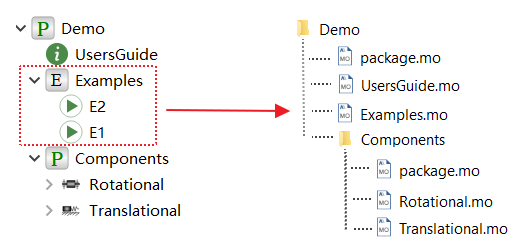

# 模型加密规则

模型的保护级别由自身设置确定，但需要满足约束，约束以模型文件为单位。

结合模型Demo 介绍约束规则。下图为Demo 的模型和模型文件，其中Demo.Examples.E2 和Demo.Examples.E1 与其父节点Demo.Examples 保存在同一个模型文件Examples.mo 中。

1. 不同模型文件中的模型，如Demo.UsersGuide 和Demo.Examples ，保护级别互不影响。但 2. 中的情况除外。

2. 无论是否在同一个模型文件，若父节点的等级为hide ，子节点的等级将自动变为hide ，如Demo.Components 的保护级别为hide ，系统自动设置Demo.Components.Rotational 和Demo.Components.Translational 保护级别也为hide 。

3. 同一个模型文件中的模型，如Demo.Examples.E2 和Demo.Examples ：

   - 子节点(Demo.Examples.E2) 设置保护级别，父节点(Demo.Example) 没有设置，此时系统默认父节点的保护级别为Access.documentation 。

   - 相反，父节点设置了保护级别，子节点没有设置，此时子节点自动继承父节点的保护级别。

 