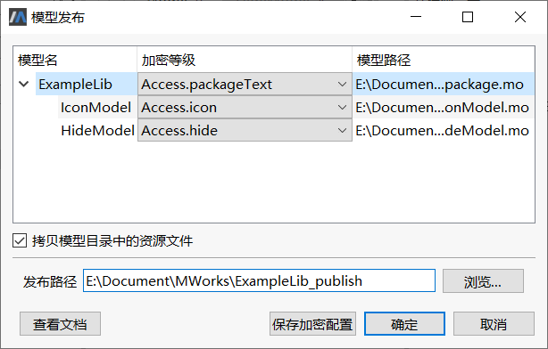
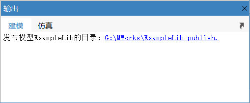
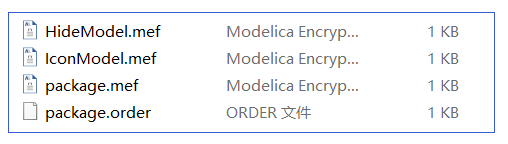
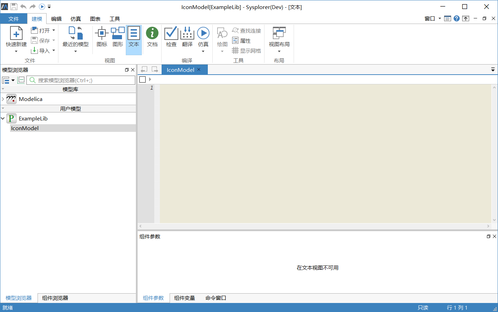

# 示例演示

本章以一个简单的示例，说明如何正确发布加密模型并使用。

### 发布加密模型库

1. 新建一个结构化的package ，命名为ExampleLib 。在ExampleLib 中插入两个model 类的模型，分别命名为IconModel 与HideModel ，且保存为单个文件。

2. 打开模型ExampleLib， 点击**文件** > **发布模型**，弹出**模型发布**窗口；

3. 在**加密保护级别**栏的下拉列表中，设置ExamloeLib 加密等级为“Access.packageText ”，IconModel 和HideModel 的加密级别自动设置为“Access.packageText ”，如下图所示。

4. 依次将IconModel 和HideModel 的加密等级设置为Access.icon 和Access.hide 。

5. 点击**确定**按钮，系统自动进行模型库发布，同时加密配置信息写入当前模型注解中。

模型发布完成后，会在**输出栏**中输出发布模型的目录，点击后系统直接打开目录所在的文件夹。

在发布的文件夹中，可查看到加密.mef 的文件。

### 使用加密模型库

模型库作者将模型库加密之后，将加密模型库发布给模型库用户使用。

打开加密模型库，与打开普通模型库的过程一致。点击菜单**文件** > **打开**，选择加密mef 文件所在的文件夹，即可以加载该模型。

如上图所示模型IconModel 加密为Access.icon ，**文本视图**、**图形视图**内容都不可见。模型HideModel 加密为Access.hide ，在**模型浏览器**上不显示。